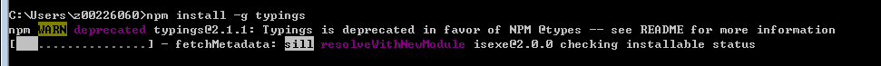
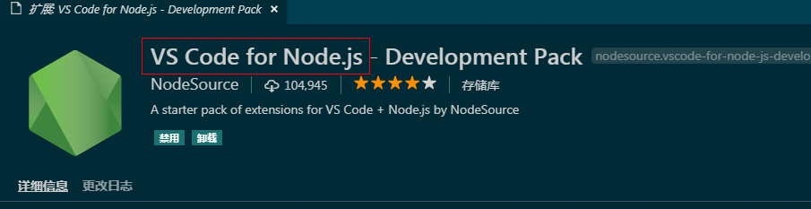
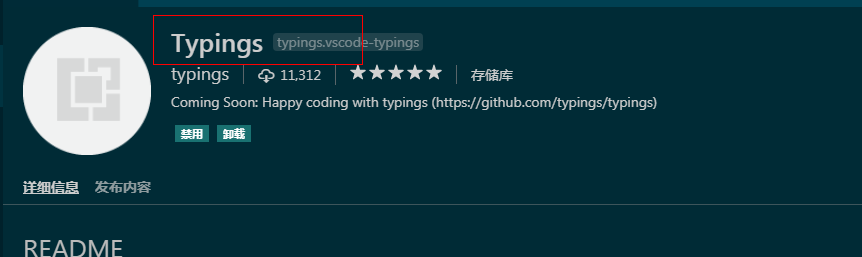
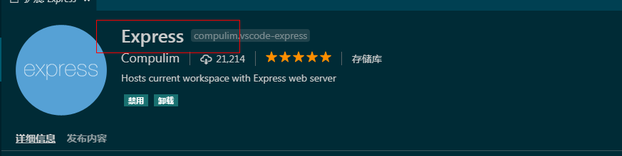
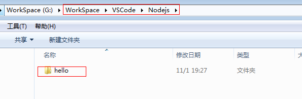
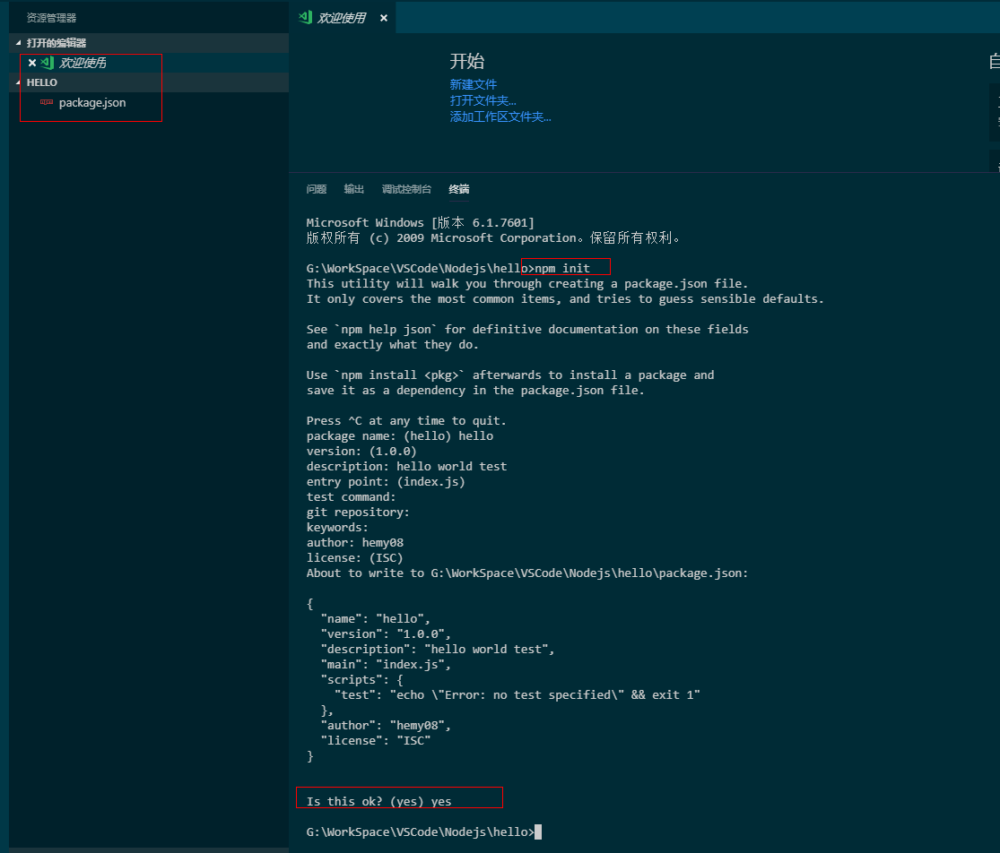
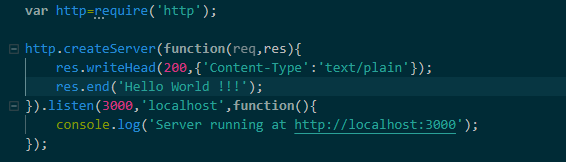
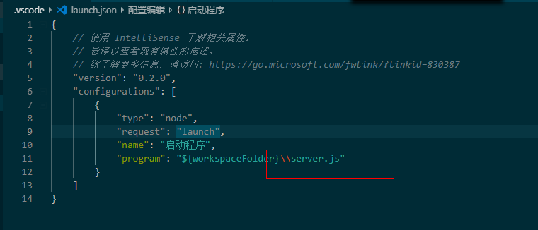
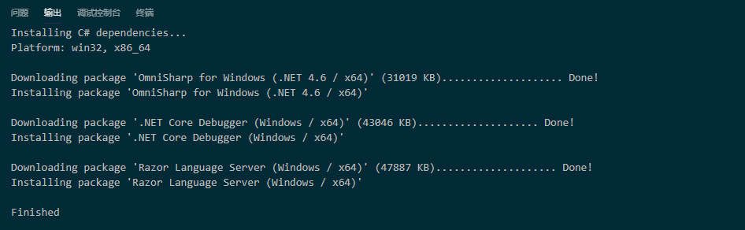
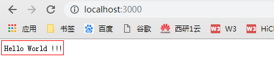

# VSCode 配置Node.js开发环境

<span style="color:rgb(100,180,246);font-size:11pt">最后更新：2022-11-19</span>

## 一、使用Typings工具配置VSCode智能提示

在cmd中安装，命令：

npm install -g typings



查看版本


```
typings -v
```

typings install dt\~node --global --save

typings install dt\~express --global

typings install dt\~lodash --global

## 二、安装插件

我也不知道具体需要那些，可能不装也可以用。

我装了下面几个插件：



VS Code for Node.js是nodejs的一个辅助工具



Typings是代码智能提示的一个工具



一个Nodejs相关的工具，不装应该也没关系，这个是用来做webserver的（猜的）

其他的可以看着安装吧，反正很多插件呢，总能找到合适的。

## 三、创建nodejs调试

创建一个工程的目录。



在VSCode打开这个文件夹，在终端上执行npm init



相关的参数需要手动输入，最终如上图，会产生一个package.json的文件。这个是Nodejs的配置文件。

## 四、新建srever.js

```javascript
var  http=require('http');

http.createServer(function(req,res){

res.writeHead(200,{'Content-Type':'text/plain'});

res.end('Hello World !!!');

}).listen(3000,'localhost',function(){

console.log('Server running at  [http://localhost:3000&#39;](http://localhost:3000'));

});
```



## 五、添加配置

当然也可以不添加，只不过每次都得选择Nodejs的环境。



首次调试会出现一堆安装，这个不用理会。



启动之后，在浏览器上进入  [http://localhost:3000](http://localhost:3000)  如下：



一番下来，我也没咋懂，反正是调试起来了。
