# 搭建Python开发环境

<span style="color:rgb(100,180,246);font-size:11pt">最后更新：2022-11-19</span>

## 一、Python工具安装

这里不用特殊说明，直接下载安装包安装就可以了。

### 1.1 pip install超时处理

现象：

Retrying (Retry(total=4, connect=None, read=None, redirect=None)) after connection broken by 'NewConnectionError('<pip._vendor.requests.packages.urllib3.connection.VerifiedHTTPSConnection object at 0x0000000003D161D0>: Failed to establish a new connection: [Errno 11004] getaddrinfo failed',)': /simple/flake8/

安装失败，提示超时。

解决办法：

在C:\\Users\\xxx用户xxx\\下新建一个pip文件夹，并在该文件夹下新增一个pip.ini的文件，内容如下：

```ini
[global]
timeout = 6000
index-url =  [http://rnd-mirrors.huawei.com/pypi/simple](http://rnd-mirrors.huawei.com/pypi/simple)
trusted-host = rnd-mirrors.huawei.com

[install]
use-mirrors = true
mirrors =  [http://rnd-mirrors.huawei.com/pypi](http://rnd-mirrors.huawei.com/pypi)
```

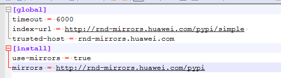

之后再重新安装就可以了。

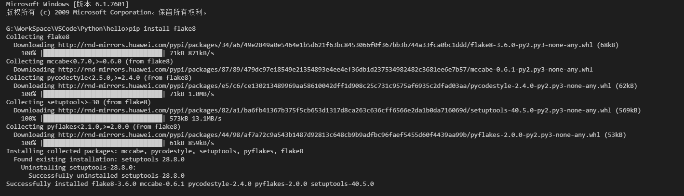

## 二、工程文件准备

1. 新建个文件夹，命名hello，G:\\WorkSpace\\VSCode\\Python\\hello
2. 写一个hello.py的文件放在目录下，G:\\WorkSpace\\VSCode\\Python\\hello\\hello.py


```python
   #!/usr/bin/python3

   # -*- coding: UTF-8 -*-

   print("Hello,World!")

   print("你好，世界！")
```

   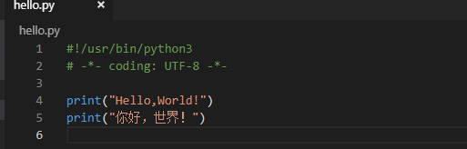

3. 用VSCode打开py文件，或者在VSCode中打开hello文件夹

## 三、安装python插件

打开py文件后，会提示要安装python插件，点击安装

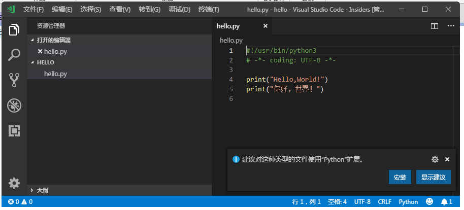

也可以在插件安装的功能区，输入python搜索安装

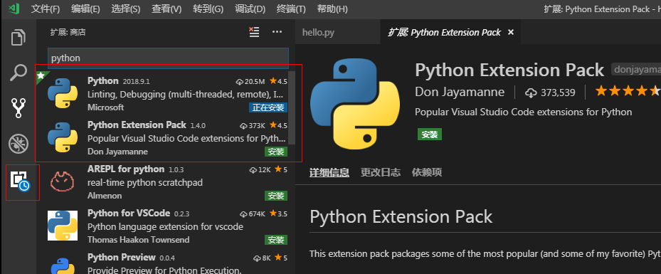

这里搜到的比较多一些，一般python就够了，我一般会安装Python、Python Extension Pack、Python for VSCode、Python Preview\(自动提示的\)，可以根据自己的需求安装一些其他的插件。点击到插件上有相应的插件描述信息。

## 四、安装pylint，flake8等检查工具

Pylint 是一个 Python 代码分析工具，它分析 Python 代码中的错误，查找不符合代码风格标准（Pylint 默认使用的代码风格是 PEP 8）和有潜在问题的代码。可以使用 pip 来下载 pylint： pip install pylint，具体如何配置可以在网上去找。

Flake8 是根据 pep8 编码规范检查 Python 代码的自动化工具，与pylint类似，但Pylint的错误类型覆盖面比flake8更广, 提供更加详细的分析报告。用 pip install flake8 安装 flake8。

这里安装使用外部镜像可能安装不了，需要使用公司的镜像。

[http://3ms.huawei.com/hi/group/1005027/wiki\_4299711.html](http://3ms.huawei.com/hi/group/1005027/wiki_4299711.html)

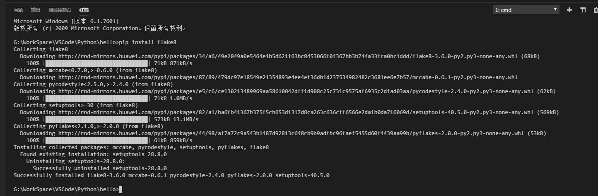

## 五、配置

### 1 launch.json

launch.json，调试-\>打开配置，也可以用添加配置（如果VSCODE配置多个开发环境的话）：

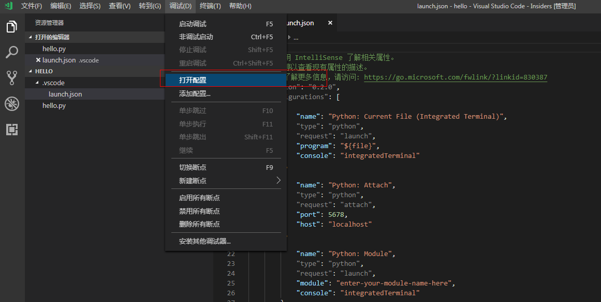

这里一般不用配置，安装完插件后就是OK的。

### 2 task.json

配置任务，否则没法调试

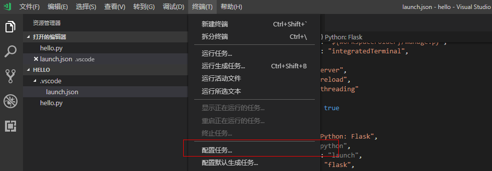

选择使用模板创建task

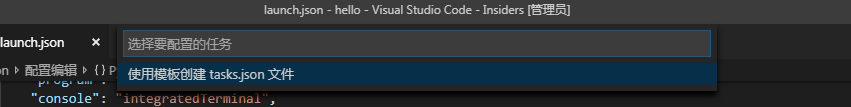

选择运行任意外部命令这个模板

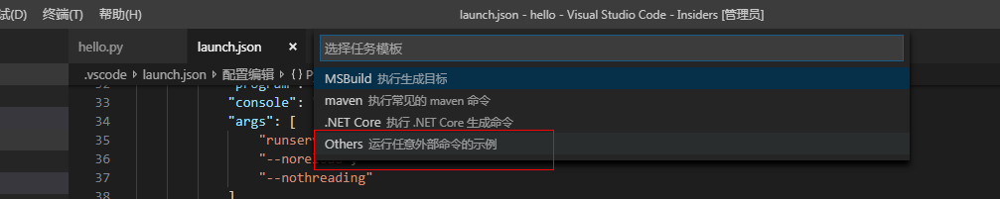

会生成一个json文件

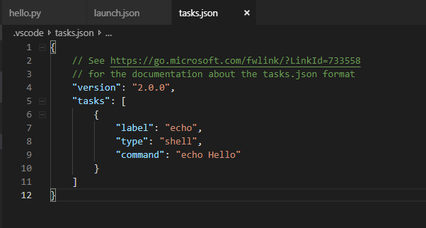

不用动，放着就行

### 3 settings.json

系统的设置，开发环境的一些设置参数。

文件-\>首选项-\>设置  现在设置有界面了，可以选择在json中编辑，然后在工作区设置中添加如下：

```json
{
    "python.formatting.provider": "autopep8"
}
```

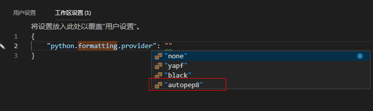

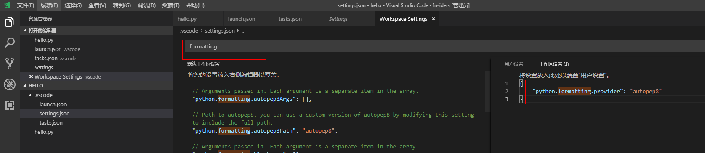

## 六、调试

按F5就可以启动调试，也可以从左侧的面板进入。

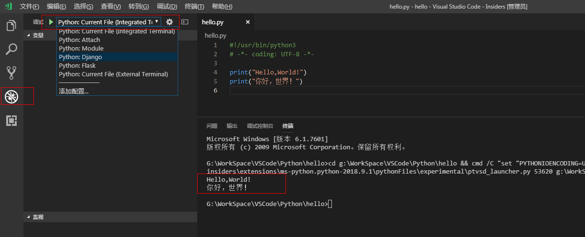
