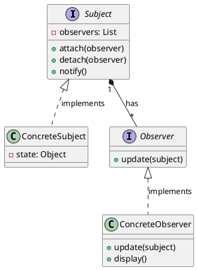

# 设计模式之观察者模式

参考：
- https://blog.csdn.net/weixin_62621696/article/details/140955296
- https://blog.csdn.net/weixin_45433817/article/details/130994583

观察者模式是一种**行为设计模式**，它定义了一种**一对多的依赖关系**，让多个观察者对象同时监听某一个主题对象。当主题对象状态发生变化时，会通知所有观察者对象，使它们能够自动更新自己

**核心思想**：解耦被观察者和观察者，使其可以独立变化。被观察者无需关心观察者的具体实现，只需维护一个观察者列表并调用统一的接口通知它们。

## 一、核心概念

**Subject (主题):** 被观察的对象
- 维护一个观察者列表，保存所有订阅的观察者
- 定义观察者的注册、删除和通知接口。

**Observer (抽象观察者):** 定义了一个更新接口
- 定义接收通知的接口（如 update() 方法）。

**ConcreteSubject (具体主题):** 
- 实现主题接口，存储具体状态，当自身状态变化时，通知所有注册的观察者。

**ConcreteObserver (具体观察者):** 实现观察者更新接口
- 实现抽象观察者的接口，处理接收到的通知，通常会依赖主题的状态。

## 二、类图结构




## 三、实现方式

观察者模式的实现方式可以分为两种：

- **同步阻塞实现方式**：当主题状态改变时，观察者的更新方法会立即执行，这种方式可能会导致阻塞，尤其是在观察者的更新操作比较耗时的情况下。
- **异步非阻塞实现方式**：观察者的更新操作在独立的线程或任务中执行，这样可以避免阻塞问题。通常推荐使用异步非阻塞的方式实现观察者模式。


## 四、代码示例

### 1. 抽象主题


```java
import java.util.ArrayList;
import java.util.List;

interface Subject {
    void attach(Observer observer); // 注册观察者
    void detach(Observer observer); // 移除观察者
    void notifyObservers(); // 通知所有观察者
}

class WeatherSubject implements Subject {
    private List<Observer> observers = new ArrayList<>();
    private String weatherState; // 天气状态（温度、湿度等）

    @Override
    public void attach(Observer observer) {
        observers.add(observer);
    }

    @Override
    public void detach(Observer observer) {
        observers.remove(observer);
    }

    @Override
    public void notifyObservers() {
        for (Observer observer : observers) {
            observer.update(this); // 传递主题自身，让观察者获取状态
        }
    }

    // 主题状态变更时调用通知
    public void setWeatherState(String state) {
        this.weatherState = state;
        notifyObservers(); // 状态变化，触发通知
    }

    public String getWeatherState() {
        return weatherState;
    }
}

```

### 2. 抽象观察者


```java
interface Observer {
    void update(Subject subject); // 接收通知的方法
}

class WeatherDisplay implements Observer {
    @Override
    public void update(Subject subject) {
        if (subject instanceof WeatherSubject) {
            WeatherSubject weatherSubject = (WeatherSubject) subject;
            System.out.println("天气更新：" + weatherSubject.getWeatherState());
        }
    }
}

```

### 3. 使用示例


```java
public class Client {
    public static void main(String[] args) {
        WeatherSubject weatherSubject = new WeatherSubject();
        WeatherDisplay display1 = new WeatherDisplay();
        WeatherDisplay display2 = new WeatherDisplay();

        // 注册观察者
        weatherSubject.attach(display1);
        weatherSubject.attach(display2);

        // 主题状态变更，触发通知
        weatherSubject.setWeatherState("晴转多云"); // 输出：天气更新：晴转多云
        weatherSubject.setWeatherState("暴雨预警");   // 输出：天气更新：暴雨预警

        // 移除观察者
        weatherSubject.detach(display2);
        weatherSubject.setWeatherState("天气转晴");   // 仅 display1 收到通知
    }
}

```

## 五、优缺点

### 优点:

- 解耦：支持松耦合，主题和观察者可以独立变化
- 支持广播通信，主题可以一次通知多个观察者
- 扩展：遵循开闭原则，可以新增观察者而不修改主题

### 缺点:

- 性能问题：观察者过多时通知可能耗时
- 观察者之间不知道彼此存在，可能导致更新冲突
- 如果观察者更新失败，主题无法感知
- 通知顺序不确定：观察者执行顺序由主题控制，可能引发依赖问题。
- 内存泄漏风险：若观察者未正确移除，可能导致主题持有无效引用。
- 循环依赖：若主题和观察者互相依赖，可能引发死锁或逻辑错误。

## 六、应用场景

**一对多依赖**：当一个对象的状态变化需要通知多个对象，且对象间关系动态变化时（如消息订阅、事件监听）。

**解耦需求**：希望主题和观察者松耦合，彼此无需知道具体实现，只需依赖抽象接口。

**实时更新**：需要实时反映数据变化的场景（如股票行情、天气监控、UI 组件联动）。

- **事件处理系统**：如GUI中的按钮点击事件
- **发布-订阅系统**：如消息队列、新闻推送
- **模型-视图-控制器(MVC)**：模型变化时自动更新视图
- **监控系统**：当监控目标状态变化时触发警报

## 六