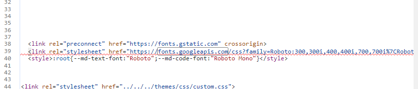

# mkdocs加载页面缓慢问题

近期发现个人mkdocs网站加载页面总是很慢，一个页面耗时5s。

最初以为是主题中引用往上的js文件问题，后面发现不是。

F12开发人员工具打开，然后刷新页面，可以看到是有个网站加载耗时6s。

看源码，这里是引用了一个Roboto字体，应该是网站访问的问题。地址拷贝到浏览器试了下，确实访问不到。

搜了下自定义的主题相关，发现没有使用这个字体，那么就可能是mkdocs默认用了这个字体。

找了一堆，试了一堆，都不好使，最后发现有个谷歌的插件 Gooreplacer。

在应用商店上找这个插件，然后安装在浏览器上，按照下面的进行配置。

替换 fonts.googleapis.com 域名为国内镜像站点 fonts.font.im 域名

Microsoft Edge浏览器慎用，反正我把电脑搞蓝屏了。......