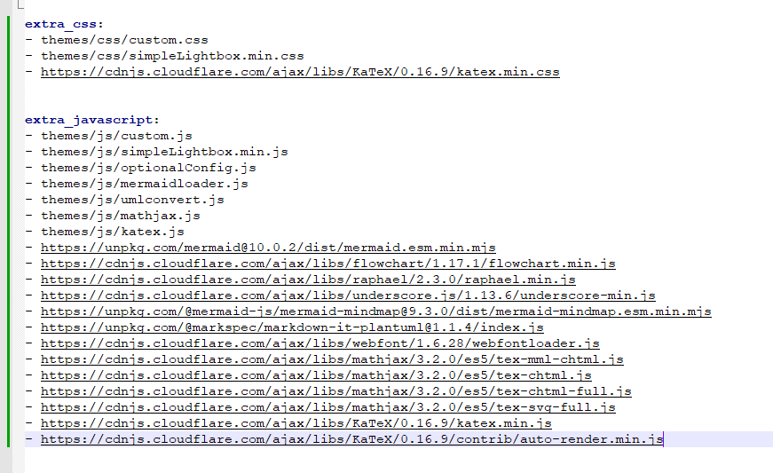
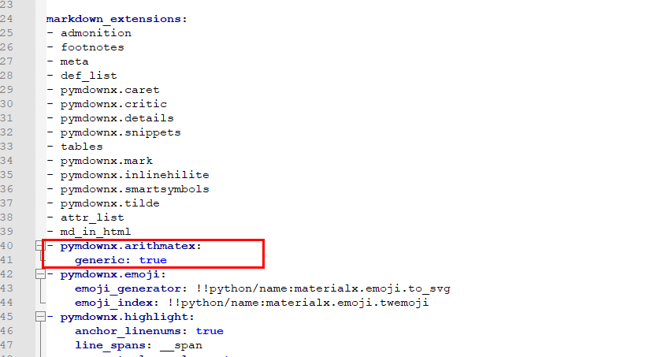

# mkdocs 配置支持数学公式--Material主题

参考 [https://squidfunk.github.io/mkdocs-material/reference/math/?h=mathjax#mathjax-docsjavascriptsmathjaxjs](https://squidfunk.github.io/mkdocs-material/reference/math/?h=mathjax#mathjax-docsjavascriptsmathjaxjs)

KaTex配置的js和css参考 [https://cdnjs.com/libraries/KaTeX](https://cdnjs.com/libraries/KaTeX)

MathJax的js和css参考 [https://cdnjs.com/libraries/mathjax](https://cdnjs.com/libraries/mathjax)

