# Qt安装

## 一、下载

参考 [Qt下载说明](011-Qt下载说明.md)
 
## 二、安装

### 2.1 配置加速

在下载的在线安装目录下执行cmd命令，然后输入下面的命令，指定镜像地址进行安装，可以提速：

```shell
qt-online-installer-windows-x64-4.9.0.exe --mirror https://mirror.nju.edu.cn/qt
```

### 2.2 启动安装

#### 1）启动程序

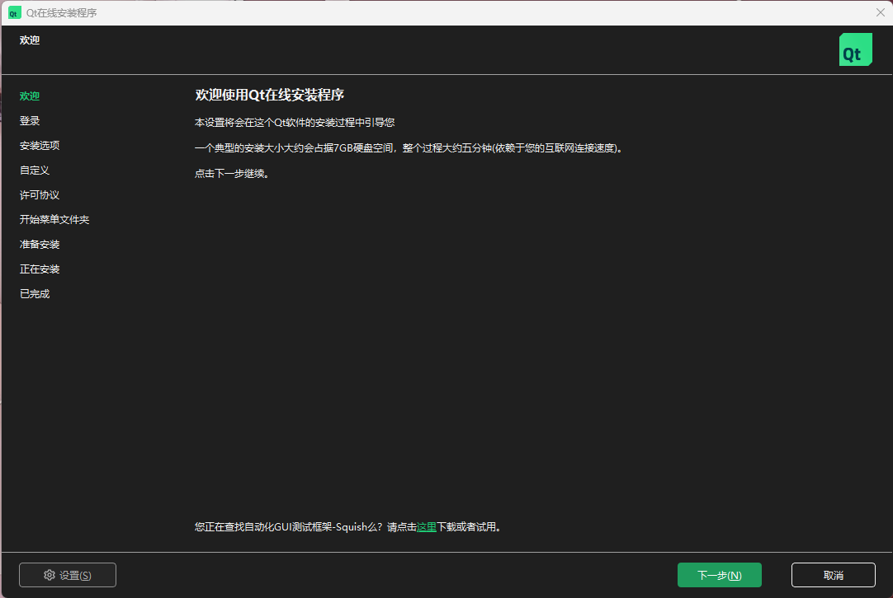

#### 2）登录账号

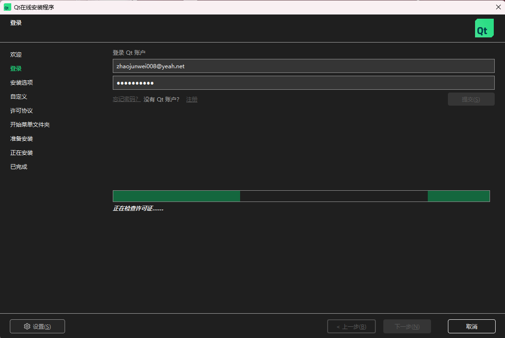

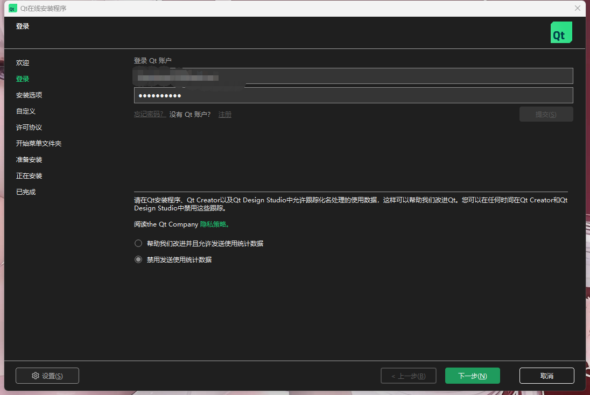

<span style="font-size: 15pt; color: red;text-align: left;display: block;"><b>勾选禁用发送使用统计数据</b></span>

#### 3）开源义务

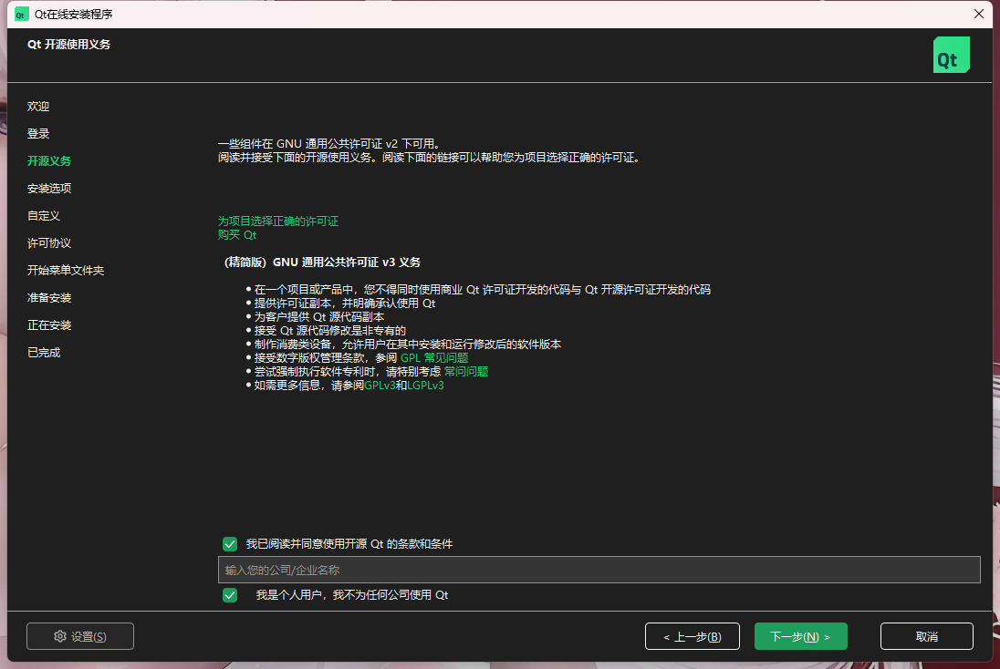

<span style="font-size: 15pt; color: red;text-align: left;display: block;"><b>勾选同意使用开源Qt的条款和条件<br>勾选个人用户，如果是公司用户，则不用勾选</b></span>

#### 4）安装选择

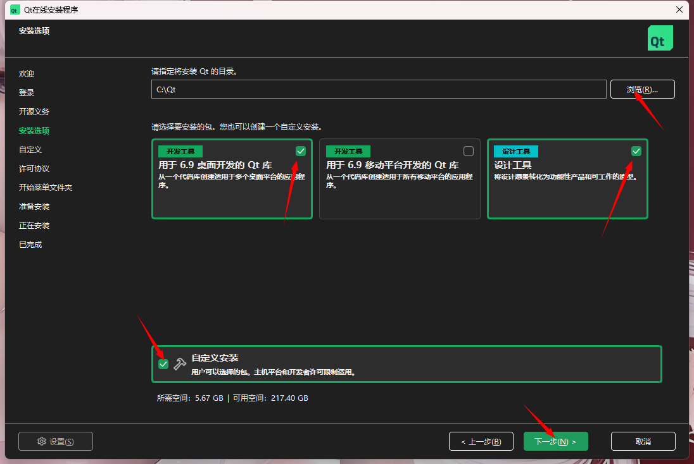

<span style="font-size: 15pt; color: red;text-align: left;display: block;"><b>
浏览选项，选择要安装的目录
<br>选择安装的组件，根据个人需要，一般Windows开发，选择开发工具和设计工具，中间的是用于移动平台开发的工具，选择这些会安装一些基本的组件
<br>也可以勾选最下面的自定义安装，后面自行选择要安装的组件
</b></span>

#### 5）自定义安装

早期5.15.2版本需要勾选Archive

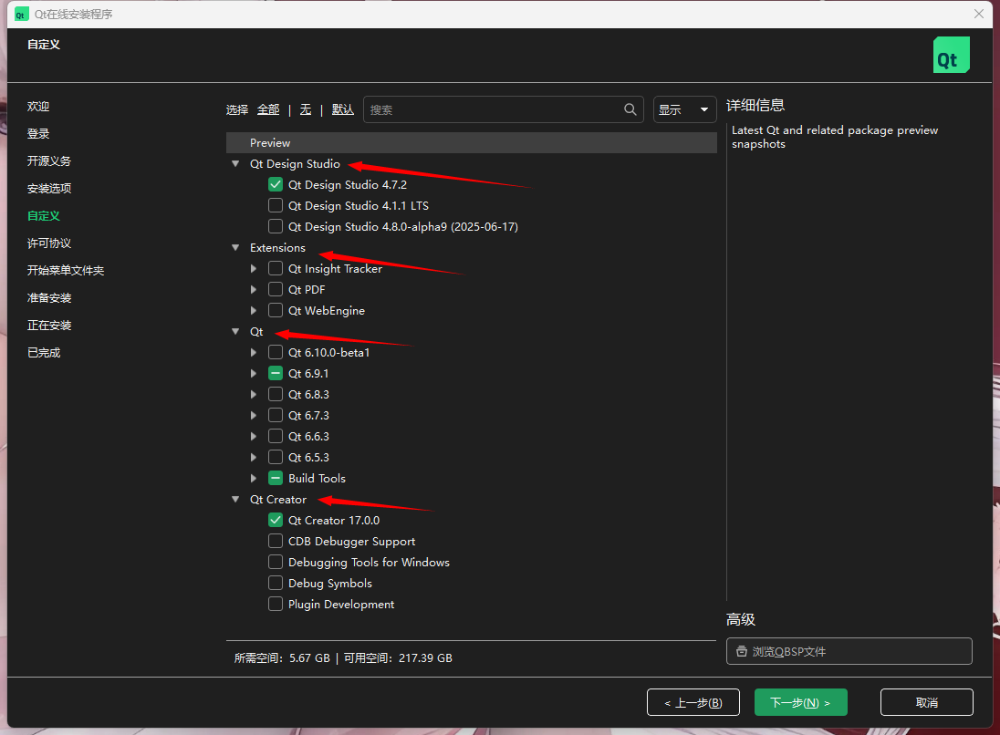

如图，可以自行选择相应的组件，Priview是预览版本，这个是联网查看的，有时候会有显示，有时候没有。

Extensions根据需要选择，一般是用不到的

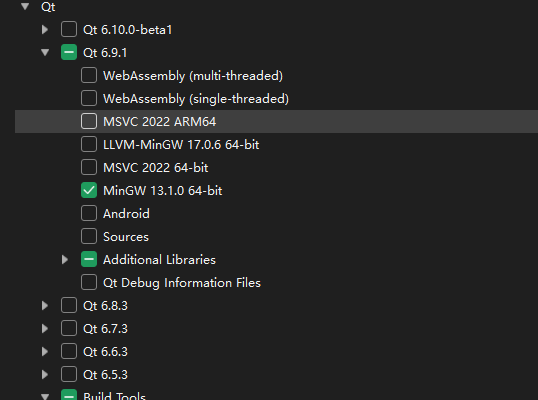

Qt自定义中包含Qt6.5到目前的几个版本，里面是默认的基础组件，可以自行选择添加，如果是和`Visual Studio`进行联合开发，这里需要自行勾选MSVC相关，笔者使用的是·，因此用`MinGw`足够了。

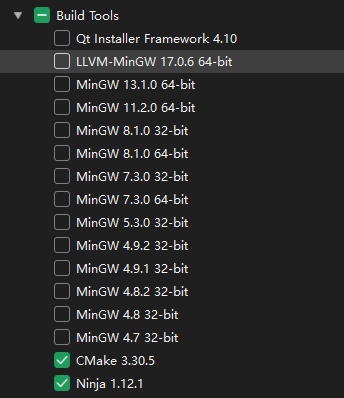

`Build Tools`中是各类插件，`CMake`和`Ninja`默认勾选的，还有其他版本的`MinGw`构建工具，这里的工具包含了Qt的各种组件，安装好之后，在安装目录的Tools目录下，每个版本的Qt都有默认绑定的`MinGw`版本，当前`6.9.1`绑定的`MinGw`是`13.1.0`版本

#### 6）许可协议

同意，然后下一步

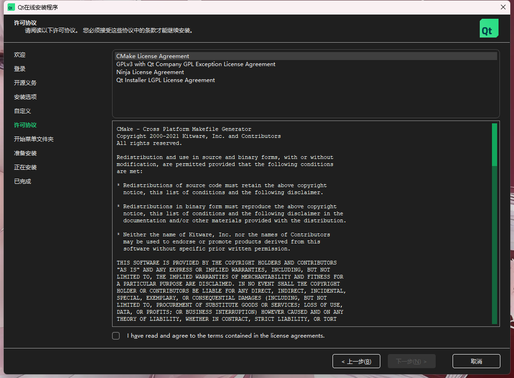

#### 7）开始菜单文件夹

直接下一步

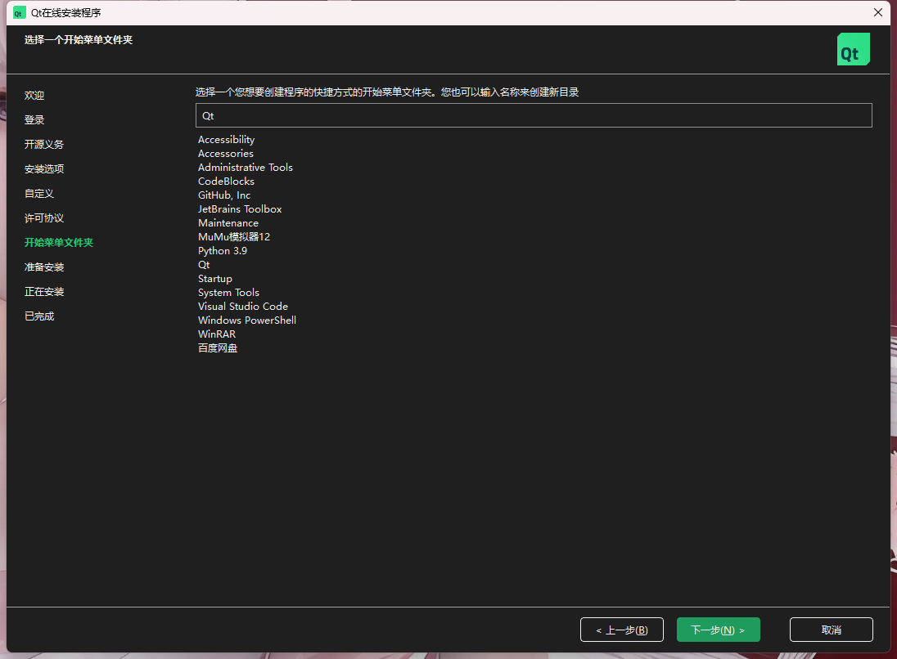

#### 8）安装过程

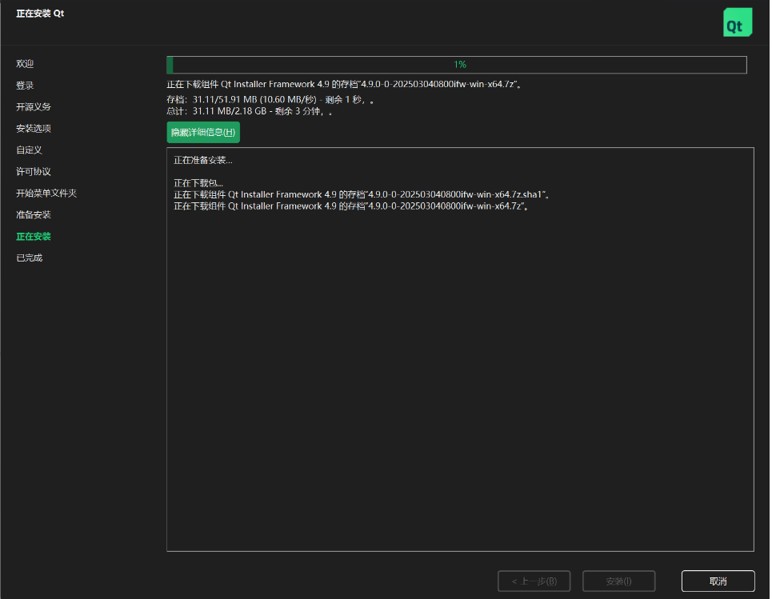

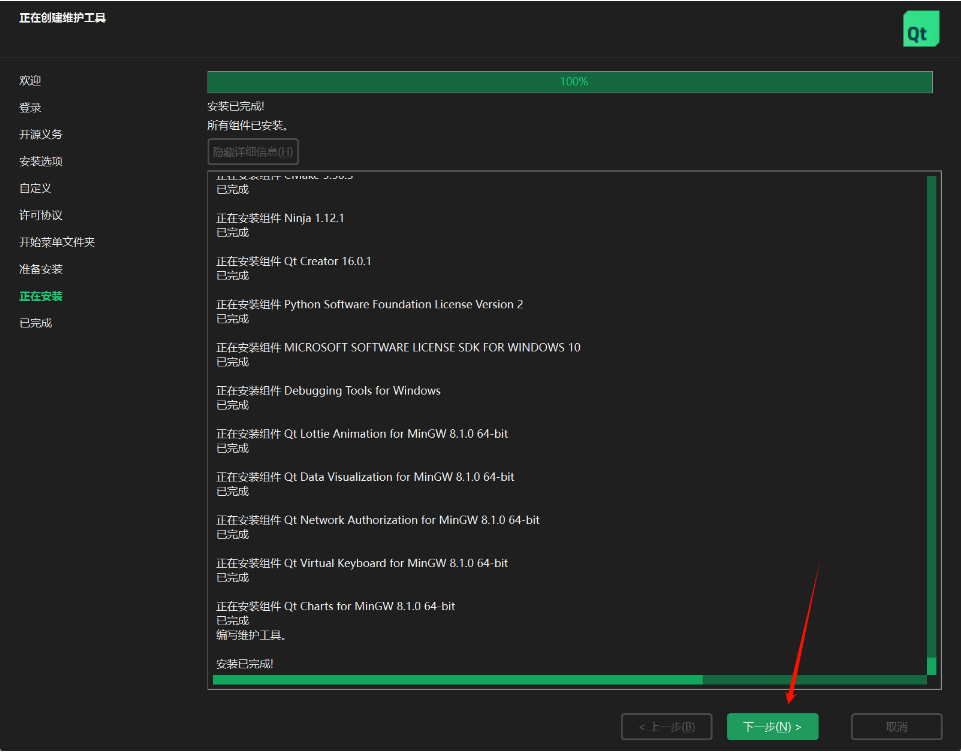

#### 9）安装完成

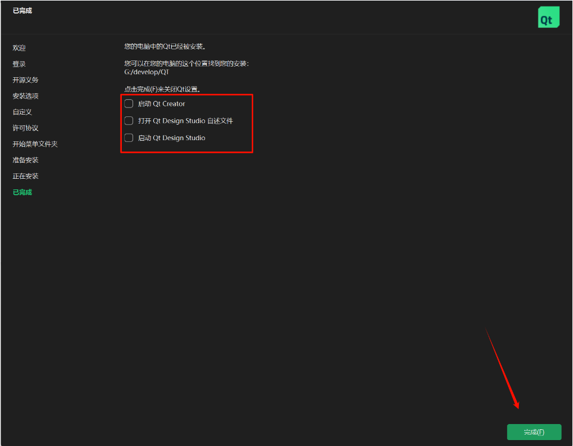

### 2.3 安装目录

D:\Qt

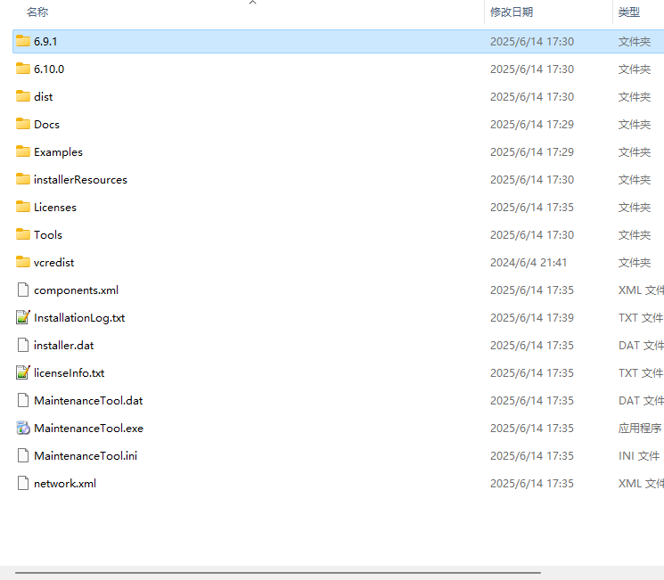

D:\Qt\6.9.1

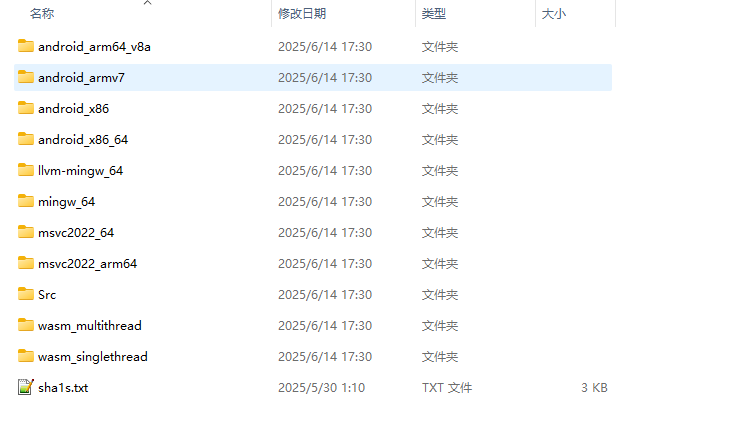

D:\Qt\Tools


## 三、配置环境变量

安装了几个版本的qt就配几个环境变量,一个版本有两个路径要配置,版本号文件夹和Tools文件夹下各有一个

MSVC安装了也要配置

注意,之前安装了mingw的最好将它放在下面，因为默认读取的时候是安装顺序读的，例如：如果不指定gcc.exe的目录，默认用的是第一个找到的


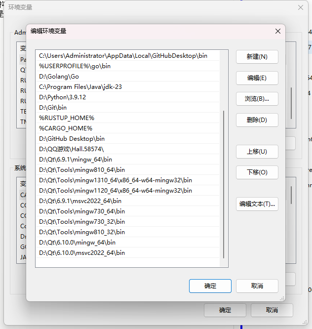

