# Qt下载说明

官网：[https://www.qt.io/zh-cn/download-dev](https://www.qt.io/zh-cn/download-dev)

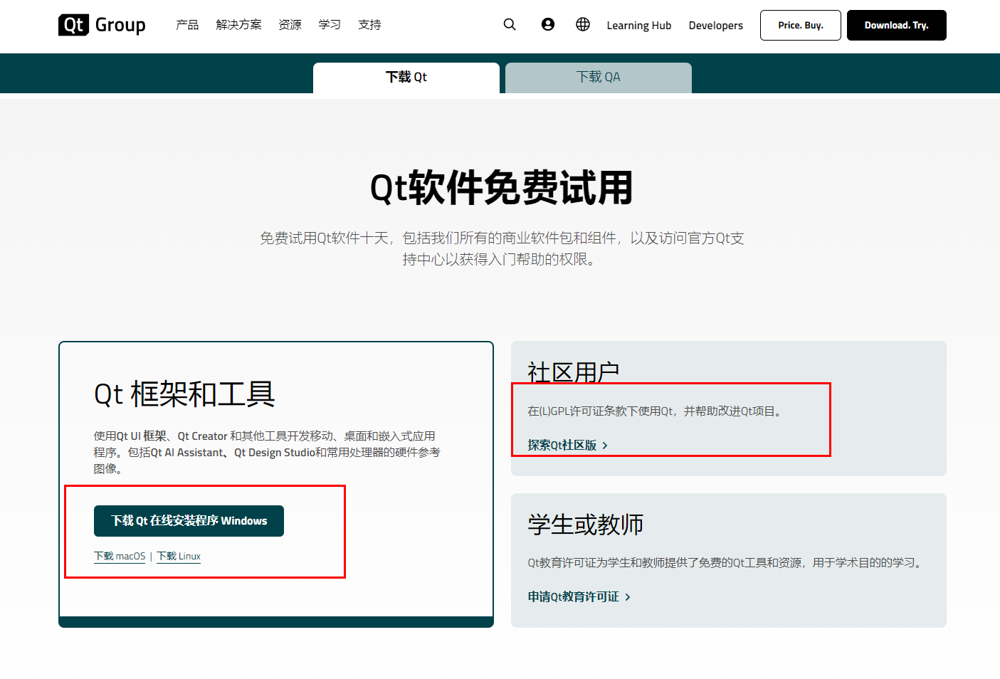

有License，可以选择左侧商业版，如果没有License，可以选择下载社区版本

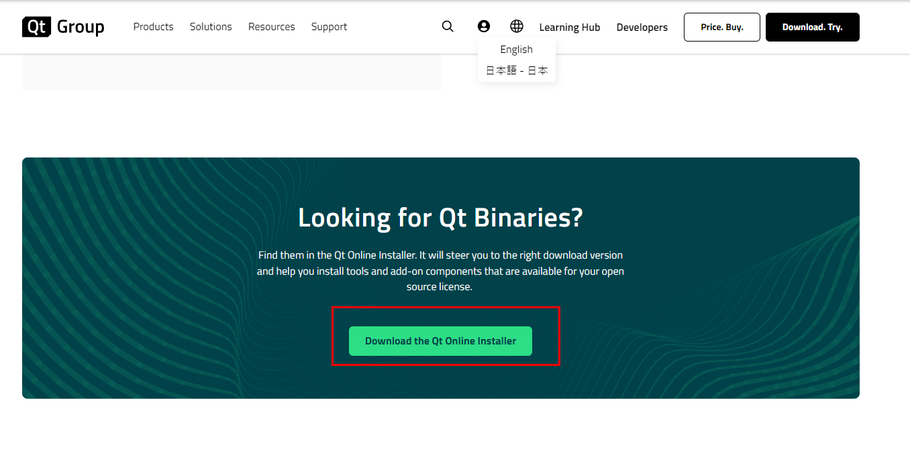

使用Online安装包，在下载的过程中会连接网络，下载相关包，进行安装。安装使用的镜像网站是默认的 [http://download.qt.io/static/mirrorlist/](http://download.qt.io/static/mirrorlist/) 这个地址比较慢，有时候安装到一半就停了，下面有几个其他的镜像，可以选用：

- <b>中国科学技术大学：</b>[http://mirrors.ustc.edu.cn/qtproject/](http://mirrors.ustc.edu.cn/qtproject/)
- <b>清华大学：</b>[https://mirrors.tuna.tsinghua.edu.cn/qt/](https://mirrors.tuna.tsinghua.edu.cn/qt/)
- <b>北京理工大学：</b>[http://mirror.bit.edu.cn/qtproject/](http://mirror.bit.edu.cn/qtproject/)
- <b>中国互联网络信息中心：</b>[https://mirrors.cnnic.cn/qt/](https://mirrors.cnnic.cn/qt/)
- <b>南京大学：</b>[https://mirror.nju.edu.cn/qt](https://mirror.nju.edu.cn/qt)
- <b>腾讯镜像：</b>[https://mirrors.cloud.tencent.com/qt/](https://mirrors.cloud.tencent.com/qt/)
- <b>阿里云镜像：</b>[https://mirrors.aliyun.com/qt/](https://mirrors.aliyun.com/qt/)
- <b>官网镜像列表：</b>[https://download.qt.io/static/mirrorlist/mirmon/](https://download.qt.io/static/mirrorlist/mirmon/)

## Qt6

[https://www.qt.io/zh-cn/product/qt6](https://www.qt.io/zh-cn/product/qt6)

Qt 6在线社区

拉到页面最下面，有下载按钮

## https://www.qt.io/offline-installers

[https://www.qt.io/offline-installers](https://www.qt.io/offline-installers)

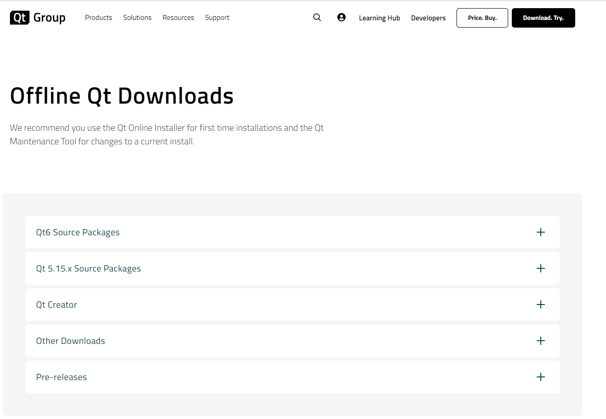

## 官网资源下载站

Qt 官网有一个专门的资源下载网站，所有的开发环境和相关工具都可以从这里下载，具体地址是：http://download.qt.io/

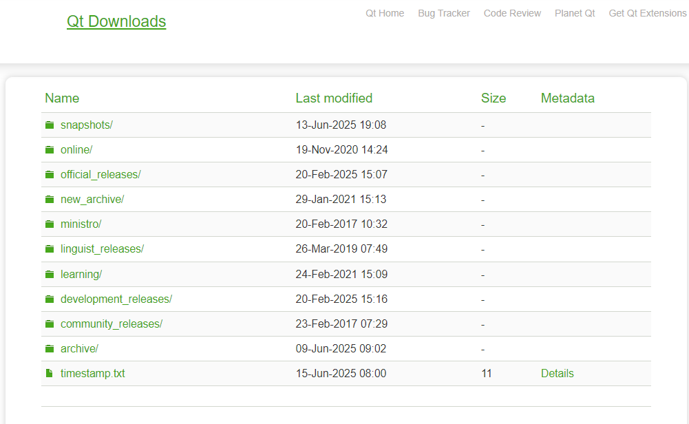

目录结构说明

| 目录 | 说明 |
| --- | --- |
| snapshots | 预览版，最新的开发测试中的 Qt 库和开发工具。 |
| online | Qt 在线安装源。 |
| official_releases | 正式发布版，是与开发版相对的稳定版 Qt 库和开发工具（可以下载Qt开发环境和源代码）。 |
| archive | 各种 Qt 开发工具安装包，新旧都有（可以下载 Qt 开发环境和源代码）。 |
| new_archive | 各种 Qt 开发工具安装包，新版本（可以下载 Qt 开发环境和源代码， 看命名是这样，我没打开）。 |
| ministro | 迷你版，目前是针对 Android 的版本。 |
| linguist_releases | 发行管理 |
| learning | 有学习 Qt 的文档教程和示范视频。 |
| development_releases | 开发版，有新的和旧的不稳定版本，在 Qt 开发过程中的非正式版本。 |
| community_releases | 社区定制的 Qt 库，Tizen 版 Qt 以及 Qt 附加源码包。 |

archive 和 official_releases 两个目录都有最新的 Qt 开发环境安装包，new_archive目录我这边打开失败。

### archive

点击进入 archive 目录，会看到如下子目录：

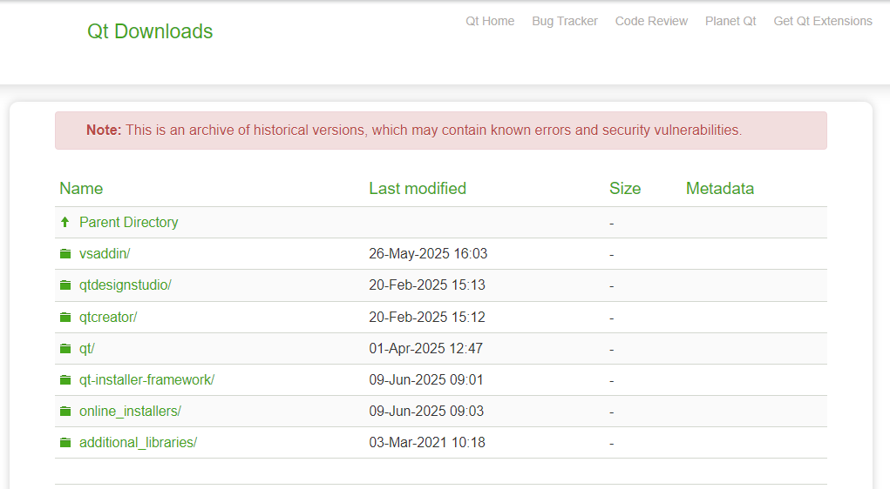

| 目录 | 说明 |
| --- | --- |
| vsaddin | 这是 Qt 针对 Visual Studio 集成的插件。 |
| qtdesignstudio | 存放与 Qt Design Studio 相关的资源。Qt Design Studio 是 Qt 提供的用于 UI/UX 设计的工具 |
| qtcreator | 这是 Qt 官方的集成开发工具，但是 qtcreator 本身是个空壳，它没有编译套件和 Qt 开发库。  除了老版本的 Qt 4 需要手动下载 qtcreator、编译套件、Qt 开发库进行搭配之外，一般用不到。Qt5/6 有专门的大安装包，里面包含开发需要的东西，并且能自动配置好。 |
| qt | 这是 Qt 开发环境的下载目录，Qt5/6 的大安装包就在这里面。 |
| qt-installer-framework | Qt 官方出品的一款功能强大的打包工具，可以满足我们日常使用中大部分需求. |
| online_installers | 在线安装器，国内用户不建议使用，在线安装是龟速，还经常断线。 |
| additional_libraries | Qt附加库，NetWorkAuth、Qt 3D |

### official_releases

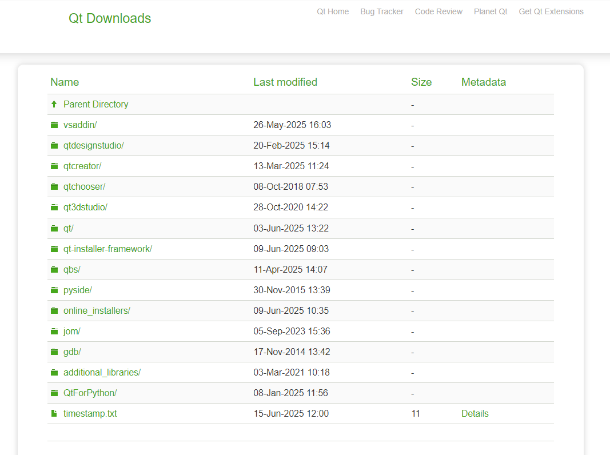

official_releases 目录内容如下：

| 目录 | 说明 |
| --- | --- |
| vsaddin | 包含 Visual Studio 的 Qt 插件安装包，帮助开发者在 Visual Studio 中进行 Qt 项目的创建、编辑和调试。这是 Qt 针对 Visual Studio 集成的插件。 |
| qtdesignstudio | 存放与 Qt Design Studio 相关的资源。Qt Design Studio 是 Qt 提供的用于 UI/UX 设计的工具 |
| qtcreator | 这是 Qt 官方的集成开发工具，但是 qtcreator 本身是个空壳，它没有编译套件和 Qt 开发库。  除了老版本的 Qt 4 需要手动下载 qtcreator、编译套件、Qt 开发库进行搭配之外，一般用不到。|
| qtchooser | 用于管理不同 Qt 版本的工具 |
| qt3dstudio | 存放与 Qt 3D Studio 相关的资源。Qt 3D Studio 是 Qt 用于创建 3D 用户界面和交互式内容的工具。|
| qt | 通常包含了Qt的各个官方发布版本。用户可以根据需要下载特定版本的Qt安装包。 |
| qt-installer-framework | 包含 Qt Installer Framework 的相关文件。Qt Installer Framework 是 Qt 提供的一个用于创建自定义安装程序的框架，允许开发者为自己的 Qt 应用程序创建专业的安装包。 |
| qbs | qbs（Qt Build Suite）是 Qt 提供的构建工具，用于自动化构建过程。 |
| pyside | 存放与 PySide 相关的资源。PySide 是 Qt 的 Python 绑定，允许开发者使用 Python 语言来开发 Qt 应用程序。 |
| online_installers | 在线安装器，国内用户不建议使用，在线安装是龟速，还经常断线。 |
| jom | jom 是 Qt 提供的一个类似于 nmake 的构建工具，但支持多线程构建，可以加速 Qt 项目的构建过程。 |
| gdb | 可能包含与 GDB（GNU 调试器）相关的文件，用于在 Qt 开发中进行调试。 |
| additional_libraries | 存放 Qt 的附加库，这些库可能不是 Qt 核心库的一部分，但可以扩展 Qt 的功能。|
| QtForPython | 与 PySide 相关，专门强调 Qt for Python（即 PySide）的资源。 |

### qt安装包

archive 目录和 official_releases 目录均有qt子目录，只是我目前没找到在线安装包

#### archive目录下的qt

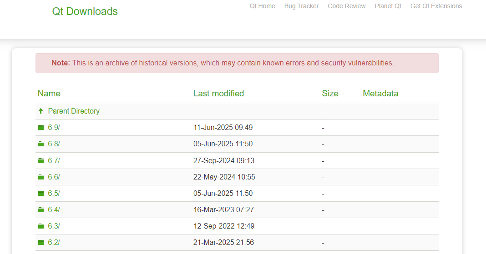

这个 qt 目录包含了所有的 Qt 版本，从 1.0 到目前的 6.9 。 中间有些版本不在了，之前是有的

#### official_releases目录下的qt

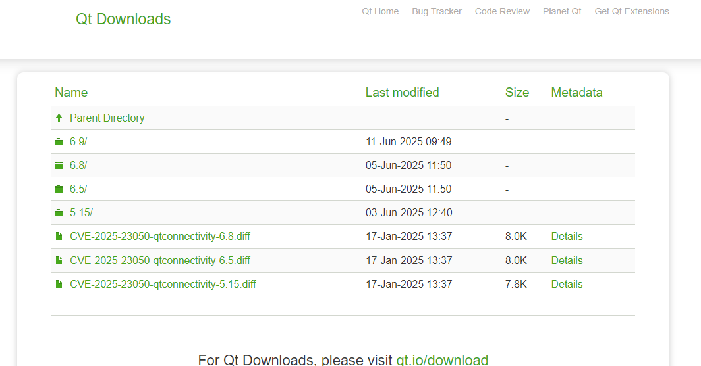

这里面只有几个版本

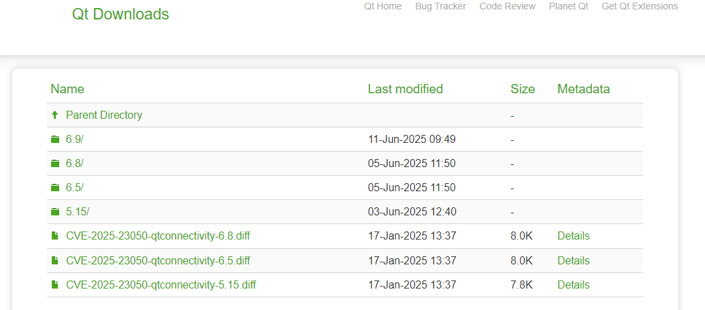

#### Qt子目录

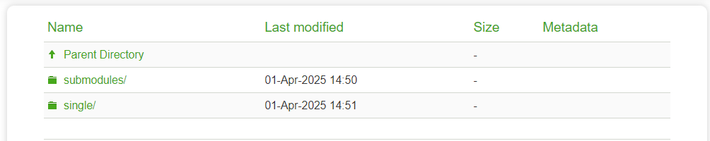

一般只有这俩子目录，可能跟权限有关系，有的可以看到相应版本的安装包

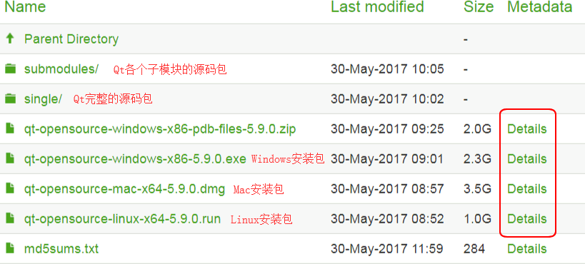

