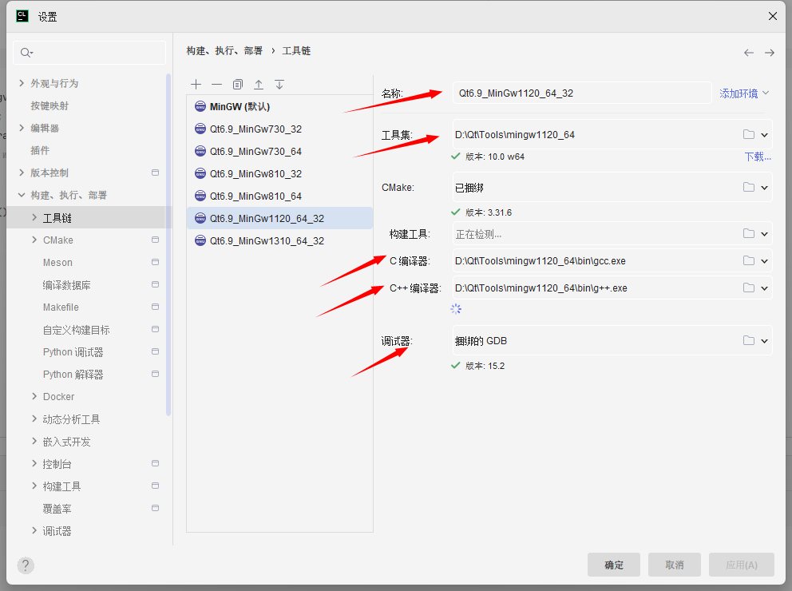
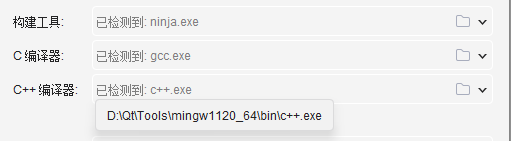
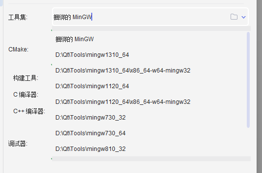
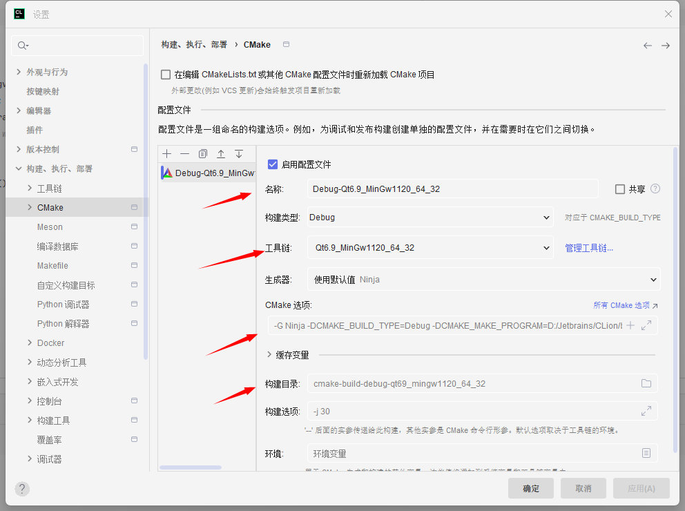
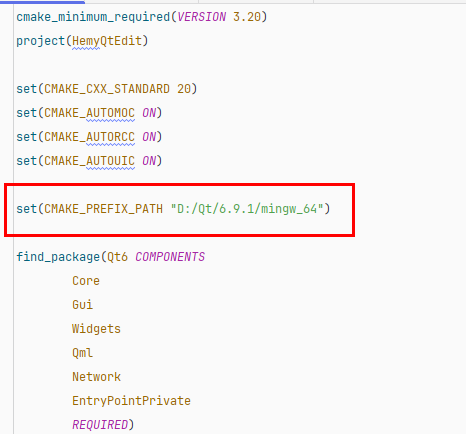
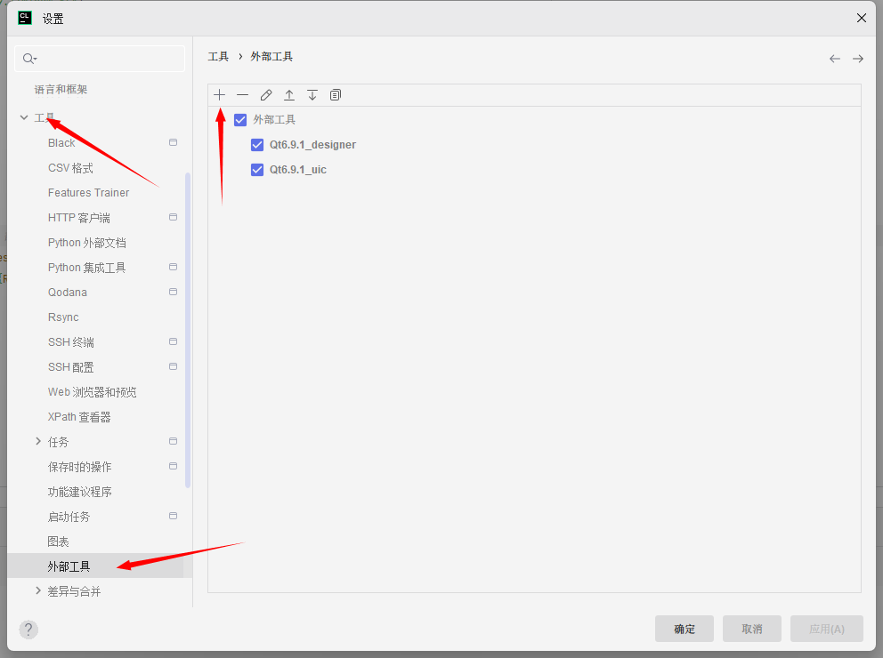
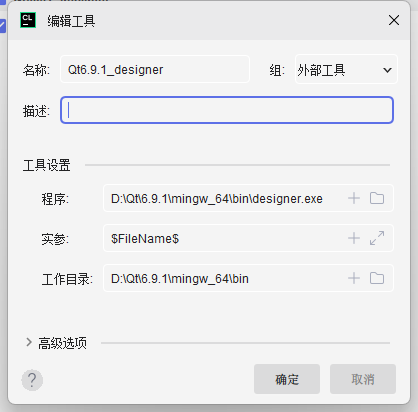
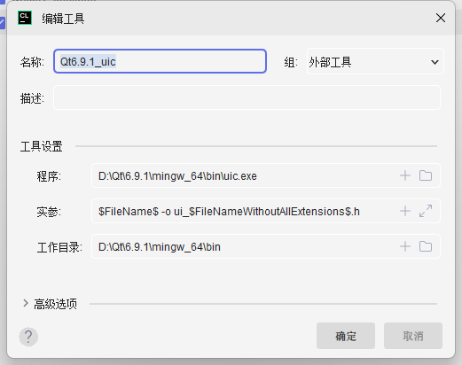

# Clion配置Qt开发环境

## ToolChains

根据自己的需要进行填写，cmake如果不想使用绑定的，可以自行设置

C编译器和C++编译器也可以自行设置，或者让cmake自行检测，这里我修改了下，因为cmake自行检测出来的C++编译器是`c++.exe`，鼠标悬停的时候可以看到CMAKE自行检测出来的工具。

Qt安装完毕，并设置环境变量后，工具集这里就能显示出来对应的工具集。

## CMake配置

一般会默认生成Debug和Release的配置，都是绑定的默认工具集，这里可以自行选择Qt的工具集。

后面的是各种参数设置，有的文章会说明要设置CMAKE_PREFIX_PATH，这个在这里可以在CMake选项中设置，也可以在CMakeList.txt中进行设置。

## 扩展工具配置

在Tools-->External Tools中设置外部工具，参数配置如下，仅供参考：

