# 创建Qml项目

## 一、新建项目

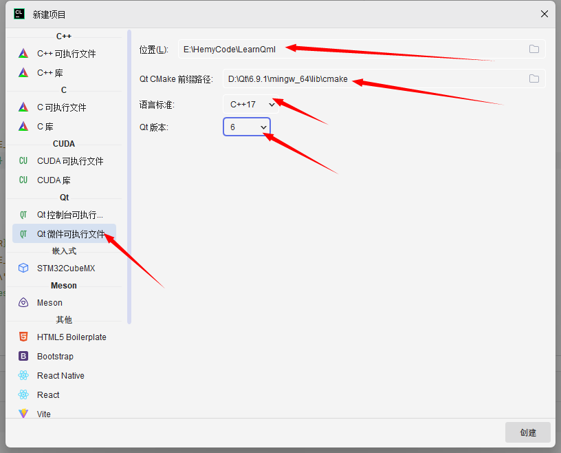

选择Qt微件可执行程序（`Qt Widgets Application`），`Qt CMake`前缀路径选择Qt安装目录下`lib/cmake`目录。

C++版本这里选择的是C++17

Qt版本选择的是Qt6

创建完毕之后会生成一个项目，项目本身是可以直接编译运行的。

从CMake配置中可以看到，这里使用的是`Clion`绑定的`MinGw`，各个`Clion`版本的不一样。这里建议用Qt版本匹配的`MinGw`


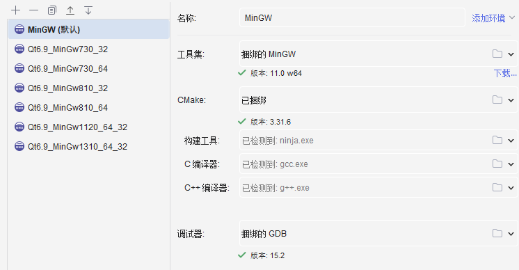


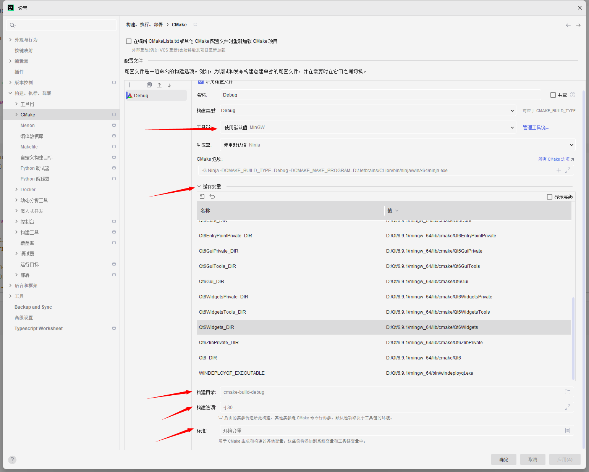

缓存变量是IDE自动生成的，我们一般不需要进行修改


## 二、更改为Qt匹配的MinGw

### 2.1 查看Qt绑定的MinGw版本

这个是最正确的方法

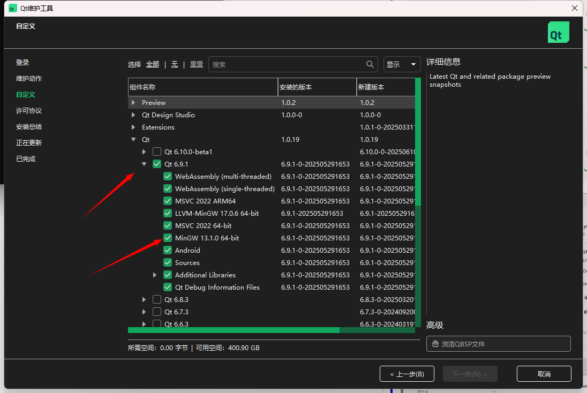

有的文档可能写着在安装目录bin下执行`g++ --version`查看，实际上这个是不准确的。这个命令运行的g++版本是我们在系统的环境变量里面设置的第一个`g++.exe`的版本，而不是Qt匹配`MinGw\bin`中的`g++.exe`，如：

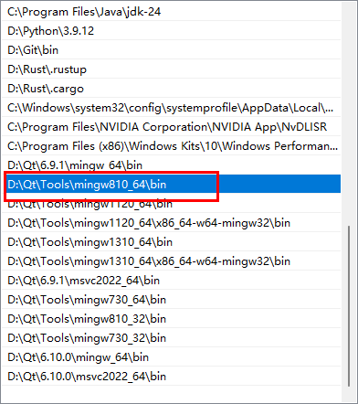

我当前的环境，第一个有g++.exe的路径是`D:\Qt\Tools\mingw810_64\bin`， 所以在cmd窗口执行 `g++ --version` 时，实际上是执行的`D:\Qt\Tools\mingw810_64\bin\g++.exe --version`

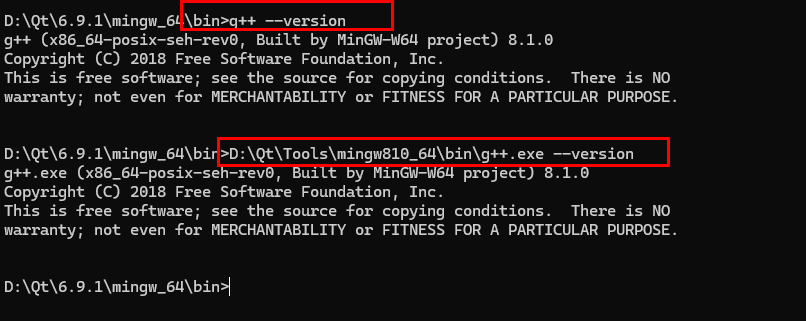

### 2.2 更改匹配MinGw

当前`Qt 6.9.1`版本匹配的MinGw是13.1版本，配置好`MinGw 13.1.0 64 bit`的工具链信息

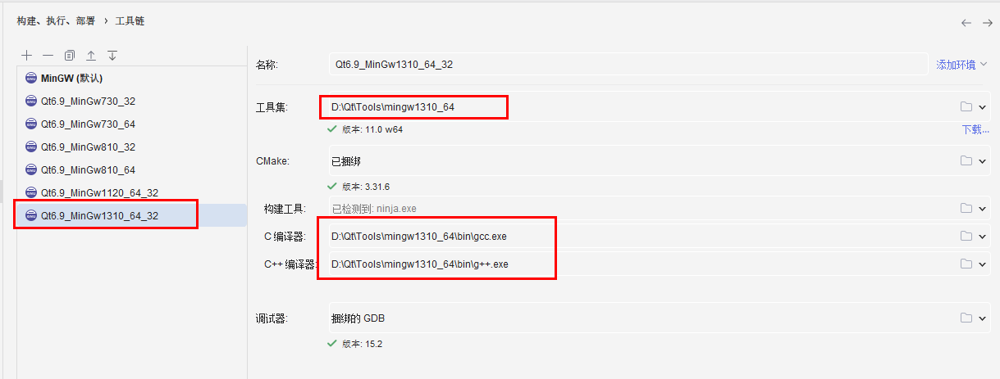

在CMake配置中选择刚才添加/配置的MinGw工具链

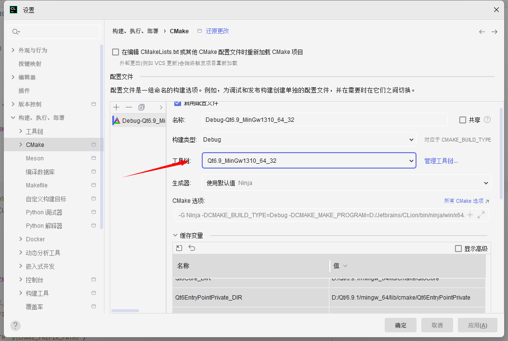

工具链配置完毕后，会在源码目录生成一个对应的cmake-build目录

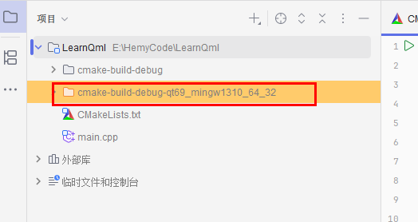

### 2.3 运行查看效果

默认的main.cpp如下：

```cpp
#include <QApplication>
#include <QPushButton>

int main(int argc, char* argv[])
{
    QApplication a(argc, argv);
    QPushButton button("Hello world!", nullptr);
    button.resize(200, 100);
    button.show();
    return QApplication::exec();
}
```

这里是用QApplication创建了一个窗口，窗口中创建了一个200*100的按钮，按钮显示的文字是“Hello world!”

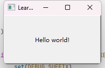

这里因为开始创建的是QWidgets的应用，所以用的都是QWidgets的接口。后面我们再介绍怎么修改为Qml的窗口。


## 三、配置Qml

### 3.1 创建目录

创建一个res或者resources目录，存放qml文件和qrc文件

创建一个src目录存放源文件

### 3.2 创建qml文件

在`res`目录中新建qml和qrc文件，也可以再自行创建子目录，比如`model1、model2、qml`等

#### HelloQml.qml

```qml
import QtQuick 2.15
import QtQuick.Window 2.15

Window {
    width: 400
    height: 300
    visible: true
    title: "CLion QML Demo"

    Rectangle {
        anchors.centerIn: parent
        width: 200
        height: 100
        color: "lightblue"
        radius: 10

        Text {
            anchors.centerIn: parent
            text: "Hello QML!"
            font.pixelSize: 24
        }
    }
}
```

#### resources.qrc

```xml
<RCC>
    <qresource prefix="/">
        <file>HelloQml.qml</file>
    </qresource>
</RCC>
```

### 3.2 配置CMakeList.txt

#### qt6_add_resources

在`CMakeList.txt`中，`add_executable`前增加资源文件加载，并修改`add_executable`


```cmake
set(RESOURCES res/resources.qrc)
qt6_add_resources(RES_SOURCES ${RESOURCES})

# 添加可执行文件
add_executable(${PROJECT_NAME}
        main.cpp
        # 后续可添加其他文件
        ${RESOURCES}
)
```

#### find_package

在find_package中增加qml，并且链接器增加qml


```cmake
# 查找Qt库（必须包含Core和Quick）
find_package(Qt6 COMPONENTS
        Core
        Quick
        Gui
        Widgets
        Qml
        REQUIRED)
```

`target_link_libraries`增加Qml，可以用`Qt::`，也可以用`Qt6::`

```cmake
# 链接Qt库
target_link_libraries(LearnQml
        Qt::Core
        Qt::Gui
        Qt::Quick
        Qt::Widgets
        Qt::Qml
)

```

### 3.3 后处理


```cmake
if (WIN32 AND NOT DEFINED CMAKE_TOOLCHAIN_FILE)
    set(DEBUG_SUFFIX)
    if (MSVC AND CMAKE_BUILD_TYPE MATCHES "Debug")
        set(DEBUG_SUFFIX "d")
    endif ()
    set(QT_INSTALL_PATH "${CMAKE_PREFIX_PATH}")
    if (NOT EXISTS "${QT_INSTALL_PATH}/bin")
        set(QT_INSTALL_PATH "${QT_INSTALL_PATH}/..")
        if (NOT EXISTS "${QT_INSTALL_PATH}/bin")
            set(QT_INSTALL_PATH "${QT_INSTALL_PATH}/..")
        endif ()
    endif ()
    if (EXISTS "${QT_INSTALL_PATH}/plugins/platforms/qwindows${DEBUG_SUFFIX}.dll")
        add_custom_command(TARGET ${PROJECT_NAME} POST_BUILD
                COMMAND ${CMAKE_COMMAND} -E make_directory
                "$<TARGET_FILE_DIR:${PROJECT_NAME}>/plugins/platforms/")
        add_custom_command(TARGET ${PROJECT_NAME} POST_BUILD
                COMMAND ${CMAKE_COMMAND} -E copy
                "${QT_INSTALL_PATH}/plugins/platforms/qwindows${DEBUG_SUFFIX}.dll"
                "$<TARGET_FILE_DIR:${PROJECT_NAME}>/plugins/platforms/")
    endif ()
    foreach (QT_LIB Core Gui Widgets Quick Qml)
        add_custom_command(TARGET ${PROJECT_NAME} POST_BUILD
                COMMAND ${CMAKE_COMMAND} -E copy
                "${QT_INSTALL_PATH}/bin/Qt6${QT_LIB}${DEBUG_SUFFIX}.dll"
                "$<TARGET_FILE_DIR:${PROJECT_NAME}>")
    endforeach (QT_LIB)
endif ()

```

这部分是默认生成的。

第一部分是设置`dll`文件后缀，默认是没有后缀，如果是`MSVC 并且Debug`场景，后缀被设置为d，即dll文件都是`xxxxd.dll、Qt6xxxxd.dll、Libxxxd.dll`等

第二部分，是找到QT_INSTALL_PATH这个值，因为后面要拷贝`qwindows.dll或qwindowsd.dll`，这个文件是在QT的安装路径下的.

第三部分是拷贝，将`qwindows.dll或qwindowsd.dll`拷贝到工程`cmake-build-xxx`目录下的`/plugins/platforms/`下。

`foreach (QT_LIB Core Gui Widgets)`这部分是遍历找到依赖的Qt6的dll文件，然后拷贝到`cmake-build-xxx`目录下，注意这里需要修改下，因为引入了新的dll库，这里需要进行添加，方便拷贝

### 3.4 后处理部署

在后处理中，还需要增加部署动作，否则工程是运行不了的。


```cmake
if (WIN32 AND NOT DEFINED CMAKE_TOOLCHAIN_FILE)
    message("QT_INSTALL_PATH ${QT_INSTALL_PATH}")
    # 查找windeployqt
    find_program(WINDEPLOYQT_EXE windeployqt
            PATHS "${QT_INSTALL_PATH}/bin"
            DOC "Qt deployment tool"
            REQUIRED
    )

    # 添加部署命令
    message("CMAKE_CURRENT_SOURCE_DIR ${CMAKE_CURRENT_SOURCE_DIR}")
    add_custom_command(TARGET ${PROJECT_NAME} POST_BUILD
            COMMAND "${WINDEPLOYQT_EXE}"
            --verbose 1
            --no-compiler-runtime
            --no-translations
            --dir "$<TARGET_FILE_DIR:${PROJECT_NAME}>"
            --qmldir "${CMAKE_CURRENT_SOURCE_DIR}/res"
            "$<TARGET_FILE:${PROJECT_NAME}>"
            COMMENT "Deploying Qt dependencies..."
    )

    # 复制QML文件到部署目录
    file(GLOB QML_FILES "res/*.qml")
    add_custom_command(TARGET ${PROJECT_NAME} POST_BUILD
            COMMAND ${CMAKE_COMMAND} -E copy
            ${QML_FILES}
            "${CMAKE_CURRENT_BINARY_DIR}"
            COMMENT "Copying QML files..."
    )
endif ()
```

先是找到windeployqt，然后用这个工具进行windows部署，这个是qt的工具，部署完毕后，需要的dll库就会生成到指定目录中。

最后是将qml文件拷贝到部署目录中

## 四、修改main.cpp

修改main.cpp，引入qml文件

### 4.1 修改前

```cpp
#include <QApplication>
#include <QPushButton>

int main(int argc, char* argv[])
{
    QApplication a(argc, argv);
    QPushButton button("Hello world!", nullptr);
    button.resize(200, 100);
    button.show();
    return QApplication::exec();
}
```

### 4.2 修改后

```cpp
#include <QGuiApplication>
#include <QQmlApplicationEngine>

int main(int argc, char *argv[]) {
    QGuiApplication app(argc, argv);

    QQmlApplicationEngine engine;
    // 加载QML文件（确保路径正确）
    //engine.load(QUrl("qrc:/main.qml"));  // 或使用绝对路径
    // 改用绝对路径（调试用）
    engine.load(QUrl::fromLocalFile("main.qml"));

    if (engine.rootObjects().isEmpty())
        return -1;

    return app.exec();
}
```

去掉了`QApplication`，引用`QGuiApplication`和`QQmlApplicationEngine`，这个就是单纯的加载qml，如果你想做复杂一点，可以考虑通过`QApplication`来拉起Qml，这个我们后面再探讨。

### 4.3 运行效果

效果如下：

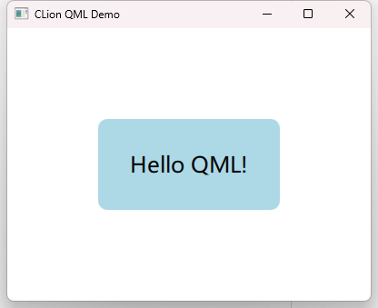

