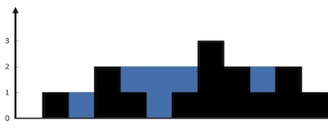

# 接雨水

<span style="color:rgb(100,180,246);font-size:11pt">最后更新：2023-12-08</span>

链接：https://leetcode.cn/problems/trapping-rain-water/description/?envType=study-plan-v2&envId=top-100-liked

<span style="color:rgb(255,0,0);font-weight:bold">这个是用AI做的题，感觉要失业了！！！</span>

!!! Question "题目描述"
    给定 `n` 个非负整数表示每个宽度为 1 的柱子的高度图，计算按此排列的柱子，下雨之后能接多少雨水。

!!! example "题目示例"
    === "示例 1："
        

        **输入：** `height = [0,1,0,2,1,0,1,3,2,1,2,1]`

        **输出：** 6

        **解释：** 上面是由数组 `[0,1,0,2,1,0,1,3,2,1,2,1]` 表示的高度图，在这种情况下，可以接 6 个单位的雨水（蓝色部分表示雨水）。

    === "示例 2："

        **输入：** `height = [4,2,0,3,2,5]`

        **输出：** 9


!!! tip "提示："
    $n == height.length$

    $1 <= n <= 2 * 10^4$
    
    $0 <= height[i] <= 10^5$

=== "AI生成C代码"

    ```c
    #include <stdio.h>
    #include <stdlib.h>
    #include <string.h>
    #include "uthash.h"
    #include "math.h"

    int trap(int* height, int heightSize) {
        if (heightSize <= 1) {
            return 0;
        }

        int leftMax[heightSize], rightMax[heightSize];
        leftMax[0] = height[0];
        rightMax[heightSize - 1] = height[heightSize - 1];
        for (int i = 1; i < heightSize; i++) {
            leftMax[i] = fmax(leftMax[i - 1], height[i]);
        }
        for (int i = heightSize - 2; i >= 0; i--) {
            rightMax[i] = fmax(rightMax[i + 1], height[i]);
        }

        int result = 0;
        for (int i = 0; i < heightSize; i++) {
            int minHeight = fmin(leftMax[i], rightMax[i]);
            result += (minHeight - height[i]);
        }

        return result;
    }
    ```

=== "AI生成Go代码"

    ```go
    func trap(height []int) int {
        if len(height) <= 1 {
            return 0
        }

        leftMax := make([]int, len(height))
        rightMax := make([]int, len(height))
        leftMax[0] = height[0]
        rightMax[len(height)-1] = height[len(height)-1]
        for i := 1; i < len(height); i++ {
            leftMax[i] = max(leftMax[i-1], height[i])
        }
        for i := len(height) - 2; i >= 0; i-- {
            rightMax[i] = max(rightMax[i+1], height[i])
        }

        var result int
        for i := 0; i < len(height); i++ {
            minHeight := min(leftMax[i], rightMax[i])
            result += (minHeight - height[i])
        }

        return result
    }

    func max(a, b int) int {
        if a > b {
            return a
        }
        return b
    }

    func min(a, b int) int {
        if a < b {
            return a
        }
        return b
    }
    ```

=== "AI生成Python代码"

    ```python
    class Solution(object):
        def trap(self, height):
            if len(height) <= 1:
                return 0

            left_max = [0] * len(height)
            right_max = [0] * len(height)
            left_max[0] = height[0]
            right_max[len(height) - 1] = height[len(height) - 1]
            for i in range(1, len(height)):
                left_max[i] = max(left_max[i-1], height[i])
            for i in range(len(height) - 2, -1, -1):
                right_max[i] = max(right_max[i+1], height[i])

            result = 0
            for i in range(len(height)):
                min_height = min(left_max[i], right_max[i])
                result += (min_height - height[i])

            return result
    ```

=== "AI生成C++代码"

    ```cpp
    class Solution {
    public:
        int trap(vector<int>& height) {
            if (height.size() <= 1) {
                return 0;
            }

            vector<int> left_max(height.size(), 0);
            vector<int> right_max(height.size(), 0);
            left_max[0] = height[0];
            right_max[height.size() - 1] = height[height.size() - 1];
            for (int i = 1; i < height.size(); i++) {
                left_max[i] = max(left_max[i - 1], height[i]);
            }
            for (int i = height.size() - 2; i >= 0; i--) {
                right_max[i] = max(right_max[i + 1], height[i]);
            }

            int result = 0;
            for (int i = 0; i < height.size(); i++) {
                int min_height = min(left_max[i], right_max[i]);
                result += (min_height - height[i]);
            }

            return result;
        }
    };
    ```