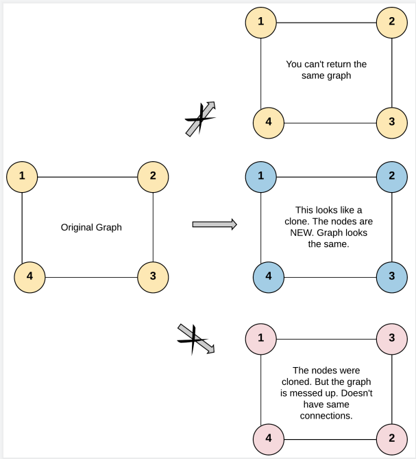
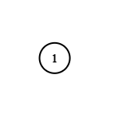

# 133. 克隆图

<span style="color:rgb(100,180,246);font-size:11pt">最后更新：2024-05-10-22</span>

链接：https://leetcode.cn/problems/clone-graph/description/

!!! Question "题目描述"
    
    给你无向 连通 图中一个节点的引用，请你返回该图的 深拷贝（克隆）。

    图中的每个节点都包含它的值 `val（int）` 和其邻居的列表（`list[Node]`）。

        class Node {
            public int val;
            public List<Node> neighbors;
        }
    

    **测试用例格式**：

    简单起见，每个节点的值都和它的索引相同。例如，第一个节点值为 1（val = 1），第二个节点值为 2（val = 2），以此类推。该图在测试用例中使用邻接列表表示。

    **邻接列表** 是用于表示有限图的无序列表的集合。每个列表都描述了图中节点的邻居集。

    给定节点将始终是图中的第一个节点（值为 1）。你必须将 **给定节点的拷贝** 作为对克隆图的引用返回。

!!! example "题目示例"

    === "示例 1："
    
        

        **输入：** `adjList = [[2,4],[1,3],[2,4],[1,3]]`

        **输出：** `[[2,4],[1,3],[2,4],[1,3]]`

        **解释：** 
        
            图中有 4 个节点。
            节点 1 的值是 1，它有两个邻居：节点 2 和 4 。
            节点 2 的值是 2，它有两个邻居：节点 1 和 3 。
            节点 3 的值是 3，它有两个邻居：节点 2 和 4 。
            节点 4 的值是 4，它有两个邻居：节点 1 和 3 。

    === "示例 2："

        
    
        **输入：** `adjList = [[]]`

        **输出：** `[[]]`

        **解释：** 输入包含一个空列表。该图仅仅只有一个值为 1 的节点，它没有任何邻居。

    === "示例 3："

        **输入：** `adjList = []`

        **输出：** `[]`

        **解释：** 这个图是空的，它不含任何节点。

!!! tip "提示："

    - 这张图中的节点数在 `[0, 100]` 之间。
    - `1 <= Node.val <= 100`
    - 每个节点值 Node.val 都是唯一的，
    - 图中没有重复的边，也没有自环。
    - 图是连通图，你可以从给定节点访问到所有节点。


!!! note "解题思路"

    参考官方题解
    
    之前自己写的时候，老是单个用例没问题，提交就有问题
    
    后来看了下，因为我用的visit是全局变量，每次进行新的计算时没有清零。
    
    因为是个图，所以函数自身进行递归调用的时候，没法判断s->val = 1的是新输入的第一个还是正在处理节点的某个节点的相邻节点。
    
    因此只能在外层加一个调用，每次新输入的时候，先清理下visit的数据。


=== "C"

    ```c
    #define MAX_MAP_NUM 101

    #define GRAPH_NODE_INIT(node) \
        (node)->val = 0;\
        (node)->numNeighbors = 0;\
        (node)->neighbors = NULL;

    #define GRAPH_NODE_COPY(dst,src) \
        (dst)->val = (src)->val;\
        (dst)->numNeighbors = (src)->numNeighbors;

    struct Node* visit[MAX_MAP_NUM] = {NULL};

    struct Node *cloneGraphNode(struct Node *s)
    {
        if (s == NULL) {
            return NULL;
        }

        struct Node *cloneNode = (struct Node *)malloc(sizeof(struct Node));
        if (cloneNode == NULL) {
            return NULL;
        }
        GRAPH_NODE_INIT(cloneNode);

        // 是否被访问过
        if (visit[s->val] != NULL) {
            return visit[s->val];
        }

        // 标记节点访问记录
        GRAPH_NODE_COPY(cloneNode, s);
        visit[s->val] = cloneNode;

        // 没有相连的顶点
        if (cloneNode->numNeighbors == 0) {
            cloneNode->neighbors = NULL;
            return cloneNode;
        }

        // 遍历该节点的邻居并更新克隆节点的邻居列表
        cloneNode->neighbors = (struct Node**)malloc(sizeof(struct Node*) * cloneNode->numNeighbors);
        for (int i = 0; i < cloneNode->numNeighbors; i++) {
            cloneNode->neighbors[i] = cloneGraphNode(s->neighbors[i]);
        }
        return cloneNode;
    }

    struct Node *cloneGraph(struct Node *s)
    {
        // 全局变量，防止上一次的数据残留，每次都清理
        memset(visit, 0, sizeof(struct Node*) * MAX_MAP_NUM);
        return cloneGraphNode(s);
    }
    ```

=== "Go"

    ```go
    ```

