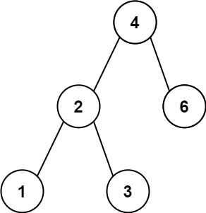
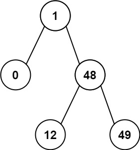

# 530. 二叉搜索树的最小绝对差

<span style="color:rgb(100,180,246);font-size:11pt">最后更新：2024-05-10-22</span>

链接：https://leetcode.cn/problems/minimum-absolute-difference-in-bst/description/

!!! Question "题目描述"
    
    给你一个二叉搜索树的根节点 root ，返回 树中任意两不同节点值之间的最小差值 。

    差值是一个正数，其数值等于两值之差的绝对值。

!!! example "题目示例"

    === "示例 1："
        
        

        **输入：** `root = [4,2,6,1,3]`

        **输出：** `1`

    === "示例 2："
    
        

        **输入：** `root = [1,0,48,null,null,12,49]`

        **输出：** `1`

!!! tip "提示："
    - 注意：本题与 783 https://leetcode-cn.com/problems/minimum-distance-between-bst-nodes/ 相同
    - 树中节点的数目范围是$[2, 10^4]$
    - $0 <= Node.val <= 10^5$


!!! note "解题思路"
    
    首先要想到二叉搜索树的特点，对于所有node，node->left以及子树的值都比node值小，node->right以及子树的值都比node值大。
    对于node节点，满足题目条件的只有以下几种情况：

    - `node->left` 或者 `node->right` 就是尾节点，后面再没有子树了，那么以node为根节点的二叉搜索树，满足题目条件的只有两个值，最最小即可；
        - `node->val - node->left->val`
        - `node->right->val - node->val`
    - `node->left` 不是尾节点，根据二叉树的特点，与node差值最小的值只能是left子树中最右端的值，即：`node->left->right.....->right->val`;
    - 同样的，对于右侧子节点也是一样，与node差值最小的应该是`node->right->left.........->left->val`


=== "C"

    ```c
    /**
    * Definition for a binary tree node.
    * struct TreeNode {
    *     int val;
    *     struct TreeNode *left;
    *     struct TreeNode *right;
    * };
    */
    
    // 二叉搜索树，左侧都比root小，右侧都比root大
    // 找差值最小的，对root，就是找left->right或者right->left
    int getMinimumDifference(struct TreeNode* root)
    {
        int tmp = INT_MAX;
        int left = INT_MAX;
        int right = INT_MAX;
        if (root == NULL) {
            return 0;
        }

        if (root->left != NULL) {
            struct TreeNode* node = root->left;
            while (node->right != NULL) {
                node = node->right;
            }
            left = root->val - node->val;
            tmp = getMinimumDifference(root->left);
            if (tmp < left) {
                left = tmp; 
            }
        }

        if (root->right != NULL) {
            struct TreeNode* node = root->right;
            while (node->left != NULL) {
                node = node->left;
            }
            right = node->val - root->val;
            tmp = getMinimumDifference(root->right);
            if (tmp < right) {
                right = tmp; 
            }
        }

        if (left > right) {
            return right;
        }

        return left;
    }
    ```

=== "Golang暴力解法"

    ```go
    ```

