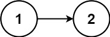

# 回文链表

<span style="color:rgb(100,180,246);font-size:11pt">最后更新：2023-12-02</span>

链接：https://leetcode.cn/leetbook/read/top-interview-questions-easy/xnv1oc/

!!! Question "题目描述"

    给你一个单链表的头节点 `head` ，请你判断该链表是否为回文链表。如果是，返回 `true` ；否则，返回 `false` 。

!!! example "题目示例"

    === "示例 1："
        

        **输入：** `head = [1,2,2,1]`

        **输出：** `true`

    === "示例 2："
        

        **输入：** `head = [1,2]`

        **输出：** `false`


!!! tip "提示："
    - 链表中节点数目在范围 $[1, 10^5]$ 内
    - $0 <= Node.val <= 9$

!!! note "进阶"

    你能否用 $O(n)$ 时间复杂度和 $O(1)$ 空间复杂度解决此题？

=== "C解法一"

    ```c
    #include <stdio.h>
    #include <stdlib.h>
    #include <string.h>

    bool intToChar(int x, char *acBuf, int  len)
    {
        for (int i = 0; i < len; ++i) {
            acBuf[i] = x%10 + 0x30;
            x /= 10;
            if (x == 0) {
                return true;
            }
        }

        return false;
    }

    bool isPalindrome(int x){
        char acDig[12] = {0};
        char  *ret = NULL;
        int nDigNum = 0;
        int maxForTim = 0; // 控制最大循环次数

        // 回文数必须是正整数
        if (x < 0) {
            return false;
        }

        if (intToChar(x,acDig,12) == false) {
            return  false;
        }

        // 循环，进行判断
        nDigNum = strlen(acDig);
        maxForTim = nDigNum/2;
        for (int j = 0; j <= maxForTim; ++j) {
            if (acDig[j] != acDig[nDigNum-j-1]) {
                return false;
            }
        }

        return true;
    }
    ```

=== "C解法二"

    ```c
    #include <stdio.h>
    #include <stdlib.h>
    #include <string.h>

    bool isPalindrome(int x)
    {

        if (x < 0) {
            return false;
        }

        char nums[32] = {0};

        int numsSize = 0;
        while(x != 0) {
            nums[numsSize++] = x % 10 + 0x30;
            x = x / 10;
        }

        int max = numsSize / 2;
        for (int i = 0; i < max; i++){
            if (nums[i] != nums[numsSize - i - 1]) {
                return false;
            }
        }

        return true;
    }
    ```


=== "Golang"

    ```go
    import "strings"

    func isValid(c byte) bool {
        if c >= '0' && c <= '9' || c >= 'a' && c <= 'z' {
            return true
        }

        return false
    }

    func isPalindrome(s string) bool {
        tmp := strings.ToLower(s)
        n := len(s)
        for left, right := 0, n-1; left < right; {
            if !isValid(tmp[left]) {
                left++
                continue
            }

            if !isValid(tmp[right]) {
                right--
                continue
            }

            if tmp[left] != tmp[right] {
                return false
            }

            left++
            right--
        }

        return true
    }
    ```