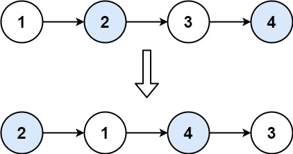

# 24. 两两交换链表中的节点

<span style="color:rgb(100,180,246);font-size:11pt">最后更新：2024-05-10-22</span>

链接：https://leetcode.cn/problems/swap-nodes-in-pairs/description/

!!! Question "题目描述"
    
    给你一个链表，两两交换其中相邻的节点，并返回交换后链表的头节点。你必须在不修改节点内部的值的情况下完成本题（即，只能进行节点交换）。

!!! example "题目示例"

    === "示例 1："
    
        

        **输入：** `head = [1,2,3,4]`

        **输出：** `[2,1,4,3]`

    === "示例 2："

        **输入：** `head = []`

        **输出：** `[]`

    === "示例 3："

        **输入：** `head = [1]`

        **输出：** `[1]`

!!! tip "提示："
    - 链表中节点的数目在范围 `[0, 100]` 内
    - $0 <= Node.val <= 100$

!!! note "思路"

    简单的思路，向将链表拆分成两个list
    然后将这两个链表进行合并

=== "C"

    ```c
    /**
    * Definition for singly-linked list.
    * struct ListNode {
    *     int val;
    *     struct ListNode *next;
    * };
    */


    #define INSERT_LIST_NEXT(list, node) \
        (list)->next = node;\
        (node) = (node)->next;\
        (list) = (list)->next;

    #define INSERT_LIST(list, node) \
        (list)->next = node;\
        (list) = (list)->next;\
        (list)->next = NULL;

    struct ListNode* mergeTwoLists(struct ListNode* list1, struct ListNode* list2)
    {
        struct ListNode head = {0,NULL};
        struct ListNode *temp = &head;

        // 遍历，插入
        while ((list1 != NULL) && (list2 != NULL)) {
            INSERT_LIST_NEXT(temp, list1);
            INSERT_LIST_NEXT(temp, list2);
        }

        // 插入l1。L2为空
        while (list1 != NULL) {
            INSERT_LIST_NEXT(temp, list1);
        }

        // 插入l2，l1为空
        while (list2 != NULL) {
            INSERT_LIST_NEXT(temp, list2);
        }

        return head.next;
    }

    struct ListNode* swapPairs(struct ListNode* head)
    {
        if ((head == NULL) || (head->next == NULL)) {
            return head;
        }

        struct ListNode list1 = {0,NULL};
        struct ListNode list2 = {0,NULL};

        // 先拆成两个链表，然后重新合并
        struct ListNode* temp = head;
        struct ListNode* temp1 = &list1;
        struct ListNode* temp2 = &list2;
        int flag = 1;
        while (temp != NULL) {
            struct ListNode* next = temp->next;
            if (flag == 1) {
                INSERT_LIST(temp1, temp);
                flag++;
            } else {
                INSERT_LIST(temp2, temp);
                flag--;
            }
            temp = next;
        }

        return mergeTwoLists(list2.next, list1.next);
    }
    ```

=== "Golang暴力解法"

    ```go
    ```

