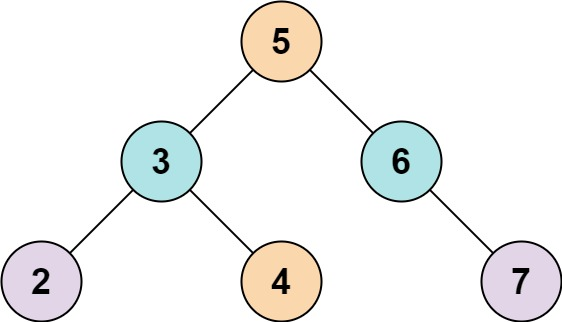
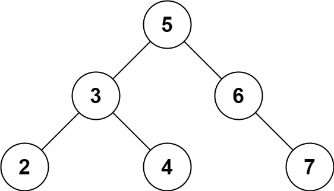

# 两数之和Ⅳ-输入二叉搜索树

最后更新：2024-05-09-22

链接：https://leetcode.cn/problems/two-sum-iv-input-is-a-bst/description/

!!! Question "题目描述"

    给定一个二叉搜索树 root 和一个目标结果 k，如果二叉搜索树中存在两个元素且它们的和等于给定的目标结果，则返回 true。

!!! example "题目示例"

    === "示例 1："
        
        
        **输入：** `root = [5,3,6,2,4,null,7], k = 9`

        **输出：** `true`

    === "示例 2："
    
        
    
        **输入：** `root = [5,3,6,2,4,null,7], k = 28`

        **输出：** `false`
        

!!! tip "提示："
    - 二叉树的节点个数的范围是  $[1, 10^4]$
    - $-10^4 <= Node.val <= 10^4$
    - 题目数据保证，输入的` root` 是一棵 有效 的二叉搜索树
    - $-10^5 <= k <= 10^5$

这个题目，实际上就是在前两题的基础上，将输入修改为二叉搜索树。

题目的解法有个比较简单的方法，我们将二叉搜索树给换成数组，然后调用一、二题的函数即可。

比较复杂的方法，就是利用二叉搜索树的特点，二叉搜索树必然满足root.left.val < root.val < root.right.val

可以参考下官方题解：[两数之和 IV - 输入 BST 力扣官方题解](https://leetcode.cn/problems/two-sum-iv-input-is-a-bst/solutions/1347526/liang-shu-zhi-he-iv-shu-ru-bst-by-leetco-b4nl/)
