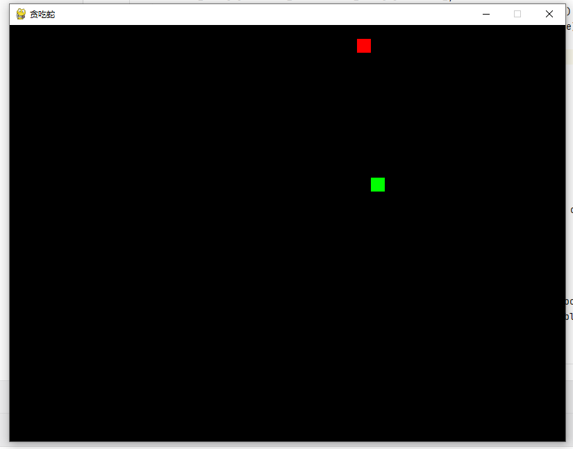

# pygame组件实现的贪吃蛇游戏

就是一个简单的pygame实现的贪吃蛇游戏，遇到边界程序自动退出，没有任何按钮选项配置之类的。

<details>
<summary style="color:rgb(0,0,255);font-weight:bold">贪吃蛇小游戏Python源码</summary>
<blockcode><pre><code>
```Python
import pygame
import random

# 初始化游戏
pygame.init()

# 定义颜色
BLACK = (0, 0, 0)
WHITE = (255, 255, 255)
GREEN = (0, 255, 0)
RED = (255, 0, 0)

# 设置屏幕尺寸
screen_width = 800
screen_height = 600
screen = pygame.display.set_mode((screen_width, screen_height))
pygame.display.set_caption("贪吃蛇")

# 定义蛇的初始位置和大小
snake_block_size = 20
# 定义蛇的移动速度
snake_speed = 5
snake_list = []
snake_length = 1
snake_head = [screen_width / 2, screen_height / 2]

# 定义食物的初始位置
food_block_size = 20
food_x = round(random.randrange(0, screen_width - food_block_size) / 20) * 20
food_y = round(random.randrange(0, screen_height - food_block_size) / 20) * 20

# 定义蛇的移动方向
direction = "RIGHT"
change_to = direction

# 定义游戏结束的标志
game_over = False


# 定义蛇的移动函数
def move_snake():
    if direction == "UP":
        snake_head[1] -= snake_block_size
    elif direction == "DOWN":
        snake_head[1] += snake_block_size
    elif direction == "LEFT":
        snake_head[0] -= snake_block_size
    elif direction == "RIGHT":
        snake_head[0] += snake_block_size


# 游戏主循环
while not game_over:
    for event in pygame.event.get():
        if event.type == pygame.QUIT:
            game_over = True
        elif event.type == pygame.KEYDOWN:
            if event.key == pygame.K_UP and direction != "DOWN":
                change_to = "UP"
            elif event.key == pygame.K_DOWN and direction != "UP":
                change_to = "DOWN"
            elif event.key == pygame.K_LEFT and direction != "RIGHT":
                change_to = "LEFT"
            elif event.key == pygame.K_RIGHT and direction != "LEFT":
                change_to = "RIGHT"

    # 更新蛇的移动方向
    direction = change_to

    # 移动蛇的头部
    move_snake()

    # 判断蛇是否吃到食物
    if snake_head[0] == food_x and snake_head[1] == food_y:
        food_x = round(random.randrange(0, screen_width - food_block_size) / 20) * 20
        food_y = round(random.randrange(0, screen_height - food_block_size) / 20) * 20
        snake_length += 1

    # 更新蛇的身体
    snake_list.append(list(snake_head))
    if len(snake_list) > snake_length:
        del snake_list[0]

    # 判断蛇是否撞到自己或撞到边界
    for segment in snake_list[:-1]:
        if segment == snake_head:
            game_over = True
    if snake_head[0] < 0 or snake_head[0] >= screen_width or snake_head[1] < 0 or snake_head[1] >= screen_height:
        game_over = True

    # 绘制游戏界面
    screen.fill(BLACK)
    for segment in snake_list:
        pygame.draw.rect(screen, GREEN, [segment[0], segment[1], snake_block_size, snake_block_size])
    pygame.draw.rect(screen, RED, [food_x, food_y, food_block_size, food_block_size])
    pygame.display.update()

    # 控制游戏速度
    clock = pygame.time.Clock()
    clock.tick(snake_speed)

# 退出游戏
pygame.quit()
```
</code></pre></blockcode></details>

