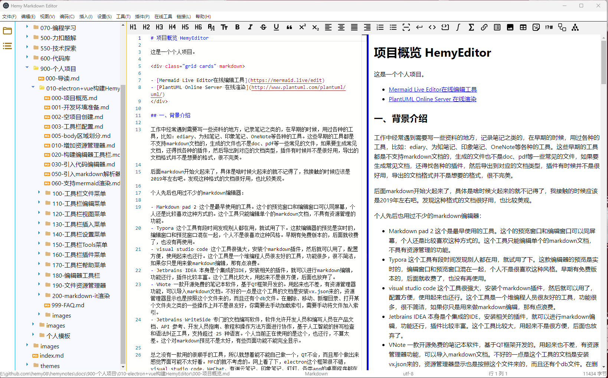

# 项目概览 HemyEditor



这是一个个人项目，命名为 **白泽笔记（BaiZeNotes）**，基于 Electron + Vue 3 + TypeScript 构建，采用 Monaco Editor 作为核心编辑组件，支持实时预览、多格式导入导出、丰富的主题系统和强大的工具集成。

<div class="grid cards" markdown>

- [Mermaid Live Editor在线编辑工具](https://mermaid.live/edit)
- [PlantUML Online Server 在线渲染](http://www.plantuml.com/plantuml/uml/)
- [项目源码 GitHub](https://github.com/hemy08/BaiZeNotesByVue.git)
</div> 

## 一、背景介绍

工作中经常遇到需要写一些资料的地方，记录笔记之类的，在早期的时候，用过各种的工具，比如：ediary、为知笔记、印象笔记、OneNote等各种的工具。这些早期的工具都是不支持markdown文档的，生成的文件也不是doc、pdf等一些常见的文件，如果要生成常见文档，还得找各种的插件，然后导出到对应的文档类型，插件有时候并不是很好用，导出的文档格式并不是想要的格式，很不完美。

后面markdown开始火起来了，具体是啥时候火起来的就不记得了，我接触的时候应该是2019年左右吧。发现这种格式的文档很好用，也比较美观。

个人先后也用过不少的markdown编辑器：

- Markdown pad 2 这个是最早使用的工具。这个的预览窗口和编辑窗口可以同屏幕，个人还是比较喜欢这种方式的。这个工具只能编辑单个的markdown文档，不具有资源管理的功能。
- Typora 这个工具有段时间发现别人都在用，就试用了下。这款编辑器的预览是实时的，编辑窗口和预览窗口混在一起，个人不是很喜欢这种风格。早期有免费版本的，后面就收费了，也没有再使用。
- visual studio code 这个工具很强大，安装个markdown插件，然后就可以用了，配置方便，使用起来也还行。这个工具是一个堆编程人员很友好的工具，功能很多，很不简洁，如果你只是用来做markdown编辑，那有点浪费。
- Jetbrains IDEA 本身是个集成的IDE，安装相关的插件，就可以进行markdown编辑，功能还行，插件比较丰富。这个工具比较大，用起来不是很方便，后面也放弃了。
- VNote 一款开源免费的笔记本软件，基于QT框架开发的。用起来也不差，有资源管理器功能，可以导入markdown文档。不好的一点是这个工具的文档是安装vx.json来的，资源管理器显示也是按照这个文件来的，而且还有个db文件。在删除、移动、新增目录、打开某个文件夹之类的一些操作上并不是很友好，你需要去手动加载索引，需要手动将文件加入索引。
- Jetbrains WriteSide 专门的文档编写软件，软件允许开发人员和编写人员在产品文档、API 参考、开发人员指南、教程和操作方法方面进行协作，基于人工智能的拼写检查和语法纠正工具，支持超过 25 种语言。个人当前正在使用的是这个，也还行，不算太差。这个对markdown预览不是太好，有些页面功能不能完全显示。

总之没有一款用的很顺手的工具，所以就想着能不能自己做一个，QT不会，而且那个做出来感觉界面可能不太好看。MFC的就不考虑的。网上看了下，electron这个框架很不错，visual studio code、WeChat、有道云笔记、印象笔记、钉钉、各类app的桌面程序都在使用这个框架，很热门。

## 二、当前版本信息

| 项目 | 版本 | 说明 |
| --- | --- | --- |
| BaiZeNotes | 1.2.2 | 当前发布版本 |
| Electron | 43.x | 跨平台桌面应用框架 |
| Vue | 3.5.41 | 渐进式 JavaScript 框架 |
| TypeScript | 6.0.2 | 类型安全的 JavaScript 超集 |
| Vite | 8.2.2 | 下一代前端构建工具 |
| electron-vite | 6.0.0-beta.1 | Electron + Vite 集成工具 |
| Monaco Editor | 0.56.0 | VS Code 同款编辑器 |
| markdown-it | 15.0.0 | Markdown 解析器 |
| mermaid | 11.17.0 | 图表渲染库 |
| KaTeX | 0.18.4 | 数学公式渲染 |

## 三、功能特性

### 3.1 编辑器核心

#### Monaco Editor 集成
- **智能补全**：Markdown 语法智能补全
- **多光标编辑**：支持多光标同时编辑
- **代码折叠**：支持代码块折叠
- **语法高亮**：完整的 Markdown 语法高亮
- **快捷键支持**：丰富的快捷键支持

#### 实时预览
- **Markdown 渲染**：实时 Markdown 渲染
- **代码高亮**：支持 100+ 编程语言高亮
- **数学公式**：KaTeX 数学公式渲染
- **流程图**：Mermaid 流程图、时序图、甘特图等
- **PlantUML**：支持 PlantUML 图表渲染
- **Material 主题**：支持 mkdocs material 的 Admonition、选项卡等功能

#### 快速访问
- **符号插入**：快速插入常用符号
- **表情插入**：快速插入表情
- **自定义快捷键**：支持自定义快捷键绑定

#### 多格式支持
- **导入格式**：Word、HTML、JSON、YAML、XML、TXT、CSV
- **导出格式**：Word、JSON、XML、YAML、HTML、PDF
- **编码检测**：自动检测文件编码（UTF-8、GBK、GB2312等）
- **编码转换**：支持多种编码格式转换

### 3.2 主题系统

#### 应用主题（23种）
- **经典主题**：白泽紫韵、暖白温馨、清新简约
- **护眼主题**：护眼绿、护眼米、护眼蓝、护眼粉、护眼琥珀、护眼青、护眼紫
- **特色主题**：薰衣草梦、珊瑚暖阳、薄荷清风、日落余晖、玫瑰晨曦
- **深色主题**：深邃夜空、深空黑曜、科技蓝
- **自然主题**：海洋之心、森林绿意

#### 编辑器主题（55种）
- Monaco Editor 主题同步
- 支持自定义主题
- 主题实时切换，无需重启

### 3.3 工具集成

#### 转换工具
- **格式转换**：JSON/CSV/YAML/TOML 互转
- **大小写转换**：驼峰、下划线、短横线等
- **颜色转换**：HEX、RGB、HSL 互转
- **日期转换**：时间戳、日期格式转换

#### 加密工具
- **加密解密**：AES、DES、RSA 等多种加密算法
- **哈希计算**：MD5、SHA-1、SHA-256、SHA-512
- **Base64**：Base64 编码解码

#### 其他工具
- **Mermaid 绘图**：独立的 Mermaid 编辑预览窗口
- **公式编辑器**：KaTeX 公式编辑
- **HTML 查看**：直接预览 HTML 文件
- **PDF 编辑器**：PDF 文件查看

### 3.4 资源管理
- **文件树**：递归显示文件夹和文件
- **文件操作**：新建、重命名、删除、复制、剪切、粘贴
- **右键菜单**：丰富的右键操作
- **文章大纲**：Markdown 标题大纲导航
- **最近打开**：记录最近打开的文件和文件夹

## 四、项目结构

```
BaiZeNotesByVue/
├── src/
│   ├── main/                    # 主进程（Electron 主线程）
│   │   ├── index.ts             # 主进程入口
│   │   ├── global-types.d.ts    # 全局类型定义
│   │   ├── config/              # 配置管理
│   │   │   ├── config-manager.ts        # 配置管理器
│   │   │   ├── default-configs.ts      # 默认配置
│   │   │   ├── editor-setting.ts       # 编辑器设置
│   │   │   ├── system-setting.ts       # 系统设置
│   │   │   ├── theme-config.ts         # 主题配置
│   │   │   ├── theme-registry.ts       # 主题注册
│   │   │   ├── quick-link-config.ts   # 快速链接配置
│   │   │   ├── short-key-register.ts  # 快捷键注册
│   │   │   └── window-manager.ts       # 窗口管理器
│   │   ├── constants/           # 常量定义
│   │   ├── dialogs/             # 对话框
│   │   │   ├── dialogs.ts               # 对话框入口
│   │   │   ├── dialog-defaults.ts      # 对话框默认值
│   │   │   ├── dialog_common.ts        # 通用对话框
│   │   │   ├── ShowEditorSettingDialog.ts      # 编辑器设置对话框
│   │   │   ├── ShowSystemSettingDialog.ts      # 系统设置对话框
│   │   │   ├── ShowThemeSettingDialog.ts       # 主题设置对话框
│   │   │   ├── ShowFontSelectDialog.ts         # 字体选择对话框
│   │   │   ├── ShowHelpAboutDialog.ts          # 关于对话框
│   │   │   ├── ShowReleaseNotesDialog.ts       # 版本发布对话框
│   │   │   ├── ShowUpdateLogDialog.ts          # 更新日志对话框
│   │   │   ├── ShowTechStackDialog.ts          # 技术栈对话框
│   │   │   ├── ShowQuickLinkSettingDialog.ts   # 快速链接设置
│   │   │   ├── ShowImportOptionDialog.ts       # 导入选项对话框
│   │   │   ├── ShowCreateFileFolderDialog.ts   # 新建文件/文件夹
│   │   │   ├── ShowRemaneDialog.ts             # 重命名对话框
│   │   │   ├── OpenMermaidRenderFrame.ts      # Mermaid 渲染窗口
│   │   │   └── OpenOnlineWebPages.ts          # 在线网页窗口
│   │   ├── ipc/                 # IPC 通信
│   │   │   ├── index.ts                 # IPC 入口
│   │   │   ├── handlers.ts              # IPC 处理器
│   │   │   ├── ipc-listener-manager.ts # IPC 监听管理器
│   │   │   ├── menu_file.ts             # 文件菜单处理
│   │   │   ├── menu_edit.ts             # 编辑菜单处理
│   │   │   ├── menu_view.ts             # 视图菜单处理
│   │   │   ├── menu_tools.ts            # 工具菜单处理
│   │   │   ├── menu_help.ts             # 帮助菜单处理
│   │   │   ├── menu_context.ts          # 右键菜单处理
│   │   │   └── menu_handle.ts           # 菜单处理入口
│   │   ├── renders/             # 渲染处理
│   │   │   ├── HemyRender.ts            # 主渲染器
│   │   │   ├── KatexRender.ts           # KaTeX 渲染
│   │   │   ├── MaterialRender.ts        # Material 主题渲染
│   │   │   └── TabbedSetRender.ts       # 选项卡渲染
│   │   └── utils/               # 工具函数
│   │       ├── utils.ts                 # 通用工具
│   │       ├── app-paths.ts             # 应用路径
│   │       ├── app-state.ts             # 应用状态
│   │       ├── baize-store.ts           # 白泽存储
│   │       ├── logger.ts                # 日志模块
│   │       ├── file-state.ts            # 文件状态
│   │       ├── encrypt_decrypt.ts       # 加解密
│   │       └── file-utils/              # 文件工具
│   ├── preload/                 # 预加载脚本
│   │   ├── index.ts             # 主预加载脚本
│   │   ├── index.d.ts           # 类型声明
│   │   └── dialog.ts            # 对话框预加载
│   ├── renderer/                # 渲染进程（Vue 应用）
│   │   ├── index.html           # HTML 入口
│   │   └── src/
│   │       ├── App.vue          # Vue 根组件
│   │       ├── main.ts          # 渲染进程入口
│   │       ├── env.d.ts         # 环境类型声明
│   │       ├── assets/          # 静态资源
│   │       ├── common/          # 公共模块
│   │       │   ├── event_bus/           # 事件总线
│   │       │   ├── templates.ts         # 模板
│   │       │   └── useConfigStore.ts   # 配置状态管理
│   │       ├── components/      # Vue 组件
│   │       │   ├── BaiZeNotes.vue       # 主应用组件
│   │       │   ├── MenuBar.vue          # 菜单栏
│   │       │   ├── StatusBar.vue        # 状态栏
│   │       │   ├── WelcomeScreen.vue    # 欢迎界面
│   │       │   ├── MenuBar/             # 菜单栏模块
│   │       │   │   ├── menu_config.ts   # 菜单配置
│   │       │   │   ├── menu_consts.ts   # 菜单常量
│   │       │   │   └── menu_actions.ts  # 菜单动作
│   │       │   ├── WorkSpaceArea/       # 工作区域
│   │       │   │   ├── WorkSpace.vue    # 工作空间
│   │       │   │   └── NaviTab.vue      # 导航标签
│   │       │   ├── ResourceManager/     # 资源管理器
│   │       │   │   ├── ResourceManager.vue
│   │       │   │   ├── FileTreeNode.vue
│   │       │   │   └── resource-manager.ts
│   │       │   ├── Markdown/            # Markdown 编辑器
│   │       │   │   ├── MarkdownContainer.vue       # 容器
│   │       │   │   ├── MarkdownEditComponent.vue   # 编辑组件
│   │       │   │   ├── MarkdownMonacoEditor.vue    # Monaco 编辑器
│   │       │   │   ├── MarkdownPreviewComponent.vue # 预览组件
│   │       │   │   ├── MarkdownEditToolsComponent.vue # 编辑工具栏
│   │       │   │   ├── MermaidRender.vue           # Mermaid 渲染
│   │       │   │   ├── hemy-editor.ts              # 编辑器入口
│   │       │   │   ├── hemy-editor-common.ts      # 编辑器通用
│   │       │   │   ├── hemy-editor-render.ts      # 编辑器渲染
│   │       │   │   ├── hemy-editor-actions.ts     # 编辑器动作
│   │       │   │   ├── hemy-editor-shortcut.ts    # 编辑器快捷键
│   │       │   │   ├── hemy-editor-quick-access.ts # 快速访问
│   │       │   │   ├── editor-option-maps.ts      # 编辑器选项
│   │       │   │   └── register-languages.ts     # 语言注册
│   │       │   ├── HemyTools/           # 工具组件
│   │       │   ├── PluginTools/         # 插件工具
│   │       │   └── dialogs/             # Vue 对话框组件
│   │       ├── composables/     # 组合式函数
│   │       │   ├── useDialogDrag.ts     # 对话框拖拽
│   │       │   ├── useDialogResize.ts   # 对话框缩放
│   │       │   ├── useEventBus.ts       # 事件总线
│   │       │   ├── useThemeIcons.ts     # 主题图标
│   │       │   └── useWindowManagement.ts # 窗口管理
│   │       └── styles/          # 样式文件
│   └── shared/                  # 共享代码（主进程和渲染进程共用）
│       ├── ipc-channels.ts      # IPC 通道定义
│       ├── constants/           # 共享常量
│       └── types/               # 共享类型
├── resources/                   # 应用资源
│   ├── config/                  # 配置文件
│   ├── icon/                    # 图标
│   ├── themes/                  # 主题文件
│   ├── katex/                   # KaTeX 资源
│   ├── mermaid/                 # Mermaid 资源
│   └── plantuml/                # PlantUML 资源
├── build/                       # 构建脚本
├── docs/                        # 项目文档
├── tests/                       # 测试文件
├── package.json                 # 项目配置
├── electron.vite.config.ts      # electron-vite 配置
├── electron-builder.yml         # 打包配置
├── tsconfig.json                # TypeScript 配置
├── tsconfig.node.json           # Node 环境 TS 配置
├── tsconfig.web.json            # Web 环境 TS 配置
└── vitest.config.ts             # 测试配置
```

## 五、架构说明

### 5.1 整体架构

白泽笔记采用 Electron 的三进程架构：

```
┌─────────────────────────────────────────────────────────────┐
│                    Electron 应用                            │
├─────────────────────────────────────────────────────────────┤
│  主进程 (Main Process)                                       │
│  ├── 窗口管理 (BrowserWindow)                                │
│  ├── 菜单管理 (Menu)                                         │
│  ├── IPC 通信 (ipcMain)                                      │
│  ├── 文件系统操作 (fs)                                       │
│  ├── 对话框管理 (dialog)                                     │
│  ├── 配置管理 (electron-store)                               │
│  └── 自动更新 (electron-updater)                             │
├─────────────────────────────────────────────────────────────┤
│  预加载脚本 (Preload)                                        │
│  ├── contextBridge 暴露安全 API                              │
│  └── ipcRenderer 封装                                        │
├─────────────────────────────────────────────────────────────┤
│  渲染进程 (Renderer Process - Vue 3)                         │
│  ├── Vue 应用 (App.vue)                                      │
│  ├── 菜单栏 (MenuBar.vue)                                    │
│  ├── 工作空间 (WorkSpace.vue)                                │
│  │   ├── 资源管理器 (ResourceManager)                        │
│  │   └── Markdown 容器 (MarkdownContainer)                   │
│  │       ├── 编辑器 (MarkdownMonacoEditor - Monaco)          │
│  │       └── 预览 (MarkdownPreviewComponent - markdown-it)   │
│  ├── 状态栏 (StatusBar.vue)                                  │
│  └── 对话框 (dialogs/)                                       │
└─────────────────────────────────────────────────────────────┘
```

### 5.2 进程通信（IPC）

项目使用 Electron 的 IPC 机制进行主进程和渲染进程之间的通信。所有 IPC 通道定义在 `src/shared/ipc-channels.ts` 中，按功能分组：

- `WINDOW`：窗口操作（最小化、最大化、关闭等）
- `CONFIG`：配置读写
- `THEME`：主题管理
- `MENU`：菜单动作
- `EDITOR`：编辑器设置
- `FILE`：文件操作
- `FILE_MANAGER`：资源管理器操作

<details>
<summary style="color:rgb(0,0,255);font-weight:bold">IPC 通道定义示例</summary>
<blockcode><pre><code>
```typescript
// src/shared/ipc-channels.ts
export const IPC = {
  WINDOW: {
    MINIMIZE: 'window-minimize',
    MAXIMIZE: 'window-maximize',
    CLOSE: 'window-close',
    // ...
  } as const,
  CONFIG: {
    READ: 'config:read',
    WRITE: 'config:write',
    // ...
  } as const,
  THEME: {
    UPDATE_THEME: 'baize-notes:update-theme',
    THEME_UPDATED: 'baize-notes:theme-updated',
    // ...
  } as const,
  // ...
}
```
</code></pre></blockcode></details>

### 5.3 预加载脚本安全暴露 API

预加载脚本通过 `contextBridge` 安全地向渲染进程暴露 API，避免直接暴露 Node.js API：

<details>
<summary style="color:rgb(0,0,255);font-weight:bold">preload/index.ts 示例</summary>
<blockcode><pre><code>
```typescript
import { contextBridge, ipcRenderer } from 'electron'
import { electronAPI } from '@electron-toolkit/preload'

const api = {
  config: {
    read: (configName: string): Promise<any> => {
      return ipcRenderer.invoke('config:read', configName)
    },
    write: (configName: string, data: any): Promise<boolean> => {
      return ipcRenderer.invoke('config:write', configName, data)
    },
    // ...
  },
  app: {
    getVersion: (): Promise<{...}> => {
      return ipcRenderer.invoke('app:get-version')
    }
  }
}

if (process.contextIsolated) {
  contextBridge.exposeInMainWorld('electron', electronAPI)
  contextBridge.exposeInMainWorld('api', api)
}
```
</code></pre></blockcode></details>

### 5.4 菜单栏实现

菜单栏采用 Vue 组件实现（非 Electron 原生 Menu），支持主题适配和灵活定制。菜单配置集中在 `menu_config.ts`，包含 11 个顶级菜单：

- **文件**：新建、打开、导入导出、保存、退出
- **编辑**：撤销、重做、剪切、复制、粘贴、查找、替换
- **视图**：编辑模式、预览模式、显示/隐藏各面板、折叠展开
- **编码**：重新编码打开、转换编码
- **插入**：特殊字体、数学公式、表格、链接、模板、Material、Mermaid、PlantUML
- **设置**：系统设置、主题设置、编辑器设置、快速链接
- **工具**：Mermaid 绘图、公式编辑器、电子表格、绘图工具
- **插件**：加解密、转换器、网络工具、对照表
- **在线**：各类在线工具网站
- **GitHub**：GitHub 相关链接
- **帮助**：版本发布、快捷键、使用文档、关于、检查更新

### 5.5 编辑器与预览

编辑器使用 Monaco Editor（VS Code 同款），预览使用 markdown-it 及其插件链：

```
编辑器内容变化
      │
      ▼
MarkdownMonacoEditor.vue ──emit('update:code')──▶ MarkdownEditComponent.vue
      │                                                │
      │                                                ▼
      │                                    MarkdownPreviewComponent.vue
      │                                                │
      │                                                ▼
      │                                    markdown-it 渲染管线
      │                                    ├── highlight.js (代码高亮)
      │                                    ├── markdown-it-emoji (表情)
      │                                    ├── markdown-it-plantuml (PlantUML)
      │                                    ├── KaTeX (数学公式)
      │                                    ├── Mermaid (图表)
      │                                    └── Material (Admonition/选项卡)
      │                                                │
      ▼                                                ▼
v-html 绑定渲染结果 ◀────────────── renderedMarkdownContent
```

### 5.6 配置与状态管理

- **配置存储**：使用 `electron-store` 在用户目录下管理配置，支持多用户独立配置（`.baizenotes` 目录）
- **状态管理**：渲染进程使用自定义的 `useConfigStore` 管理全局状态（对话框可见性、主题等）
- **事件总线**：`EventBus` 用于组件间通信
- **文件状态**：自动保存文件和目录状态，应用重启后自动恢复

## 六、开发命令

| 命令 | 说明 |
| --- | --- |
| `npm run dev` | 启动开发环境 |
| `npm run build` | 构建应用（未打包） |
| `npm run build:win` | 构建 Windows 安装包 |
| `npm run build:mac` | 构建 macOS 安装包 |
| `npm run build:linux` | 构建 Linux 安装包 |
| `npm run build:win:portable` | 构建 Windows 免安装版 |
| `npm run typecheck` | TypeScript 类型检查 |
| `npm run lint` | ESLint 代码检查 |
| `npm run test` | 运行测试 |
| `npm run format` | Prettier 格式化 |

## 七、参考

- [Vue3 Vite electron 开发桌面程序](https://juejin.cn/post/7255224807322239034)
- [Vite+Electron快速构建一个VUE3桌面应用](https://blog.csdn.net/qq_44333271/article/details/135864962)
- [vite+vue3+ts+electron桌面应用web端桌面端开发及生产打包配置！](https://article.juejin.cn/post/7248982532727963705)
- [基于electron-vite构建Vue桌面客户端](https://zhuanlan.zhihu.com/p/659550657)
- [用vite的方式开发electron应用](https://zhuanlan.zhihu.com/p/672648200)
- [vue3+vite+electron开发桌面端应用流程](https://blog.csdn.net/qq_39460057/article/details/137223595)
- [从0到1搭建electron+vite+vue3模板](https://juejin.cn/post/7091126224411426846?from=search-suggest)
- [基于Electron24+Vite4+Vue3搭建桌面端应用实战教程](https://www.jb51.net/javascript/2856394zz.htm)
- [前端必学的桌面开发：Electron+React开发桌面应用](https://zhuanlan.zhihu.com/p/687001430)
- [学习 Electron：构建跨平台桌面应用](https://blog.csdn.net/qq_32682301/article/details/133902143)
- [Electron + Vue3 开发桌面应用](https://blog.csdn.net/qq_37460847/article/details/126918641)
- [Vue+Electron打包桌面应用(从零到一完整教程)](https://blog.csdn.net/weixin_68658847/article/details/133843466)
- [WEB代码编辑器哪家强](https://juejin.cn/post/6934153579900960782#heading-7)
- [Web代码编辑器使用统计](https://github.com/styfle/awesome-online-ide?tab=readme-ov-file#snippets)


## 八、开源软件选型

### 8.1 Electron

- [Electron](https://github.com/electron/electron)
- [Electron 中文文档](https://www.electronjs.org/zh/docs/latest/)
- [electron-vite](https://cn-evite.netlify.app/) 下一代 Electron 开发构建工具。基于 Vite，快速、简单且功能强大！
- [electron-vite](https://github.com/alex8088/electron-vite)
- [electron-vite-vue](https://github.com/electron-vite/electron-vite-vue)  真正简单的Electron + Vue + Vite样板。
- [vite-plugin-electron](https://github.com/electron-vite/vite-plugin-electron) vite-plugin-lectron让开发Electron应用变得和普通的Vite项目一样简单。
- [awesome-vite](https://github.com/vitejs/awesome-vite#templates) Awesome Vite.js

### 8.2 Markdown解析器

- [Remarkable](https://github.com/jonschlinkert/remarkable) 一个纯 JavaScript 的 Markdown 解析器，解析速度快而且易于扩展。100% 支持 Commonmark。
- [Marked](https://github.com/markedjs/marked): 一款可以编译和解析markdown的开源库，支持命令行、浏览器。
- [CommonMark](https://github.com/commonmark/commonmark.js): 是由 John MacFarlane 开发的 Markdown 解析库。
- <span style="color:rgb(255,0,0);font-weight:bold">Markdown-it</span> 一款功能强大的Markdown解析器，支持丰富的Markdown语法，能够轻松将Markdown文本转换为HTML格式。 
    - [Markdown-it](https://github.com/markdown-it/markdown-it) 
    - [markdown-it 中文文档](https://markdown-it.docschina.org/)
    - [markdown-it-footnote](https://github.com/markdown-it/markdown-it-footnote)：支持脚注。
    - [markdown-it-task-lists](https://github.com/revin/markdown-it-task-lists)：支持任务列表。
    - [markdown-it-abbr](https://github.com/markdown-it/markdown-it-abbr)：支持缩写。
    - [markdown-it-container](https://github.com/markdown-it/markdown-it-container)：支持自定义容器。
    - [markdown-it-anchor](https://github.com/valeriangalliat/markdown-it-anchor)：为标题自动生成锚点。
    - [markdown-it-emoji](https://github.com/markdown-it/markdown-it-emoji)：支持Emoji表情。
    - [markdown-it-highlightjs](https://github.com/nhn/markdown-it-highlightjs)：代码高亮。
    - [markdown-it-plantuml](https://github.com/gmunguia/markdown-it-plantuml)：PlantUML 支持。

### 8.3 Vue

- [Vue3](https://cn.vuejs.org/) 易学易用，性能出色，适用场景丰富的 Web 前端框架。
- [Vite](https://www.vitejs.net/)  下一代前端开发与构建工具

### 8.4 代码编辑器 

- [Monaco](https://github.com/microsoft/monaco-editor)
- [Monaco Editor API](https://microsoft.github.io/monaco-editor/docs.html)
- [codemirror](https://codemirror.net/)

### 8.5 图表渲染

- [Mermaid](https://github.com/mermaid-js/mermaid) 基于 JavaScript 的图表工具
- [mermaid-live-editor](https://github.com/mermaid-js/mermaid-live-editor)
- [plantuml  github.com](https://github.com/plantuml/plantuml)
- [PlantUML 一览](https://plantuml.com/zh/)
- [KaTeX](https://github.com/KaTeX/KaTeX) 数学公式渲染

### 8.6 编译工具 

- [Electron-Builder](https://github.com/electron-userland/electron-builder)
