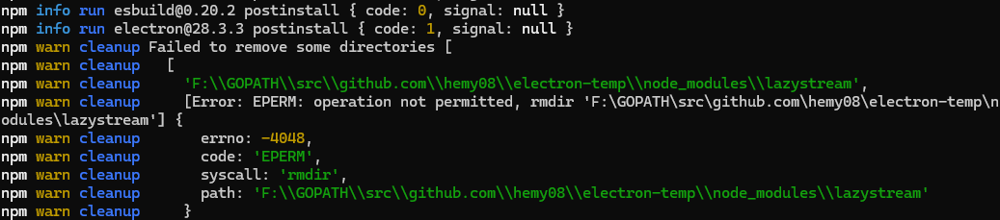

# 项目初始创建


```
npm create @quick-start/electron --registry http://registry.npmmirror.com/
```


设置相关参数


- **Project name**：项目名称自定义输入 <span style="color:rgb(255,0,0);font-weight:bold">HemyMarkdownEditor</span>
- **Select a framework**：选择框架，内置vanilla,vue,react,svelte,solid可选择，这里我们选择vue
- **Add TypeScript**：是否添加TypeScript，这里我们选择yes
- **Add Electron updater plugin**：是否添加Electron更新插件，yes
- **Enable Electron download mirror proxy**：镜像下载代理，国内网络建议开启，yes


```
cd electron-temp
npm install --registry=http://registry.npmmirror.com --loglevel verbose
npm run dev
```


报错了



这里的意思是权限不够，不过试了各种方式，添加权限啥的，都不行。从网上看到一个帖子，npm 命令执行install的时候，不是以类似root的用户去操作的，而是以一个低权限的用户进行执行。

没找到解决方案，很巧的是解决了，不知道啥原因，估计有可能是网络的问题。执行过下面的一些命令

```
npm cache clean -f
npm install --registry=http://registry.npmmirror.com --loglevel verbose
```

同时用IDEA打开项目，这个时候会提示`RUN NPM INSTALL`，点击这个的同时，在cmd界面执行上面的命令。然后就问题解决了。下载成功了。


```
npm install --registry=http://registry.npmmirror.com --loglevel verbose electron
npm install --registry=http://registry.npmmirror.com --loglevel verbose electron-store
```

```
npm run dev // 运行工具
npm run build:win // win编译
```

