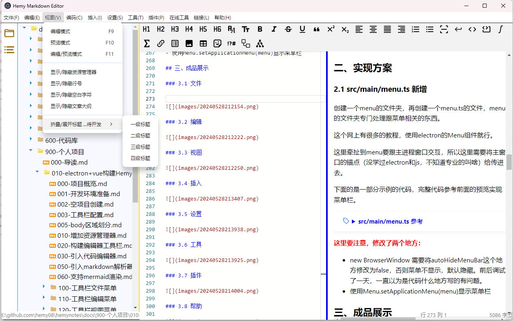
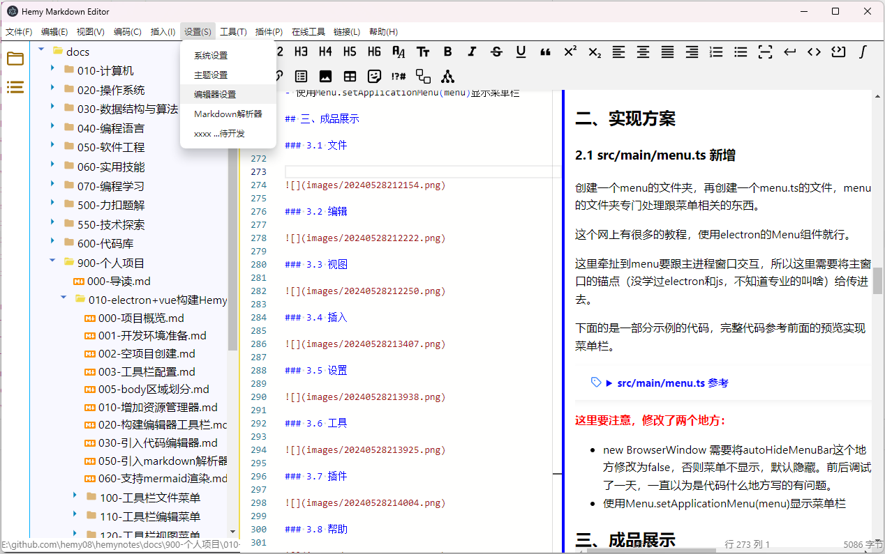

# 工具栏配置以及实现

## 一、效果预演

后续实现过程中可能与当前有差异，会实时调整工具栏

=== "文件(F)"

    - 新建文件
    - 新建文件夹
    - 从文件导入
	    - Word
        - HTML 
    - --------------
    - 打开文件
    - 打开文件夹
    - --------------- 
    - 导出为
    - 另存为
    - 保存
    - 保存所有
    - --------------
    - 历史记录
    - 从磁盘重新读取
    - --------------
    - 退出

=== "编辑(E)"

    - 撤销
    - 恢复
    - --------------
    - 拷贝
    - 剪切
    - 黏贴
    - 删除
    - --------------
    - 查找
    - 在文件中查找
    - -------------
    - 替换
    - 在文件中替换

=== "视图(V)"

    - 全屏
    - 编辑模式
    - 预览模式
    - 编辑/预览模式
    - -----------------
    - 显示/隐藏资源管理器
    - 显示/隐藏制表符
    - 显示/隐藏换行符
    - 显示/隐藏行号
    - 显示/隐藏文章大纲
    - ------
    - 折叠/展开标题

=== "插入(I)"

    - 插入模板
        - 力扣题解模块
        - 问题处理模块
        - xxx模板
        - 图片链接
        - 文章更新日期
        - 文章封面
    - 插入卡片
    - 插入文本块
        - 特殊字体
        - Markdown表格
        - Html表格
    - 插入数学公式
    - 插入链接
    - -----------
    - Mermaid
        - 流程图
        - 序列图
        - 类图
        - 状态图
        - 实体关系图
        - 用户旅程图
        - 甘特图
        - 饼图
        - 象限图
        - 需求图
        - 甘特图
        - C4图
        - 思维导图
        - 时间线图
        - Zenuml
        - 桑基图
        - XYChart
        - BlockDiagram
        - Packet
    - PlantUml
        - 序列图
        - 用例图
        - 类图
        - 对象图
        - 活动图
        - 组件图
        - 部署图
        - 状态图
        - 时序图
        - JSON 数据
        - YAML 数据
        - EBNF 图表
        - Regex 图表
        - 网络图 (nwdiag)
        - 用户界面模型 (salt)
        - 架构图
        - 规范和描述语言（SDL）
        - Ditaa 图表
        - 甘特图
        - 思维导图
        - WBS 图表
        - 信息工程图
        - 实体关系图
    - ------------
    - 自定义模板
    - 模板管理


=== "设置(S)"

    - 系统设置
    - 主题
    - 字体
    - 编辑器
    - markdown解析器
    - xxx

=== "工具(T)"

    - 电子表格
    - 配图创作
    - 绘图工具

=== "插件(P)"

    - PlantUml插件
    - Latex插件

=== "帮助(H)"
    
    - 版本发行说明
    - -------------
    - 键盘快捷方式
    - 使用文档
    - 提交issue
    - --------------
    - 关于
    - 主页
    - 致谢
    - 检查更新

## 二、实现方案

### 2.1 src/main/menu.ts 新增

创建一个menu的文件夹，再创建一个menu.ts的文件，menu的文件夹专门处理跟菜单相关的东西。

这个网上有很多的教程，使用electron的Menu组件就行。

这里牵扯到menu要跟主进程窗口交互，所以这里需要将主窗口的锚点（没学过electron和js，不知道专业的叫啥）给传进去。

下面的是一部分示例的代码，完整代码参考前面的预览实现菜单栏。

<details>
<summary style="color:rgb(0,0,255);font-weight:bold">src/main/menu.ts 参考</summary>
<blockcode><pre><code>
```Typescript
import { Menu } from 'electron'

const template = [
  {
    label: '文件',
    submenu: [
      {
        label: '新建文件',
        accelerator: 'ctrl+n',
        click: function () {
          alert('ctrl')
        }
      },
      {
        label: '新建窗口',
        accelerator: 'Ctrl+Shift+N',
        click: function () {
          alert('新建窗口')
        }
      }
    ]
  },
  {
    label: '编辑',
    submenu: [
      {
        label: '编辑文件'
      },
      {
        label: '编辑窗口'
      }
    ]
  }
]

export function getApplicationMenu(mainWindow) {
  return template
}
```
</code></pre></blockcode></details>

### 2.2 src/main/index.ts

先导入`import { getApplicationMenu } from './menu/menu'`

修改创建窗口的函数。参考如下：

<details>
<summary style="color:rgb(0,0,255);font-weight:bold">src/main/index.ts 参考</summary>
<blockcode><pre><code>
```Typescript
function createWindow(): void {
  // Create the browser window.
  const mainWindow = new BrowserWindow({
    width: 900,
    height: 670,
    show: false,
    title: 'HemyMarkdownEditor',
    autoHideMenuBar: false,
    ...(process.platform === 'linux' ? { icon } : {}),
    webPreferences: {
      preload: join(__dirname, '../preload/index.js'),
      sandbox: false
    }
  })

  mainWindow.on('ready-to-show', () => {
    mainWindow.show()
  })

  mainWindow.webContents.setWindowOpenHandler((details) => {
    shell.openExternal(details.url)
    return { action: 'deny' }
  })

  // HMR for renderer base on electron-vite cli.
  // Load the remote URL for development or the local html file for production.
  if (is.dev && process.env['ELECTRON_RENDERER_URL']) {
    mainWindow.loadURL(process.env['ELECTRON_RENDERER_URL'])
  } else {
    mainWindow.loadFile(join(__dirname, '../renderer/index.html'))
  }

  const menu = Menu.buildFromTemplate(getApplicationMenu(mainWindow))
  Menu.setApplicationMenu(menu)
}
```
</code></pre></blockcode></details>

 <span style="color:rgb(255,0,0);font-weight:bold">这里要注意，修改了两个地方：</span>


- new BrowserWindow 需要将autoHideMenuBar这个地方修改为false，否则菜单不显示，默认隐藏。前后调试了一天，一直以为是代码什么地方写的有问题。
- 使用Menu.setApplicationMenu(menu)显示菜单栏

## 三、成品展示

### 3.1 文件

[11111](F:/GOPATH\src\github.com\hemy08\hemynotes\docs\900-个人项目\010-electron+vue构建HemyEditor/images/20240528212154.png)


### 3.2 编辑


### 3.3 视图



### 3.4 插入


### 3.5 设置



### 3.6 工具


### 3.7 插件


### 3.8 帮助

