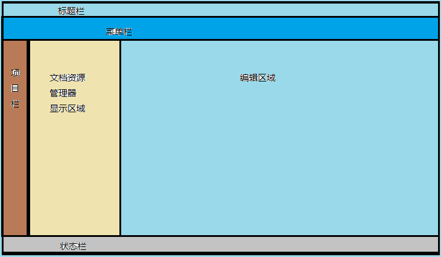
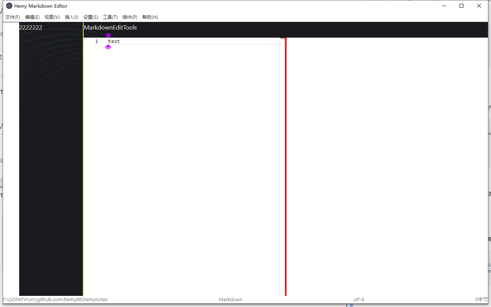

# Body区域划分

## 一、预览

body区域准备划分两部分，左侧做出文件管理器页面，右侧是编辑区域，对于Markdown编辑来说，可以平方做预览区域。



## 二、实现思路

在app.vue中进行处理，利用template，以及html相关的语言配置，先上学分为两部分，上面部分作为工作区域，下面部分作为状态栏。

工作区域划分两部分，文件管理器页面和编辑区域。

项目栏：包含文件资源管理器、文章大纲、绘图工具、PlantUML、Mermaid

- 文件资源管理器，中间区域显示文档信息，文件列表tree，编辑区域嵌入Markdown编辑器，并增加预览功能（可选）
- 文章大纲，中间区域显示Markdown-toc
- 绘图工具，中间区域显示简单的绘图工具，这个看看有没有比较成熟的绘图插件，右侧区域作为绘图区域
- PlantUML，中间区域显示PlantUML支持的绘图，点击后，在右侧区域显示语言原码，并且增加预览区域（可选）
- Mermaid，同上

状态栏暂时没想好显示啥，先保留：文件绝对路径、字数等信息

## 三、实现

### 3.1 app.vue

在app.vue中进行处理，利用template，以及html相关的语言配置，先上学分为两部分，上面部分作为工作区域，下面部分作为状态栏。

<details>
<summary style="color:rgb(0,0,255);font-weight:bold">app.vue 参考</summary>
<blockcode><pre><code>
```typescript
<template>
  <div id="editor-container">
    <!-- 应用工具栏和下发区域分割部分，2px高度，宽度与app一致 -->
    <div id="file-bar"></div>
    <!-- 整个工作区域 -->
    <div id="workspace-area" class="workspace-area"><WorkSpace /></div>
    <!-- 状态栏区域，高度10px，宽度与app一致 -->
    <div id="status-bar" class="status-bar"><StatusBar /></div>
  </div>
</template>
<script setup lang="ts">
import WorkSpace from './components/WorkSpaceArea/WorkSpace.vue'
import StatusBar from './components/StatusBar.vue'
</script>
```
</code></pre></blockcode></details>

区域的大小调节，可以自己根据需要进行调节。

### 3.2 StatusBar.vue

状态栏，这里就不多说了，先简单划分下，后续再慢慢补齐功能

```typescript
<template>
  <div id="status-bar-file-path">F:\GOPATH\src\github.com\hemy08\hemynotes</div>
  <div id="status-bar-file-type">Markdown</div>
  <div id="status-bar-file-type">utf-8</div>
  <div id="status-bar-file-size">0字节</div>
</template>
```

### 3.2 WorkSpace.vue

工作区域，将工作区域分为三部分，并且增加了中间的宽度调节，内容后面补充

利用ref特性，完成窗口的动态变化，在窗口被拖动或者最大化最小化时，窗口大小随着刷新

<details>
<summary style="color:rgb(0,0,255);font-weight:bold">WorkSpace.vue 参考</summary>
<blockcode><pre><code>
```typescript
<template>
  <!-- 左侧区域导航，固定宽度，放置图标，鼠标悬停显示详细信息 -->
  <div id="navi-tab" class="navi-tab" :style="naviTabStyle">
    <NaviTab />
  </div>
  <!-- 中间资源管理显示区域，宽度可以调节 -->
  <div id="resource-manager" class="resource-manager" :style="resMgrStyle">
    <ResManager />
  </div>
  <!-- 资源管理器和编辑区域的宽度调节条 -->
  <div
    id="resizer-main"
    class="resizer-main"
    :style="resizerMainStyle"
    @mousedown="startResizerMainResize()"
  >
    1
  </div>
  <!-- 右侧编辑区域 -->
  <div id="edit-area" class="edit-area" :style="editAreaStyle">
    <EditArea />
  </div>
</template>
<script setup lang="ts">
import NaviTab from './NaviTab.vue'
import ResManager from './ResourceManager.vue'
import EditArea from './EditArea.vue'
import { computed, ref } from 'vue'
// 使用 ref 来创建响应式引用
const resMgrWidth = ref('300px')
const naviTabWidth = ref('40px')
const naviTabStyle = computed(() => ({
  width: naviTabWidth.value, // 视窗宽度
  height: '100%' // 视窗高度
}))
// 拖动区域
const resMgrStyle = computed(() => ({
  width: resMgrWidth.value, // 视窗宽度
  height: '100%' // 视窗高度
  //marginLeft: naviTabWidth.value // 左侧遗留navi-tab宽度
}))
// 拖动区域
const resizerMainStyle = computed(() => ({
  width: '2px', // 视窗宽度
  height: '100% - 20px - 2px' // 视窗高度
  // marginLeft: naviTabWidth.value + resMgrWidth.value // 左侧遗留navi-tab宽度
}))
// 预览区域样式设置
const editAreaStyle = computed(() => ({
  width: `calc(100vw - ${naviTabWidth.value} - ${resMgrWidth.value} - 2px)`, // 视窗宽度
  height: '100%' // 视窗高度
  // marginLeft: 'naviTabWidth.value + resMgrWidth.value + 2px' // 左侧遗留navi-tab宽度
}))
function startResizerMainResize() {}
</script>
```
</code></pre></blockcode></details>

### 3.3 MarkdownContainer.vue

这个是编辑区域，因为是做markdown，所以分工具栏、编辑器和预览区域

在最上面做一个编辑器工具栏，支持常见的插入命令

```typescript
<template>
  <div id="md-tools-bar" class="md-tools-bar"><MdEditTools /></div>
  <div id="md-container" class="md-container"><MdEditComp /></div>
</template>
```

### 3.4 MarkdownEditComponent.vue

编辑区域和预览区域，

目前实现是，编辑区域和预览区域各占编辑区域的50%，并且需要窗口区域大小跟随应用的大小变化。

```typescript
<template>
  <div id="md-edit-component" class="md-edit-component" :style="mdEditComponetStyle">
    <MdMonacoEdit
        v-model="markdownEditorCode"
        :code="initialCodeContent"
        @update:code="handleMarkdownCodeUpdate"
    />
  </div>
  <div id="resizer-md" class="resizer-md">1</div>
  <div id="md-preview" class="md-preview" :style="mdPreviewComponentStyle">
    <MdPreview :code="markdownEditorCode" />
  </div>
</template>
```

窗口区域大小跟随应用的大小变化
<details>
<summary style="color:rgb(0,0,255);font-weight:bold">窗口大小动态设置</summary>
<blockcode><pre><code>
```typescript
import { computed, onUnmounted, ref } from 'vue'
import MdMonacoEdit from './MarkdownMonacoEditor.vue'
import MdPreview from './MarkdownPreviewComponent.vue'
// 使用 ref 来创建响应式引用
const markdownEditorCode = ref('')
let initialCodeContent = 'Hello world'
// 存储窗口宽度
const windowWidth = ref(window.innerWidth)
onUnmounted(() => {
  window.removeEventListener('resize', updateWindowWidth)
})
// 监听窗口宽度变化
function updateWindowWidth() {
  windowWidth.value = window.innerWidth
}
window.addEventListener('resize', updateWindowWidth)
// 编辑区域大小计算
const mdEditComponetStyle = computed(() => {
  const editWidth = `${windowWidth.value * 0.5}px`
  console.log('editWidth', editWidth)
  return {
    width: editWidth,
    height: `100%` // 视窗高度
  }
})
// 预览区域样式设置
const mdPreviewComponentStyle = computed(() => {
  const previewWidth = `${windowWidth.value * 0.5}px`
  console.log('previewWidth', previewWidth)
  return {
    width: previewWidth,
    height: '100%' // 视窗高度
  }
})
```
</code></pre></blockcode></details>

### 3.5 MarkdownPreviewComponent.vue

预览区域设置，支持动态刷新，区域大小跟随窗口大小变化，支持自动换行

```typescript
<template>
  <div class="markdown-content" v-html="renderedMarkdownContent"></div>
</template>

<script setup lang="ts">
import { ref, onMounted, defineProps, watchEffect } from 'vue'
import MarkdownIt from 'markdown-it'

const props = defineProps({
  code: {
    type: String,
    default: ''
  }
})

const renderedMarkdownContent = ref('')

const md = MarkdownIt()

md.options.html = true
md.options.linkify = true
md.options.langPrefix = 'language-'
md.options.breaks = true
md.options.typographer = true

// 组件挂载时，进行初始渲染
onMounted(() => {
  updateMarkdown()
})

// 监听 props.code 的变化，并在变化时更新 Markdown
watchEffect(() => {
  updateMarkdown()
})

// 定义一个函数来更新 Markdown 的渲染
function updateMarkdown() {
  renderedMarkdownContent.value = md.render(props.code)
}
</script>
```

## 四、效果



