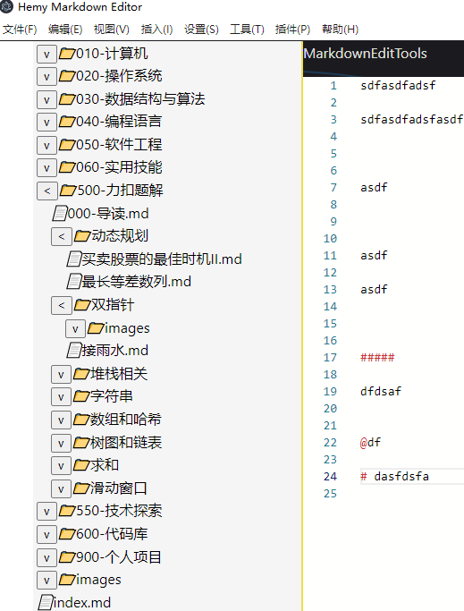

# 增加资源管理器页面

## 一、预览

- 文件管理器
- 文章大纲
- 绘图工具
- Mermaid
- PlantUml
- Json编辑
- Yaml编辑

## 二、文件管理器

经常写文档的时候，是把所有的md文件放在一起，这样找起来也比较好找，这样就需要一个文件管理器来显示所有的文件。

当前的功能，是从用户指定的文件夹下进行显示，不支持全系统盘处理，那文件太多了。

目前只支持显示`.md`、`.png`、`.jpg`后缀的文件，其他类型的不在管理器中显示。



图标什么的后面再进行优化吧。

### 2.1 打开文件夹

利用electron的dialog和fs.readdir，递归读取文件夹下的文件列表，只保留文件夹和`.md`、`.png`、`.jpg`后缀的文件属性。

通过`mainWindow.webContents.send('file-system-data', JSON.stringify(mdFiles))`将信息传递给渲染进程。

就是我们的资源管理器vue组件。

<details>
<summary style="color:rgb(0,0,255);font-weight:bold">递归读取文件夹Tree参考</summary>
<blockcode><pre><code>

```typescript
function shouOpenDirectoryDialog(mainWindow: Electron.BrowserWindow) {
    dialog
        .showOpenDialog(mainWindow, {
            properties: ['openDirectory']
        })
        .then((result) => {
            if (result.canceled) return

            const dirPath = result.filePaths[0]

            traverseDirectory(dirPath, (mdFiles) => {
                // 发送文件名列表到渲染进程
                mainWindow.webContents.send('file-system-data', JSON.stringify(mdFiles))
            })
        })
        .catch((err) => {
            console.error('Error opening directory dialog:', err)
        })
}

// 递归读取目录中的 .md 文件
// 递归读取目录中的 .md 文件，并构建目录树
function traverseDirectory(dir, callback) {
    fs.readdir(dir, (err, files) => {
        if (err) {
            console.error(err)
            return
        }

        const items = files.map((file) => {
            const fullPath = path.join(dir, file)
            return {
                name: file,
                path: fullPath,
                isDirectory: false, // 默认为文件
                children: [] // 初始化 children 为空数组
            }
        })

        Promise.all(
            items.map((item) => {
                return new Promise((resolve, reject) => {
                    fs.lstat(item.path, (err, stats) => {
                        if (err) {
                            reject(err)
                        } else {
                            item.isDirectory = stats.isDirectory()

                            if (item.isDirectory) {
                                // 如果是目录，则递归调用 traverseDirectory
                                traverseDirectory(item.path, (subItems) => {
                                    item.children = subItems
                                    item.type = 'folder'
                                    resolve(item)
                                })
                            } else if (
                                path.extname(item.name) === '.md' ||
                                path.extname(item.name) === '.png' ||
                                path.extname(item.name) === '.jpg'
                            ) {
                                // 如果是 .md 文件，则直接解析
                                item.type = 'file'
                                resolve(item)
                            } else {
                                // 对于非 .md 文件，我们不需要它，所以简单地解析
                                resolve(null)
                            }
                        }
                    })
                })
            })
        )
            .then((resolvedItems) => {
                // 过滤掉非 .md 文件和目录（它们为 null）
                const filteredItems = resolvedItems.filter(Boolean)

                // 构建完整的目录树
                const tree = filteredItems.reduce((acc, item) => {
                    if (item.isDirectory) {
                        // 如果目录已经在树中，则添加其子项
                        const existingDir = acc.find((dir) => dir.path === item.path)
                        if (existingDir) {
                            existingDir.children = existingDir.children.concat(item.children)
                        } else {
                            acc.push(item)
                        }
                    } else {
                        // 对于文件，直接添加到树中（假设它们总是添加到顶层目录）
                        acc.push(item)
                    }
                    return acc
                }, [])

                // 调用回调并传入目录树
                callback(tree)
            })
            .catch((err) => {
                console.error(err)
            })
    })
}
```
</code></pre></blockcode></details>

### 2.2 资源管理器

```html
<template>
    <div id="file-tree">
        <FileTreeNode
                v-for="(rootItem, index) in fileSystemTree"
                :key="index"
                v-model:is-expanded="rootItem.isExpanded"
                :is-indented="false"
                :node="rootItem"
        />
    </div>
</template>
```

在资源管理器组件中，监听主进程的消息，收到后给组件进行解析显示。这里用了子组件FileTreeNode.vue

```typescript
window.electron.ipcRenderer.on('file-system-data', (_, fileSystemData: string) => {
  try {
    // 解析接收到的 JSON 数据
    // 更新响应式引用
    fileSystemTree.value = JSON.parse(fileSystemData)
  } catch (error) {
    console.error('Error parsing file system data:', error)
  }
})
```

### 2.3 FileTreeNode

这里面就是递归显示处理了，并在文件操作上增加了点击事件。

```vue
<template>
    <div class="file-tree-node" :class="{ indented: isIndented }">
        <div class="node-content" @click="handleClick(node)">
            <!-- 如果是文件夹，显示文件夹图标和名称，并提供一个展开/收起按钮 -->
            <span v-if="node.type === 'folder'">
        <button @click="toggleFolder">
          {{ isExpanded ? '<' : 'v' }}
        </button>
        <i class="folder-icon">📁</i>
        <span>{{ node.name }}</span>
      </span>
            <!-- 如果是文件，只显示文件图标和名称 -->
            <span v-else>
        <i class="file-icon">📄</i>
        <span>{{ node.name }}</span>
      </span>
        </div>
        <!-- 如果当前是文件夹并且已经展开，递归显示子节点 -->
        <div v-if="node.type === 'folder' && isExpanded">
            <FileTreeNode
                    v-for="child in node.children"
                    :key="child.id"
                    v-model:is-expanded="child.isExpanded"
                    :node="child"
                    :is-indented="true"
            />
        </div>
    </div>
</template>
```

这里本来想将处理放在父组件的，后来发现不行，因为这里是递归处理，消息会堵起来的，只有第一层的md文件能打开。

打开文件处理这里不说了，可以参考文件菜单的处理

这里就是给主进程发送了一条消息，主进程收到后，读取文件内容，然后将内容发送给monaco-editor组件的渲染进程，然后显示在编辑器，同时通过markdown-it进行渲染，显示在预览区域。
