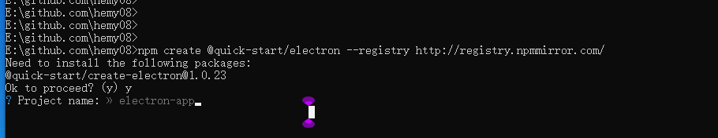
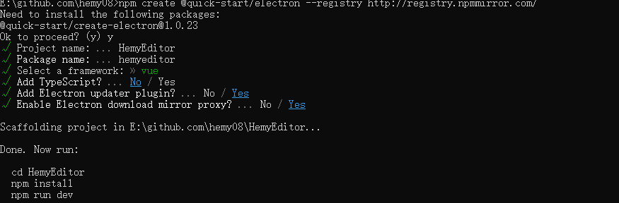
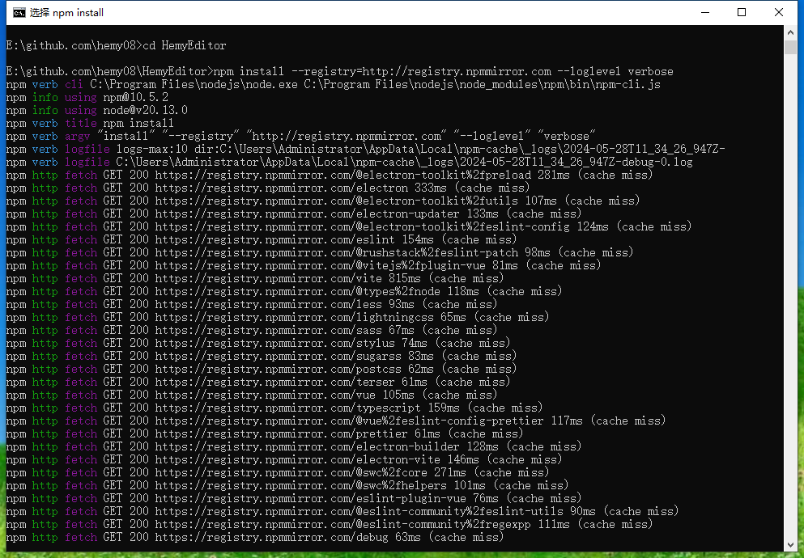
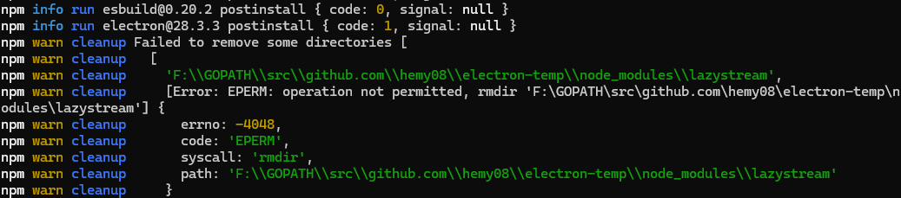
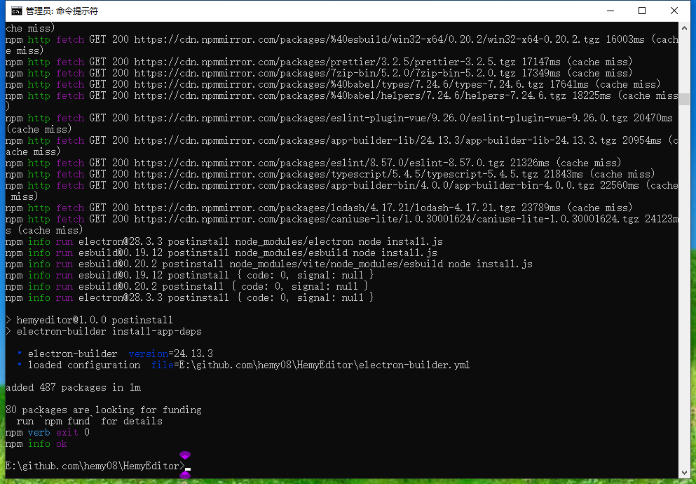
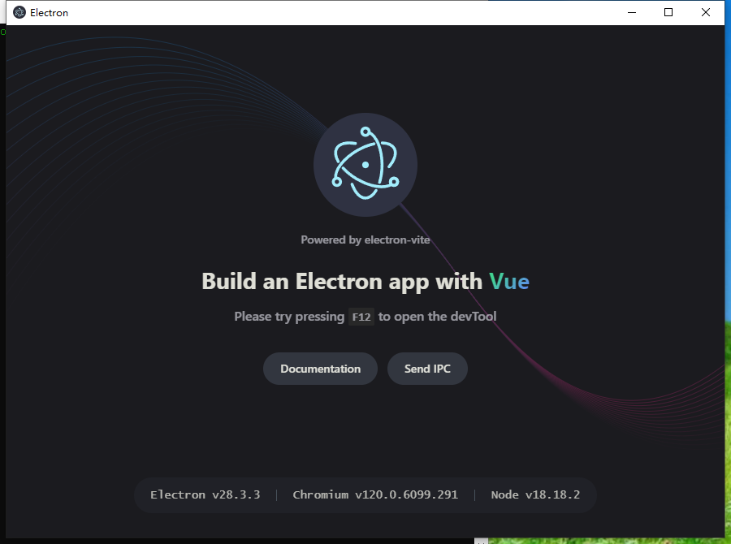

# 项目初始创建


```
npm create @quick-start/electron --registry http://registry.npmmirror.com/
```



设置相关参数



- **Project name**：项目名称自定义输入 <span style="color:rgb(255,0,0);font-weight:bold">HemyMarkdownEditor</span>
- **Select a framework**：选择框架，内置vanilla,vue,react,svelte,solid可选择，这里我们选择vue
- **Add TypeScript**：是否添加TypeScript，选择no，不用Typescript，默认使用JavaScript
- **Add Electron updater plugin**：是否添加Electron更新插件，yes
- **Enable Electron download mirror proxy**：镜像下载代理，国内网络建议开启，yes

这里建议就用js，虽然TypeScript更优秀，但是TypeScript+VUE+Electron，如果不是特别熟悉这几个工具的，不建议使用，我自己光添加应用菜单就碰了一鼻子灰。

```
cd HemyEditor
npm install --registry=http://registry.npmmirror.com --loglevel verbose
// 如果不行，可以试试cnpm
cnpm install --registry=http://registry.npmmirror.com --loglevel verbose
npm run dev
```



第一次尝试的时候报错了



这里的意思是权限不够，不过试了各种方式，添加权限啥的，都不行。从网上看到一个帖子，npm 命令执行install的时候，不是以类似root的用户去操作的，而是以一个低权限的用户进行执行。

没找到解决方案，很巧的是解决了，不知道啥原因，估计有可能是网络的问题，也有可能是镜像或者`.npmrc`文件设置问题。执行过下面的一些命令

```
npm cache clean -f
npm install --registry=http://registry.npmmirror.com --loglevel verbose
```

日志显示这里是安装`electron@28.3.3`版本失败了，手动下载下安装包，然后放在`C:\Users\{用户名}\AppData\Local\electron\Cache`目录下，不用解压。



然后重新执行命令

```
npm install --registry=http://registry.npmmirror.com --loglevel verbose electron
npm install --registry=http://registry.npmmirror.com --loglevel verbose electron-store
```

```
npm run dev // 运行工具
npm run build:win // win编译
```

