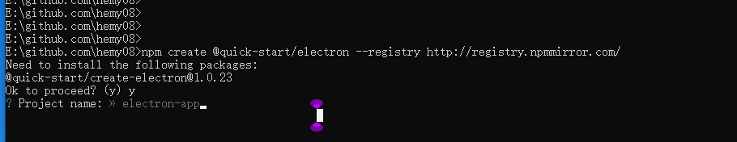
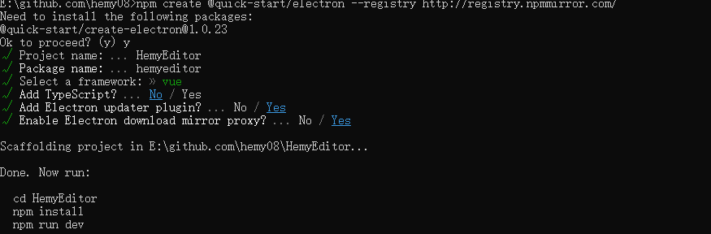
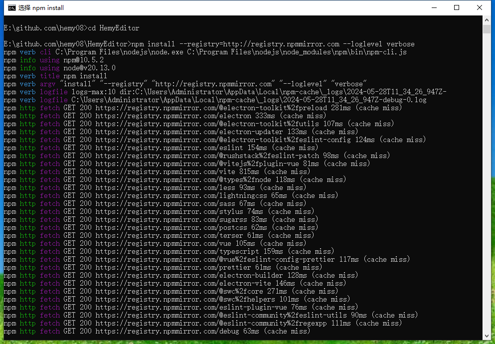
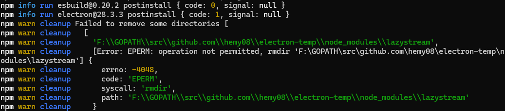
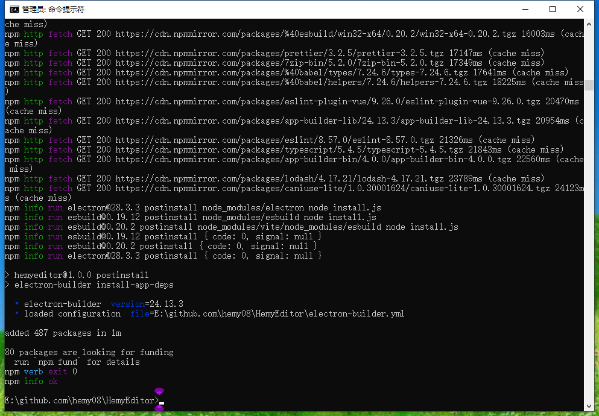
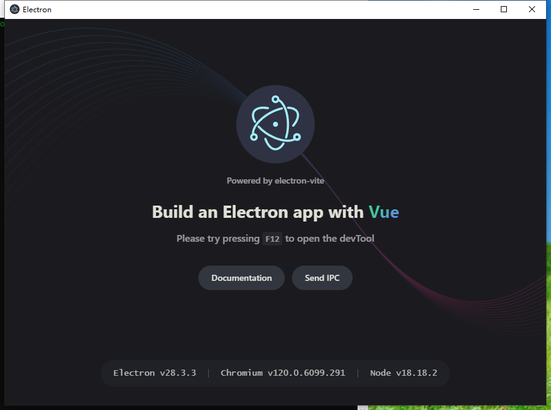

# 项目初始创建

## 一、使用 electron-vite 脚手架创建

项目使用 [electron-vite](https://github.com/alex8088/electron-vite) 的脚手架工具 `@quick-start/electron` 创建，基于 Vite 构建，支持 TypeScript。

```
npm create @quick-start/electron --registry http://registry.npmmirror.com/
```



设置相关参数



- **Project name**：项目名称自定义输入 <span style="color:rgb(255,0,0);font-weight:bold">BaiZeNotesByVue</span>
- **Select a framework**：选择框架，内置 vanilla、vue、react、svelte、solid 可选择，这里我们选择 <span style="color:rgb(255,0,0);font-weight:bold">vue</span>
- **Add TypeScript**：是否添加 TypeScript，选择 <span style="color:rgb(255,0,0);font-weight:bold">yes</span>，使用 TypeScript（项目实际采用 TypeScript 开发）
- **Add Electron updater plugin**：是否添加 Electron 更新插件，yes
- **Enable Electron download mirror proxy**：镜像下载代理，国内网络建议开启，yes

> **说明**：项目早期尝试过使用纯 JavaScript 开发，但后续全面迁移到 TypeScript。TypeScript + Vue + Electron 组合虽然学习曲线较陡，但类型安全带来的收益值得，特别是在大型项目中能有效减少运行时错误。

## 二、安装依赖并启动

```
cd BaiZeNotesByVue
npm install --registry=http://registry.npmmirror.com --loglevel verbose
// 如果不行，可以试试cnpm
cnpm install --registry=http://registry.npmmirror.com --loglevel verbose
npm run dev
```



### 常见问题处理

第一次尝试的时候可能报错（权限问题）：



这里的意思是权限不够，不过试了各种方式，添加权限啥的，都不行。从网上看到一个帖子，npm 命令执行 install 的时候，不是以类似 root 的用户去操作的，而是以一个低权限的用户进行执行。

没找到解决方案，很巧的是解决了，不知道啥原因，估计有可能是网络的问题，也有可能是镜像或者 `.npmrc` 文件设置问题。执行过下面的一些命令

```
npm cache clean -f
npm install --registry=http://registry.npmmirror.com --loglevel verbose
```

日志显示这里是安装 `electron` 版本失败了，手动下载下安装包，然后放在 `C:\Users\{用户名}\AppData\Local\electron\Cache` 目录下，不用解压。



然后重新执行命令

```
npm install --registry=http://registry.npmmirror.com --loglevel verbose electron
npm install --registry=http://registry.npmmirror.com --loglevel verbose electron-store
```

## 三、项目脚本命令

项目创建完成后，`package.json` 中预置了以下脚本：

```
npm run dev          // 启动开发环境（热更新）
npm run build        // 构建应用（未打包）
npm run build:win    // 构建 Windows 安装包（nsis + portable）
npm run build:mac    // 构建 macOS 安装包
npm run build:linux  // 构建 Linux 安装包
npm run typecheck    // TypeScript 类型检查
npm run lint         // ESLint 代码检查并修复
npm run test         // 运行单元测试
npm run format       // Prettier 格式化
```



## 四、electron-vite 配置

项目根目录的 `electron.vite.config.ts` 是 electron-vite 的配置文件，分别配置 main、preload、renderer 三个部分：

<details>
<summary style="color:rgb(0,0,255);font-weight:bold">electron.vite.config.ts 参考</summary>
<blockcode><pre><code>
```typescript
import { resolve } from 'path'
import { defineConfig, externalizeDepsPlugin } from 'electron-vite'
import vue from '@vitejs/plugin-vue'

export default defineConfig({
  main: {
    plugins: [externalizeDepsPlugin()],
  },
  preload: {
    plugins: [externalizeDepsPlugin({ exclude: ['@electron-toolkit/preload'] })],
    build: {
      rollupOptions: {
        input: {
          index: resolve(__dirname, 'src/preload/index.ts'),
          dialog: resolve(__dirname, 'src/preload/dialog.ts')
        }
      }
    }
  },
  renderer: {
    resolve: {
      alias: {
        '@renderer': resolve('src/renderer/src'),
        '@mainer': resolve('src/main')
      }
    },
    plugins: [vue({})]
  }
})
```
</code></pre></blockcode></details>

配置说明：

- **main**：主进程配置，使用 `externalizeDepsPlugin` 将依赖外部化
- **preload**：预加载脚本配置，支持多入口（index 和 dialog）
- **renderer**：渲染进程配置，设置路径别名 `@renderer` 和 `@mainer`，加载 Vue 插件

## 五、TypeScript 配置

项目使用三个 tsconfig 文件分别配置不同环境：

- `tsconfig.json`：基础配置
- `tsconfig.node.json`：Node.js 环境（主进程和 preload）
- `tsconfig.web.json`：Web 环境（渲染进程）

## 六、打包配置

`electron-builder.yml` 配置了应用的打包选项：

- **appId**：`hemye.BaiZeNotes`
- **productName**：`BaiZeNotes`
- **win**：Windows 平台，支持 nsis 安装包和 portable 免安装版
- **extraResources**：额外资源文件（config、icon、katex、themes、mermaid、plantuml）
- **electronDownload**：Electron 下载镜像配置

<details>
<summary style="color:rgb(0,0,255);font-weight:bold">electron-builder.yml 关键配置</summary>
<blockcode><pre><code>
```yaml
appId: hemye.BaiZeNotes
productName: BaiZeNotes
directories:
  buildResources: build
files:
  - out/**/*
  - '!out/renderer/src/**'
extraResources:
  - from: "resources/config"
    to: "config"
  - from: "resources/themes"
    to: "themes"
  - from: "resources/katex"
    to: "katex"
  - from: "resources/mermaid"
    to: "mermaid"
  - from: "resources/plantuml"
    to: "plantuml"
win:
  target:
    - target: nsis
      arch: [x64]
    - target: portable
      arch: [x64]
electronDownload:
  mirror: https://npmmirror.com/mirrors/electron/
```
</code></pre></blockcode></details>

## 七、项目目录结构

创建完成后的项目目录结构：

```
BaiZeNotesByVue/
├── src/
│   ├── main/           # 主进程
│   │   └── index.ts
│   ├── preload/        # 预加载脚本
│   │   └── index.ts
│   └── renderer/       # 渲染进程
│       ├── index.html
│       └── src/
│           ├── App.vue
│           └── main.ts
├── resources/          # 应用资源
├── package.json
├── electron.vite.config.ts
├── electron-builder.yml
└── tsconfig.json
```

后续开发中，按照功能模块逐步扩展 `src/main`、`src/preload`、`src/renderer` 和 `src/shared` 目录的内容，详细结构参考 [000-项目概览](000-项目概览.md#四、项目结构)。
