# 工具栏配置以及实现

## 一、效果预演

后续实现过程中可能与当前有差异，会实时调整工具栏

=== "文件(F)"

    - 新建 `Ctrl+N`
    - 打开文件
    - 打开文件夹 `Ctrl+O`
    - --------------
    - 从文件导入
        - 从 Word 导入
        - 从 HTML 导入
        - 从 JSON 导入
        - 从 YAML 导入
        - 从 XML 导入
        - 从文本文件导入
    - 导出到文件
        - 导出为Word
        - 导出为JSON
        - 导出为XML
        - 导出为YAML
        - 导出为HTML
        - 导出为PDF
    - --------------
    - 保存 `Ctrl+S`
    - 另存为
    - 从磁盘重新加载 `Ctrl+R`
    - --------------
    - 重启应用 `Ctrl+Shift+R`
    - --------------
    - 退出 `F4`

=== "编辑(E)"

    - 撤销 `Ctrl+Z`
    - 重做 `Ctrl+Y`
    - --------------
    - 剪切 `Ctrl+X`
    - 复制 `Ctrl+C`
    - 粘贴 `Ctrl+V`
    - --------------
    - 跳转到行 `Ctrl+G`
    - 查找 `Ctrl+F`
    - 替换 `Ctrl+H`
    - 在文件中查找 `Ctrl+Shift+F`
    - 在文件中替换 `Ctrl+Shift+H`

=== "视图(V)"

    - 编辑模式 `F9`
    - 预览模式 `F10`
    - 编辑/预览模式 `F11`
    - 开发人员工具 `F12`
    - -----------------
    - 显示/隐藏资源管理器
    - 显示/隐藏行号
    - 显示/隐藏空白字符
    - 显示/隐藏文章大纲
    - ------
    - 折叠/展开标题
        - 全部折叠
        - 全部展开
        - 一级标题
        - 二级标题
        - 三级标题
        - 四级标题
        - 五级标题
        - 六级标题

=== "编码(C)"

    - 重新用...编码打开
        - UTF-8
        - UTF-16LE
        - UTF-16BE
        - GBK(简体中文)
        - GB2312(简体中文)
        - GB18030(简体中文)
        - Big5(繁体中文)
        - 十六进制
    - 转为...编码
        - 同上

=== "插入(I)"

    - 特殊字体
    - 数学公式
    - Markdown表格
    - 网页链接
    - ---------------
    - 写作模板
        - 力扣题解模块
        - 问题处理模块
        - 文章封面
        - 论文模板
    - 文本块
        - 图片链接
        - 折叠代码块
        - 有序链接列表
        - 文章更新日期
    - 来自文件
        - json
        - txt、log
        - ini、csv
    - -----------
    - Material
        - Admonition
    - Mermaid
        - Mermaid Part1
        - Mermaid Part2
    - PlantUml
        - PlantUML Part1
        - PlantUML Part2
    - ------------
    - 自定义模板
    - 模板管理


=== "设置(S)"

    - 系统设置
    - 主题设置
    - --------------
    - 快速链接设置
    - 编辑器设置

=== "工具(T)"

    - Mermaid绘图
    - 公式编辑器
    - 电子表格
    - 配图制作
    - 绘图工具

=== "插件(P)"

    - 语言语法关键字对照表
    - 加解密插件
    - 各类转换器
        - 编解码转换
        - 格式转换器
        - 大小写转换
        - 格式化工具
    - 网络计算插件
        - 地址转换器
        - 解析器
    - 常用对照表
        - 对照表一
        - 数据和命令对照表
        - 科学符号对照表

=== "在线"

    - 菜鸟在线工具
    - 编程狮在线工具
    - 在线编解码工具
    - 在线IDE编辑器
    - 开发者工具
    - 国内知名前端团队
    - 云计算平台

=== "GitHub"

    - GitHub 相关链接

=== "帮助(H)"
    
    - 版本发布
        - v1.2.2 / v1.2.1 / v1.2.0 / v1.1.5 / ...
    - 修改日志
        - 重大版本升级
    - -------------
    - 键盘快捷方式
    - 使用文档
    - 提交创意/意见
    - --------------
    - 技术栈
    - 关于
    - 主页
    - --------------
    - 检查更新
    - 联系我们

## 二、实现方案

### 2.1 菜单栏架构

项目菜单栏采用 **Vue 组件实现**（非 Electron 原生 Menu），这样可以更好地支持主题适配、自定义样式和灵活交互。

菜单相关文件分布在两个位置：

```
src/
├── main/ipc/                    # 主进程菜单处理
│   ├── menu_file.ts             # 文件菜单 IPC 处理
│   ├── menu_edit.ts             # 编辑菜单 IPC 处理
│   ├── menu_view.ts             # 视图菜单 IPC 处理
│   ├── menu_tools.ts            # 工具菜单 IPC 处理
│   ├── menu_help.ts             # 帮助菜单 IPC 处理
│   ├── menu_context.ts          # 右键菜单处理
│   └── menu_handle.ts           # 菜单处理入口
└── renderer/src/components/
    ├── MenuBar.vue              # 菜单栏 Vue 组件
    └── MenuBar/
        ├── menu_config.ts       # 菜单数据配置
        ├── menu_consts.ts       # 菜单常量（URL、插件等）
        └── menu_actions.ts      # 菜单动作处理
```

### 2.2 菜单数据结构

菜单项使用 `BaiZeMenuItem` 类型定义，支持子菜单、分隔符、快捷键、动作标识等：

<details>
<summary style="color:rgb(0,0,255);font-weight:bold">BaiZeMenuItem 类型定义</summary>
<blockcode><pre><code>
```typescript
interface BaiZeMenuItem {
    label?: string              // 菜单显示文本
    icon?: string              // 图标标识
    accelerator?: string       // 快捷键
    menu_action?: string       // 菜单动作标识（触发 IPC）
    submenu?: BaiZeMenuItem[]  // 子菜单
    type?: 'separator'         // 分隔符
}
```
</code></pre></blockcode></details>

### 2.3 菜单配置 menu_config.ts

所有菜单在 `menu_config.ts` 中集中配置，通过 `menuMap` 导出。每个菜单项通过 `menu_action` 字段标识动作，由 `menu_actions.ts` 中的 `HandleMenuAction` 函数统一处理。

<details>
<summary style="color:rgb(0,0,255);font-weight:bold">menu_config.ts 菜单配置示例</summary>
<blockcode><pre><code>
```typescript
const fileMenu: BaiZeMenuItem = {
    label: '文件',
    accelerator: 'Alt+N',
    icon: 'file',
    submenu: [
        { label: '新建', accelerator: 'Ctrl+N', menu_action: 'baize:menu:file:new' },
        { label: '打开文件', menu_action: 'baize:menu:file:open-file' },
        { label: '打开文件夹', accelerator: 'Ctrl+O', menu_action: 'baize:menu:file:open-folder' },
        { type: 'separator' },
        importMenu,    // 导入子菜单
        exportMenu,    // 导出子菜单
        { type: 'separator' },
        { label: '保存', accelerator: 'Ctrl+S', menu_action: 'baize:menu:file:save' },
        { label: '另存为', menu_action: 'baize:menu:file:save-as' },
        { label: '从磁盘重新加载', accelerator: 'Ctrl+R', menu_action: 'baize:menu:file:reload' },
        { type: 'separator' },
        { label: '重启应用', accelerator: 'Ctrl+Shift+R', menu_action: 'baize:menu:file:relaunch' },
        { type: 'separator' },
        { label: '退出', accelerator: 'F4', menu_action: 'baize:menu:file:exit' }
    ]
}

export const menuMap = ref<BaiZeMenuItem[]>(markRaw([
    fileMenu,       // 文件
    editMenu,       // 编辑
    viewMenu,       // 视图
    codingMenu,     // 编码
    insertMenu,     // 插入
    settingMenu,    // 设置
    toolsMenu,      // 工具
    pluginsMenu,    // 插件
    onlineMenu,     // 在线
    gitHubMenu,     // GitHub
    helpMenu        // 帮助
]))
```
</code></pre></blockcode></details>

### 2.4 MenuBar.vue 组件

`MenuBar.vue` 负责菜单的渲染和交互，使用 `<teleport>` 将子菜单传送到 body，避免被父容器裁剪：

<details>
<summary style="color:rgb(0,0,255);font-weight:bold">MenuBar.vue 核心结构</summary>
<blockcode><pre><code>
```vue
<template>
    <div class="menu-bar" @mouseleave="handleMenuBarLeave">
        <div
            v-for="(menu, index) in menuMap"
            :key="index"
            class="menu-item"
            :class="{ active: activeMenu === index }"
            @click="toggleMenu(index)"
            @mouseenter="handleMenuEnter(index)"
        >
            <span class="menu-label">{{ menu.label }}</span>
        </div>
        <!-- 子菜单容器，传送到 body 避免裁剪 -->
        <teleport to="body">
            <transition name="submenu-fade">
                <div v-if="activeMenu !== null" class="submenu-container" :style="submenuStyle">
                    <BaiZeSubMenuItem
                        :items="menuMap[activeMenu].submenu || []"
                        :level="0"
                        @close="closeMenu"
                    />
                </div>
            </transition>
        </teleport>
    </div>
</template>
```
</code></pre></blockcode></details>

### 2.5 菜单动作处理

菜单点击时，通过 `menu_action` 标识触发对应动作。`menu_actions.ts` 中的 `HandleMenuAction` 函数根据动作标识分发处理：

- 涉及文件系统、对话框等操作：通过 IPC 发送到主进程处理
- 涉及编辑器操作：通过 IPC 或 EventBus 通知编辑器组件
- 涉及界面切换：直接修改组件状态

### 2.6 主进程菜单处理

主进程在 `src/main/ipc/` 下按菜单类别组织 IPC 处理器：

- `menu_file.ts`：文件操作（新建、打开、保存、导入导出等）
- `menu_edit.ts`：编辑操作（撤销、重做、查找替换等）
- `menu_view.ts`：视图操作（模式切换、显示隐藏等）
- `menu_tools.ts`：工具操作（Mermaid、公式编辑器等）
- `menu_help.ts`：帮助操作（关于、版本信息等）

## 三、成品展示

### 3.1 文件

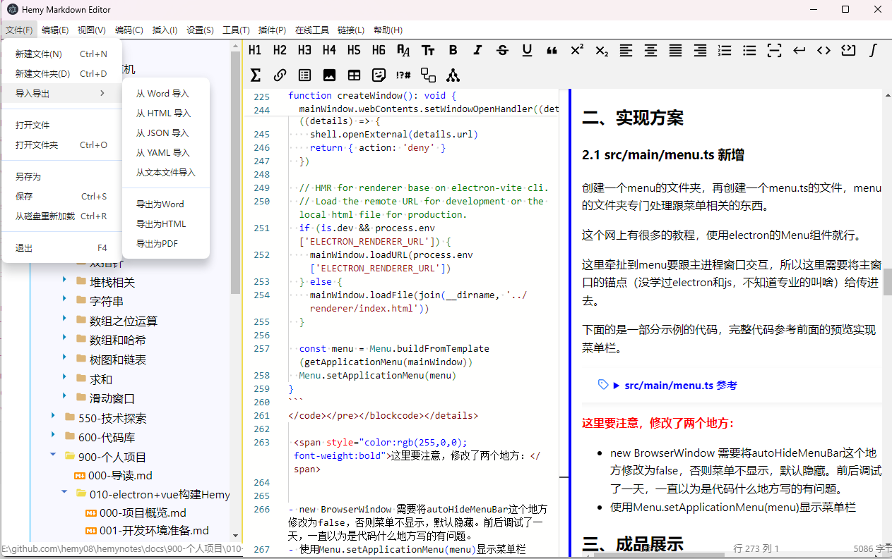

### 3.2 编辑

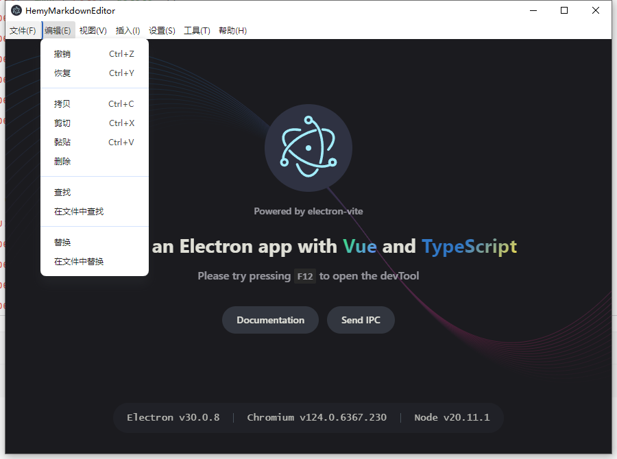

### 3.3 视图

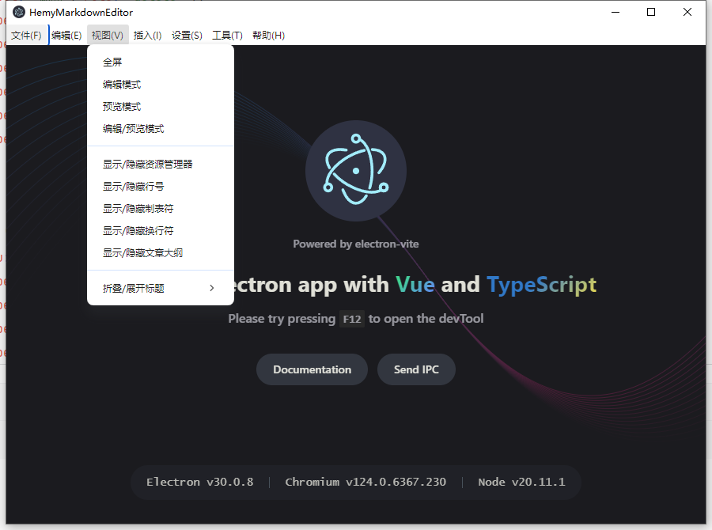

### 3.4 编码

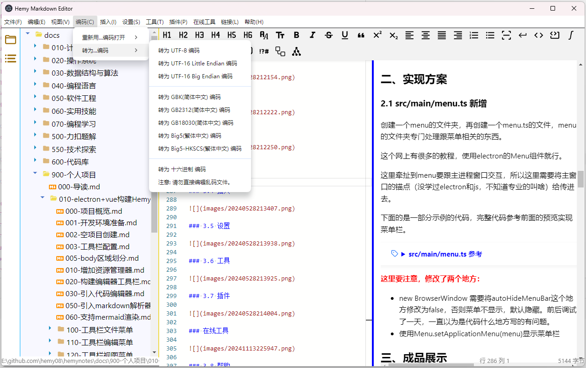

### 3.5 插入

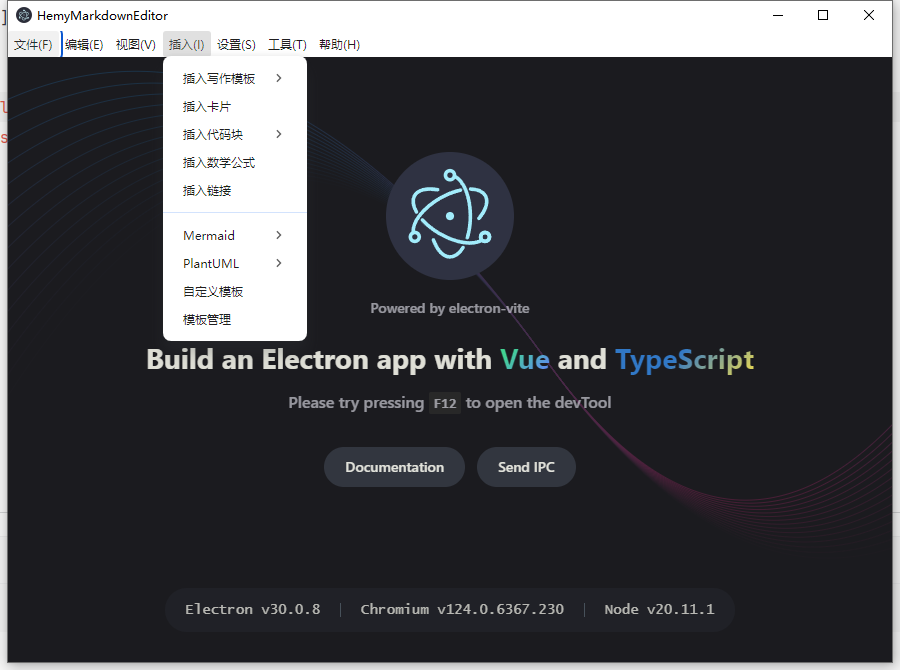

### 3.6 设置

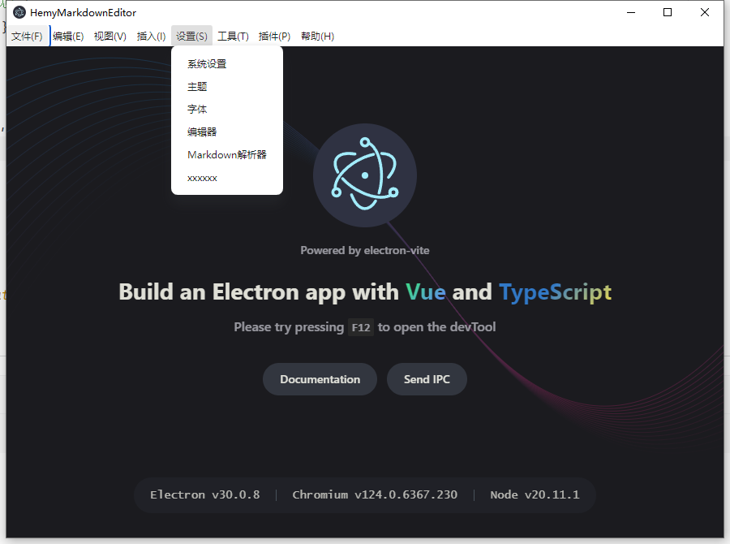

### 3.7 工具

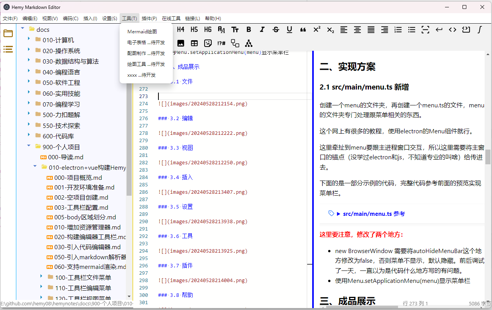

### 3.8 插件

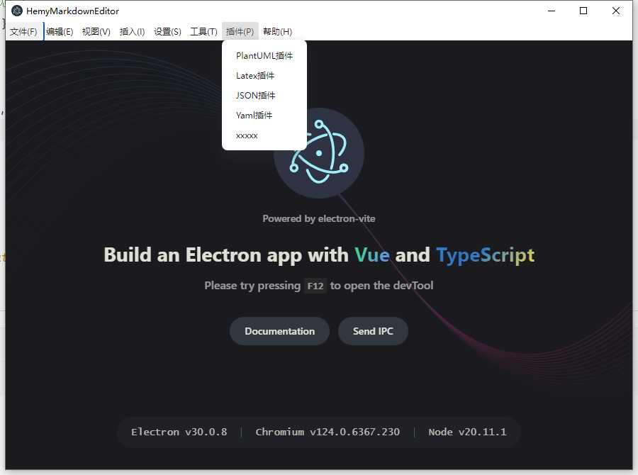

### 3.9 在线工具

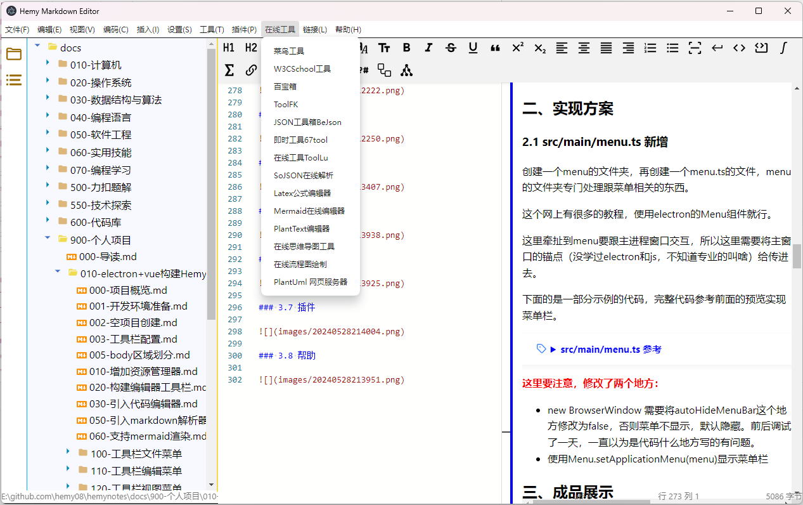

### 3.10 GitHub

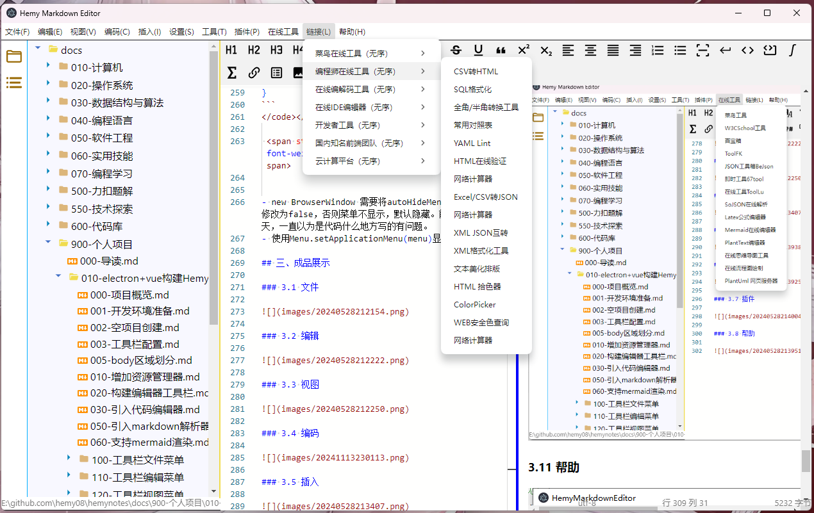

### 3.11 帮助

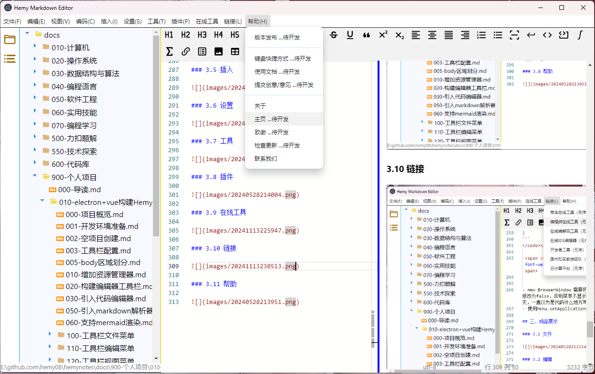
