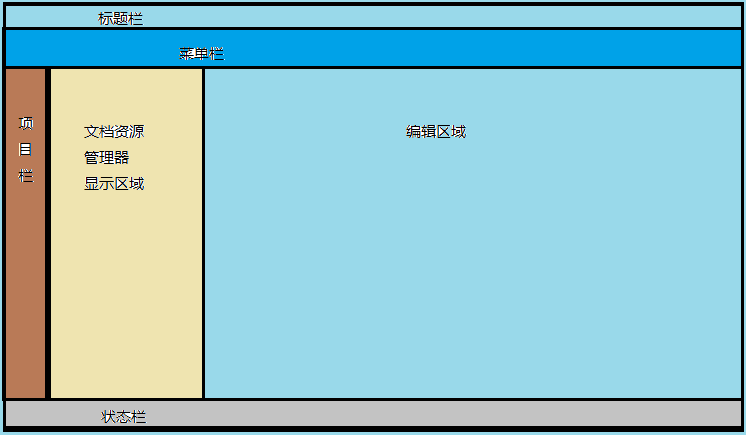
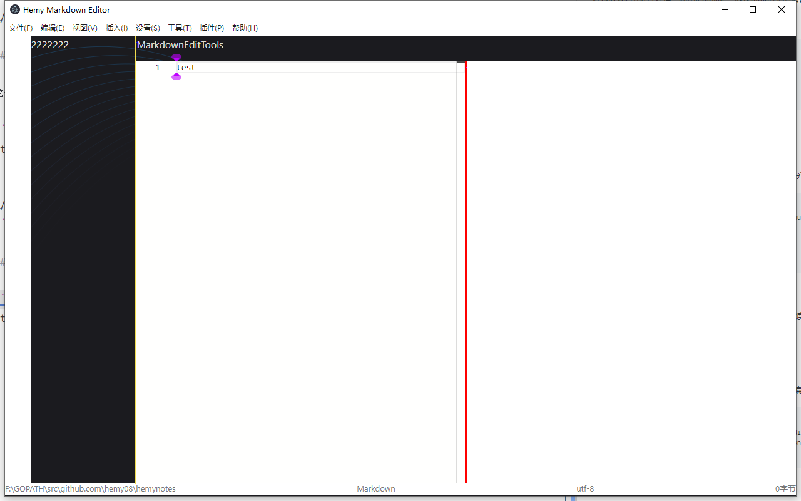

# Body区域划分

## 一、预览

body区域准备划分两部分，左侧做出文件管理器页面，右侧是编辑区域，对于Markdown编辑来说，可以平分做预览区域。



## 二、实现思路

应用界面分为以下几个层次：

```
App.vue（根组件）
├── WelcomeScreen.vue（欢迎界面，初始显示）
└── BaiZeNotes.vue（主应用界面）
    ├── 标题栏（title-bar，支持拖动、最小化/最大化/关闭）
    ├── 菜单栏（menu-bar，MenuBar.vue）
    ├── 工作区域（workspace-area，WorkSpace.vue）
    ├── 状态栏（status-bar，StatusBar.vue）
    └── 对话框组件（dialogs）
```

工作区域划分三部分：

- **左侧导航栏（navi-tab）**：固定宽度，放置图标，包含文件资源管理器、文章大纲、绘图工具、PlantUML、Mermaid 等入口
- **中间资源管理区域（resource-manager）**：宽度可调节，根据左侧导航选择显示不同内容
    - 文件资源管理器：文件列表 tree
    - 文章大纲：Markdown-toc
- **右侧工作区域**：根据导航切换不同容器
    - Markdown 编辑器（MarkdownContainer）
    - 插件工具（PluginTools）
    - Hemy 工具（HemyTools）
    - HTML 查看（ShowHtmlView）
    - PDF 编辑器（ShowPdfEditor）

状态栏显示：文件绝对路径、文件类型、编码、文件大小、保存状态等信息

## 三、实现

### 3.1 App.vue

`App.vue` 是根组件，负责在欢迎界面和主应用界面之间切换：

<details>
<summary style="color:rgb(0,0,255);font-weight:bold">App.vue 参考</summary>
<blockcode><pre><code>
```vue
<template>
    <div id="app-root">
        <!-- 欢迎界面 -->
        <WelcomeScreen 
            v-if="showWelcome"
            @openFile="handleOpenFile"
            @openFolder="handleOpenFolder"
            @openRecentFolder="handleOpenRecentFolder"
        />
        <!-- 主应用界面 -->
        <BaiZeNotes v-else />
    </div>
</template>
<script setup lang="ts">
import { ref, onMounted, onBeforeUnmount } from 'vue'
import WelcomeScreen from './components/WelcomeScreen.vue'
import BaiZeNotes from './components/BaiZeNotes.vue'

const showWelcome = ref(true)

// 处理打开文件/文件夹，通过 IPC 通知主进程
function handleOpenFile() {
    window.electron.ipcRenderer.send('baize:notes:welcome:open-file')
}
function handleOpenFolder() {
    window.electron.ipcRenderer.send('baize:notes:welcome:open-directory')
}
</script>
```
</code></pre></blockcode></details>

### 3.2 BaiZeNotes.vue

`BaiZeNotes.vue` 是主应用组件，包含标题栏、菜单栏、工作区域、状态栏和所有对话框：

<details>
<summary style="color:rgb(0,0,255);font-weight:bold">BaiZeNotes.vue 结构参考</summary>
<blockcode><pre><code>
```vue
<template>
    <div id="editor-container" :style="containerStyles">
        <!-- 标题栏区域，高度30px，支持拖动移动窗口 -->
        <div v-show="electronMenu" id="title-bar" class="title-bar"
            @mousedown="onTitleBarMouseDown"
            @dblclick="onTitleBarDblClick">
            <div class="title-left">
                
                <span class="title-text">白泽笔记 - Markdown Editor</span>
            </div>
            <div class="window-controls">
                <button class="window-btn minimize" @click="minimizeWindow"></button>
                <button class="window-btn maximize" @click="maximizeWindow"></button>
                <button class="window-btn close" @click="closeWindow"></button>
            </div>
        </div>
        <!-- 菜单栏区域 -->
        <div v-show="electronMenu" id="menu-bar" class="menu-bar"><MenuBar /></div>
        <!-- 工作区域 -->
        <div id="workspace-area" class="workspace-area"><WorkSpace /></div>
        <!-- 状态栏 -->
        <div id="status-bar" class="status-bar" :style="statusBarStyles"><StatusBar /></div>
        <!-- 对话框组件（主题设置、字体选择、编辑器设置等） -->
        <BaiZeDialogs.ThemeSettingDialog ... />
        <BaiZeDialogs.EditorSettingDialog ... />
        <!-- ... 其他对话框 -->
    </div>
</template>
```
</code></pre></blockcode></details>

### 3.3 WorkSpace.vue

`WorkSpace.vue` 是工作区域，分为左侧导航、资源管理器、右侧工作容器，支持多种容器切换：

<details>
<summary style="color:rgb(0,0,255);font-weight:bold">WorkSpace.vue 参考</summary>
<blockcode><pre><code>
```vue
<template>
    <!-- 左侧导航栏，固定宽度 -->
    <div id="left-navi" class="navi-tab" :style="{ width: naviTabWidth, float: 'left' }">
        <NaviTab position="left" @update:navi:tab="onSwitchRightNaviTab" />
    </div>
    <!-- 中间资源管理区域，宽度可调节 -->
    <div v-show="isShowResourceMgrArea" id="resource-manager" class="resource-manager"
        :style="{ width: resMgrWidth }">
        <ResManager :navi-show="naviResManagerShow" />
    </div>
    <!-- 宽度调节条 -->
    <div id="resizer-main" class="resizer-main" :style="{ left: resizerLeft }"
        @mousedown="startCursorPosition($event)"></div>
    <!-- 右侧工作区域，根据导航切换不同容器 -->
    <div v-show="isShowMdContainer" id="md-container" class="md-container"
        :style="{ width: workAreaWidth, marginRight: naviTabWidth }">
        <MdContainer :md-container-width="workAreaWidth" />
    </div>
    <div v-show="isShowPluginsContainer" id="plugin-containers" ...>
        <PluginTools :plugins-area-width="workAreaWidth" />
    </div>
    <div v-show="isShowToolsContainer" id="tool-containers" ...>
        <HemyTools :tools-area-width="workAreaWidth" />
    </div>
    <div v-show="isShowHtmlContainer" id="html-containers" ...>
        <ShowHtmlView :html-area-width="workAreaWidth" />
    </div>
    <div v-show="isShowPdfContainer" id="pdf-containers" ...>
        <ShowPdfEditor :pds-area-width="workAreaWidth" />
    </div>
    <!-- 最右侧导航栏 -->
    <div id="right-navi" class="navi-tab" :style="{ width: naviTabWidth, float: 'right' }">
        <NaviTab position="right" @update:navi:tab="onSwitchLeftNaviTab" />
    </div>
</template>
<script setup lang="ts">
import { ref, computed, onMounted, onBeforeUnmount } from 'vue'
import EventBus from "@renderer/common/event_bus/event-bus"
import NaviTab from "@renderer/components/WorkSpaceArea/NaviTab.vue"
import ResManager from "@renderer/components/ResourceManager/ResourceManager.vue"
import MdContainer from "@renderer/components/Markdown/MarkdownContainer.vue"
import PluginTools from "@renderer/components/PluginTools/PluginTools.vue"
import HemyTools from "@renderer/components/HemyTools/HemyTools.vue"
import ShowHtmlView from "@renderer/components/HemyTools/ShowHtmlVIew.vue"
import ShowPdfEditor from "@renderer/components/HemyTools/ShowPdfEditor.vue"
// ...
</script>
```
</code></pre></blockcode></details>

利用 `ref` 特性完成窗口的动态变化，在窗口被拖动或者最大化最小化时，窗口大小随着刷新。各容器通过 `v-show` 控制显示，切换时保留组件状态。

### 3.4 MarkdownContainer.vue

Markdown 编辑区域，分为编辑器工具栏、编辑器和预览区域：

```vue
<template>
  <div id="md-edit-tools-bar" class="md-edit-tools-bar">
    <MdEditTools :tool-bar-width="props.mdContainerWidth" />
  </div>
  <div id="md-edit-component" class="md-edit-component">
    <MdEditComp :editor-preview-width="props.mdContainerWidth" />
  </div>
</template>
```

### 3.5 MarkdownEditComponent.vue

编辑区域和预览区域，使用 Monaco Editor 编辑，markdown-it 实时渲染预览：

```vue
<template>
  <div id="md-edit-component" class="md-edit-component" :style="mdEditComponetStyle">
    <MdMonacoEdit v-model="markdownEditorCode" :code="initialCodeContent"
        @update:code="handleMarkdownCodeUpdate" />
  </div>
  <div id="resizer-md" class="resizer-md"></div>
  <div id="md-preview" class="md-preview" :style="mdPreviewComponentStyle">
    <MdPreview :code="markdownEditorCode" />
  </div>
</template>
```

中间有分割条，可以鼠标拖动调整编辑区和预览区的显示比例。视图菜单支持三种模式切换：编辑模式、预览模式、编辑/预览模式。

### 3.6 MarkdownPreviewComponent.vue

预览区域，使用 markdown-it 及其插件链进行渲染，支持防抖优化：

<details>
<summary style="color:rgb(0,0,255);font-weight:bold">MarkdownPreviewComponent.vue 渲染管线</summary>
<blockcode><pre><code>
```typescript
import MarkdownIt from 'markdown-it'
import highlightjs from 'markdown-it-highlightjs'
import { full as emoji } from 'markdown-it-emoji'
import plantuml from 'markdown-it-plantuml'

const md = MarkdownIt({
    html: true, xhtmlOut: true, linkify: true,
    langPrefix: 'language-', breaks: true, typographer: false
})
    .use(highlightjs, { inline: true, hljs: hljs, ... })
    .use(plantuml)
    .use(emoji)

// 监听编辑器内容变化，带防抖优化
watch(() => props.editorContent, () => {
    if (renderDebounceTimer) clearTimeout(renderDebounceTimer)
    renderDebounceTimer = setTimeout(() => {
        updateMarkdownPreRender()
        renderDebounceTimer = null
    }, 150)  // 150ms 防抖延迟
}, { immediate: true })
```
</code></pre></blockcode></details>

## 四、效果


