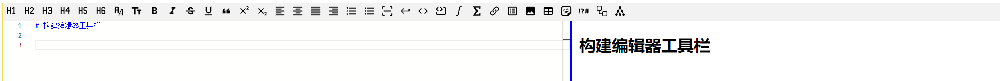
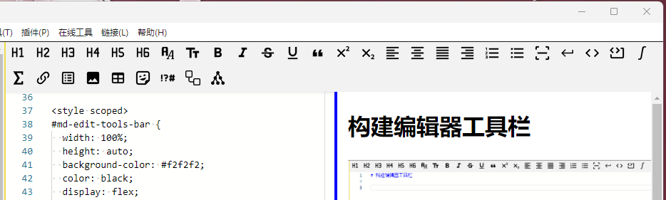
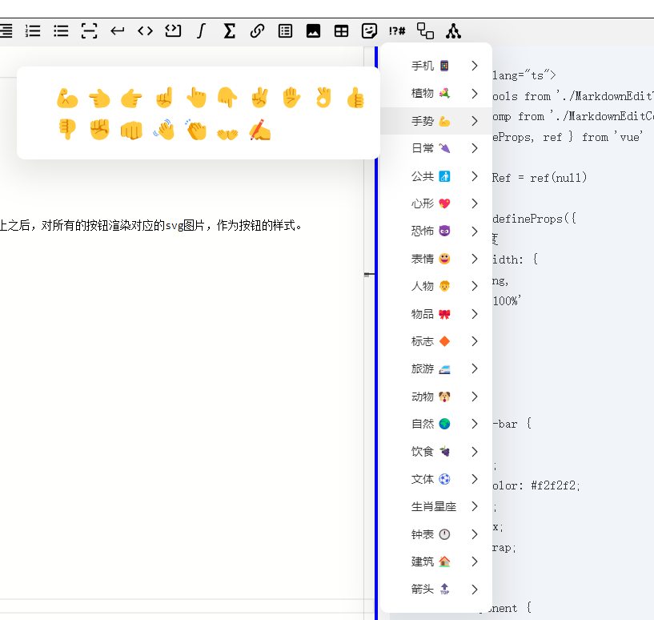

# 构建编辑器工具栏



如图所示为最终效果。

## 一、组件选用

编辑器工具栏是嵌入到编辑区域的。放在编辑组件的上方布局。

```vue
<template>
  <div id="md-edit-tools-bar" ref="toolsBarRef" class="md-edit-tools-bar">
    <MdEditTools :tool-bar-width="props.mdContainerWidth" />
  </div>
  <div id="md-edit-component" class="md-edit-component">
    <MdEditComp :editor-preview-width="props.mdContainerWidth" />
  </div>
</template>

<script setup lang="ts">
import MdEditTools from './MarkdownEditToolsComponent.vue'
import MdEditComp from './MarkdownEditComponent.vue'
import { defineProps, ref } from 'vue'

const toolsBarRef = ref(null)

const props = defineProps({
  // 编辑器宽度
  mdContainerWidth: {
    type: String,
    default: '100%'
  }
})
</script>

<style scoped>
#md-edit-tools-bar {
  width: 100%;
  height: auto;
  background-color: #f2f2f2;
  color: black;
  display: flex;
  flex-wrap: wrap;
}

#md-edit-component {
  height: calc(100vh - 40px - 2px - 20px);
  display: flex;
  flex: 1;
  width: 100%;
  flex-direction: row;
}
</style>
```

编辑器工具栏宽度按照上层组件的100%宽度显示，高度auto，这样高度就会根据内部的按钮动态变化。如下图所示例的情况，按钮分两行显示的时候，高度会自动增加。



## 二、按钮的实现

因为按钮有很多，如果在vue里面直接写，templete会占用很大篇幅，而且也不太好查找，所以这里用了一个对象，对象包含很多子对象。

```vue
<template>
  <!-- 标题 | 字体 加粗 倾斜 删除线 下划线 颜色 引用 | 文字左对齐 文字居中 文字右对齐 |
       有序列表 无序列表 水平线 段内换行 | 行内代码 代码块 行内公式 公式块 | 超链接 锚点链接 任务列表 |
       插入图片 图片居中 Emoji 表格 标记 分类 | material mermaid plantuml |
  -->
  <button
    v-for="(items, index) in editor.QuickAccess"
    :id="items.id"
    :key="index"
    :title="items.title"
    :class="['tool-btn', items.class]"
    @click="items.clickFn($event, items.param)"
  ></button>
</template>
```

按钮的属性包含id（唯一标识）、title（标题）、class（样式）、@click（按键动作）。

这里定义了一个对象，对象包含如下属性：

```typescript
type MarkdownEditQuickAccess = {
  [key: string]: {
    id: string
    title: string
    class: string
    clickFn: (event: Event, context: string, ...args: never[]) => void
    param: string
    svg: string
  } // 键是字符串，值是数字
}
```

在vue组件中，在组件加载的时候，通过for循环，先创建所有的按钮。然后在组件挂在到DOM上之后，对所有的按钮渲染对应的svg图片，作为按钮的样式。

```typescript
function initButtonSvg() {
  for (const key in editor.QuickAccess) {
    if (Object.prototype.hasOwnProperty.call(editor.QuickAccess, key)) {
      // 确保 key 是 svgs 对象自身的属性
      const element = document.getElementById(key)
      if (element) {
        element.innerHTML = editor.QuickAccess[key].svg
      }
    }
  }
}

onMounted(() => {
  initButtonSvg()
})

```

每个按钮对象的clickFn属性，指示按钮点击后的动作处理。

## 三、按钮子菜单

对于有些按钮，我增加了子菜单。比如emoji符号，这样在点击按钮的时候，就会在编辑区中增加对应的符号。



<details>
<summary style="color:rgb(0,0,255);font-weight:bold">生成标签按钮菜单列表</summary>
<blockcode><pre><code>

```typescript

// 创建一个函数来生成表情按钮的列表
function createEmojiButtons(
  emojiCategory: string,
  emojiStyle: Record<string, string>,
  buttonStyle: Record<string, string>
) {
  return h(
    'div',
    { style: emojiStyle },
    emojis[emojiCategory].data.map((text: string) => {
      return h(
        'button',
        {
          style: buttonStyle,
          onClick: () => {
            EventBus.$emit('monaco-editor-insert-text', text)
          }
        },
        text
      )
    })
  )
}

const emojiContextMenus = Object.keys(emojis).map((category) => {
  return {
    label: emojis[category].label, // 根据类别设置标签
    direction: 'lr',
    children: [
      {
        label: createEmojiButtons(
          category,
          emojiMenuChildrenStyle,
          emojiMenuChildrenButtonStyle
        )
      }
    ]
  }
})

export function showEmojiQuickAccess(e: MouseEvent) {
  ContextMenu.showContextMenu({
    x: e.x,
    y: e.y + 10,
    items: emojiContextMenus as MenuItem[]
  })
}

```

</code></pre></blockcode></details>

emojis是一个列表，这里用了`@imengyu/vue3-context-menu`组件，利用组件的showContextMenu方法，展示一个子菜单。

## 附：按钮对象列表

<details>
<summary style="color:rgb(0,0,255);font-weight:bold">按钮对象列表源码</summary>
<blockcode><pre><code>

```typescript
export const MdEditQuickAccess: MarkdownEditQuickAccess = {
  'header-1': {
    id: 'header-1',
    title: '一级标题',
    class: 'tool-btn',
    clickFn: onFontHeaderFormat,
    param: 'h1',
    svg: '<svg class="fixed-size-svg" xmlns="http://www.w3.org/2000/svg" viewBox="0 0 24 24"><path d="M3 4h2v6h4V4h2v14H9v-6H5v6H3V4m11 14v-2h2V6.31l-2.5 1.44V5.44L16 4h2v12h2v2h-6Z"/></svg>'
  },
  'header-2': {
    id: 'header-2',
    title: '二级标题',
    class: 'tool-btn',
    clickFn: onFontHeaderFormat,
    param: 'h2',
    svg: '<svg class="fixed-size-svg" xmlns="http://www.w3.org/2000/svg" viewBox="0 0 24 24"><path d="M3 4h2v6h4V4h2v14H9v-6H5v6H3V4m18 14h-6a2 2 0 0 1-2-2c0-.53.2-1 .54-1.36l4.87-5.23c.37-.36.59-.86.59-1.41a2 2 0 0 0-2-2 2 2 0 0 0-2 2h-2a4 4 0 0 1 4-4 4 4 0 0 1 4 4c0 1.1-.45 2.1-1.17 2.83L15 16h6v2Z"/></svg>'
  },
  'header-3': {
    id: 'header-3',
    title: '三级标题',
    class: 'tool-btn',
    clickFn: onFontHeaderFormat,
    param: 'H3',
    svg: '<svg class="fixed-size-svg" xmlns="http://www.w3.org/2000/svg" viewBox="0 0 24 24"><path d="M3 4h2v6h4V4h2v14H9v-6H5v6H3V4m12 0h4a2 2 0 0 1 2 2v10a2 2 0 0 1-2 2h-4a2 2 0 0 1-2-2v-1h2v1h4v-4h-4v-2h4V6h-4v1h-2V6a2 2 0 0 1 2-2Z"/></svg>'
  },
  'header-4': {
    id: 'header-4',
    title: '四级标题',
    class: 'tool-btn',
    clickFn: onFontHeaderFormat,
    param: 'H4',
    svg: '<svg class="fixed-size-svg" xmlns="http://www.w3.org/2000/svg" viewBox="0 0 24 24"><path d="M3 4h2v6h4V4h2v14H9v-6H5v6H3V4m15 14v-5h-5v-2l5-7h2v7h1v2h-1v5h-2m0-7V7.42L15.45 11H18Z"/></svg>'
  },
  'header-5': {
    id: 'header-5',
    title: '五级标题',
    class: 'tool-btn',
    clickFn: onFontHeaderFormat,
    param: 'H5',
    svg: '<svg class="fixed-size-svg" xmlns="http://www.w3.org/2000/svg" viewBox="0 0 24 24"><path d="M3 4h2v6h4V4h2v14H9v-6H5v6H3V4m12 0h5v2h-5v4h2a4 4 0 0 1 4 4 4 4 0 0 1-4 4h-2a2 2 0 0 1-2-2v-1h2v1h2a2 2 0 0 0 2-2 2 2 0 0 0-2-2h-2a2 2 0 0 1-2-2V6a2 2 0 0 1 2-2Z"/></svg>'
  },
  'header-6': {
    id: 'header-6',
    title: '六级标题',
    class: 'tool-btn',
    clickFn: onFontHeaderFormat,
    param: 'H6',
    svg: '<svg class="fixed-size-svg" xmlns="http://www.w3.org/2000/svg" viewBox="0 0 24 24"><path d="M3 4h2v6h4V4h2v14H9v-6H5v6H3V4m12 0h4a2 2 0 0 1 2 2v1h-2V6h-4v4h4a2 2 0 0 1 2 2v4a2 2 0 0 1-2 2h-4a2 2 0 0 1-2-2V6a2 2 0 0 1 2-2m0 8v4h4v-4h-4Z"/></svg>'
  },
  'font-family': {
    id: 'font-family',
    title: '字体样式',
    class: 'tool-btn',
    clickFn: onFontFormat,
    param: 'fontfamily',
    svg: '<svg class="fixed-size-svg" xmlns="http://www.w3.org/2000/svg" viewBox="0 0 24 24"><path d="M17 8h3v12h1v1h-4v-1h1v-3h-4l-1.5 3H14v1h-4v-1h1l6-12m1 1-3.5 7H18V9M5 3h5c1.11 0 2 .89 2 2v11H9v-5H6v5H3V5c0-1.11.89-2 2-2m1 2v4h3V5H6Z"/></svg>'
  },
  'font-size': {
    id: 'font-size',
    title: '字体大小',
    class: 'tool-btn',
    clickFn: onFontFormat,
    param: 'fontsize',
    svg: '<svg class="fixed-size-svg" xmlns="http://www.w3.org/2000/svg" viewBox="0 0 24 24"><path d="M2 4v3h5v12h3V7h5V4H2m19 5h-9v3h3v7h3v-7h3V9Z"/></svg>'
  },
  'font-bold': {
    id: 'font-bold',
    title: '加粗',
    class: 'tool-btn',
    clickFn: onFontFormat,
    param: 'bold',
    svg: '<svg class="fixed-size-svg" xmlns="http://www.w3.org/2000/svg" viewBox="0 0 24 24"><path d="M13.5 15.5H10v-3h3.5A1.5 1.5 0 0 1 15 14a1.5 1.5 0 0 1-1.5 1.5m-3.5-9h3A1.5 1.5 0 0 1 14.5 8 1.5 1.5 0 0 1 13 9.5h-3m5.6 1.29c.97-.68 1.65-1.79 1.65-2.79 0-2.26-1.75-4-4-4H7v14h7.04c2.1 0 3.71-1.7 3.71-3.79 0-1.52-.86-2.82-2.15-3.42Z"/></svg>'
  },
  'font-italic': {
    id: 'font-italic',
    title: '倾斜',
    class: 'tool-btn',
    clickFn: onFontFormat,
    param: 'italic',
    svg: '<svg class="fixed-size-svg" xmlns="http://www.w3.org/2000/svg" viewBox="0 0 24 24"><path d="M10 4v3h2.21l-3.42 8H6v3h8v-3h-2.21l3.42-8H18V4h-8Z"/></svg>'
  },
  'font-delete': {
    id: 'font-delete',
    title: '删除线',
    class: 'tool-btn',
    clickFn: onFontFormat,
    param: 'deleteline',
    svg: '<svg class="fixed-size-svg" xmlns="http://www.w3.org/2000/svg" viewBox="0 0 24 24"><path d="M7.2 9.8c-1.2-2.3.5-5 2.9-5.5 3.1-1 7.6.4 7.5 4.2h-3c0-.3-.1-.6-.1-.8-.2-.6-.6-.9-1.2-1.1-.8-.3-2.1-.2-2.8.3C9 8.2 10.4 9.5 12 10H7.4c-.1-.1-.1-.2-.2-.2M21 13v-2H3v2h9.6c.2.1.4.1.6.2.6.3 1.1.5 1.3 1.1.1.4.2.9 0 1.3-.2.5-.6.7-1.1.9-1.8.5-4-.2-3.9-2.4h-3c-.1 2.6 2.1 4.4 4.5 4.7 3.8.8 8.3-1.6 6.3-5.9l3.7.1Z"/></svg>'
  },
  'font-under': {
    id: 'font-under',
    title: '下划线',
    class: 'tool-btn',
    clickFn: onFontFormat,
    param: 'underline',
    svg: '<svg class="fixed-size-svg" xmlns="http://www.w3.org/2000/svg" viewBox="0 0 24 24"><path d="M5 21h14v-2H5v2m7-4a6 6 0 0 0 6-6V3h-2.5v8a3.5 3.5 0 0 1-3.5 3.5A3.5 3.5 0 0 1 8.5 11V3H6v8a6 6 0 0 0 6 6Z"/></svg>'
  },
  /*'font-color': {
    id: 'font-color',
    title: '颜色',
    class: 'tool-btn',
    clickFn: onHandleFontColor,
    param: 'fontcolor',
    svg: '<svg class="fixed-size-svg" xmlns="http://www.w3.org/2000/svg" viewBox="0 0 24 24"><path d="M19 11.5s-2 2.17-2 3.5a2 2 0 0 0 2 2 2 2 0 0 0 2-2c0-1.33-2-3.5-2-3.5M5.21 10 10 5.21 14.79 10m1.77-1.06L7.62 0 6.21 1.41l2.38 2.38-5.15 5.15c-.59.56-.59 1.53 0 2.12l5.5 5.5c.29.29.68.44 1.06.44s.77-.15 1.06-.44l5.5-5.5c.59-.59.59-1.56 0-2.12Z"/></svg>'
  },*/
  'font-quote': {
    id: 'font-quote',
    title: '引用',
    class: 'tool-btn',
    clickFn: onFontFormat,
    param: 'fontquote',
    svg: '<svg class="fixed-size-svg" xmlns="http://www.w3.org/2000/svg" viewBox="0 0 24 24"><path d="m10 7-2 4h3v6H5v-6l2-4h3m8 0-2 4h3v6h-6v-6l2-4h3Z"/></svg>'
  },
  'font-super': {
    id: 'font-super',
    title: '上标',
    class: 'tool-btn',
    clickFn: onFontFormat,
    param: 'fontsuper',
    svg: '<svg class="fixed-size-svg" xmlns="http://www.w3.org/2000/svg" viewBox="0 0 24 24"><path d="M16 7.41 11.41 12 16 16.59 14.59 18 10 13.41 5.41 18 4 16.59 8.59 12 4 7.41 5.41 6 10 10.59 14.59 6 16 7.41M21.85 9h-4.88V8l.89-.82c.76-.64 1.32-1.18 1.7-1.63.37-.44.56-.85.57-1.23a.884.884 0 0 0-.27-.7c-.18-.19-.47-.28-.86-.29-.31.01-.58.07-.84.17l-.66.39-.45-1.17c.27-.22.59-.39.98-.53S18.85 2 19.32 2c.78 0 1.38.2 1.78.61.4.39.62.93.62 1.57-.01.56-.19 1.08-.54 1.55-.34.48-.76.93-1.27 1.36l-.64.52v.02h2.58V9Z"/></svg>'
  },
  'font-sub': {
    id: 'font-sub',
    title: '下标',
    class: 'tool-btn',
    clickFn: onFontFormat,
    param: 'fontsub',
    svg: '<svg class="fixed-size-svg" xmlns="http://www.w3.org/2000/svg" viewBox="0 0 24 24"><path d="M16 7.41 11.41 12 16 16.59 14.59 18 10 13.41 5.41 18 4 16.59 8.59 12 4 7.41 5.41 6 10 10.59 14.59 6 16 7.41m5.85 13.62h-4.88v-1l.89-.8c.76-.65 1.32-1.19 1.7-1.63.37-.44.56-.85.57-1.24a.898.898 0 0 0-.27-.7c-.18-.16-.47-.28-.86-.28-.31 0-.58.06-.84.18l-.66.38-.45-1.17c.27-.21.59-.39.98-.53s.82-.24 1.29-.24c.78.04 1.38.25 1.78.66.4.41.62.93.62 1.57-.01.56-.19 1.08-.54 1.55-.34.47-.76.92-1.27 1.36l-.64.52v.02h2.58v1.35Z"/></svg>'
  },
  'align-left': {
    id: 'align-left',
    title: '左对齐',
    class: 'tool-btn',
    clickFn: onFontFormat,
    param: 'alignleft',
    svg: '<svg class="fixed-size-svg" xmlns="http://www.w3.org/2000/svg" viewBox="0 0 24 24"><path d="M3 3h18v2H3V3m0 4h12v2H3V7m0 4h18v2H3v-2m0 4h12v2H3v-2m0 4h18v2H3v-2Z"/></svg>'
  },
  'align-center': {
    id: 'align-center',
    title: '文字居中',
    class: 'tool-btn',
    clickFn: onFontFormat,
    param: 'aligncenter',
    svg: '<svg class="fixed-size-svg" xmlns="http://www.w3.org/2000/svg" viewBox="0 0 24 24"><path d="M3 3h18v2H3V3m4 4h10v2H7V7m-4 4h18v2H3v-2m4 4h10v2H7v-2m-4 4h18v2H3v-2Z"/></svg>'
  },
  'align-justify': {
    id: 'align-justify',
    title: '两边对齐',
    class: 'tool-btn',
    clickFn: onFontFormat,
    param: 'alignjustify',
    svg: '<svg class="fixed-size-svg" xmlns="http://www.w3.org/2000/svg" viewBox="0 0 24 24"><path d="M3 3h18v2H3V3m0 4h18v2H3V7m0 4h18v2H3v-2m0 4h18v2H3v-2m0 4h18v2H3v-2Z"/></svg>'
  },
  'align-right': {
    id: 'align-right',
    title: '右对齐',
    class: 'tool-btn',
    clickFn: onFontFormat,
    param: 'alignright',
    svg: '<svg class="fixed-size-svg" xmlns="http://www.w3.org/2000/svg" viewBox="0 0 24 24"><path d="M3 3h18v2H3V3m6 4h12v2H9V7m-6 4h18v2H3v-2m6 4h12v2H9v-2m-6 4h18v2H3v-2Z"/></svg>'
  },
  'list-numbered': {
    id: 'list-numbered',
    title: '有序列表',
    class: 'tool-btn',
    clickFn: onFontFormat,
    param: 'listnumbered',
    svg: '<svg class="fixed-size-svg" xmlns="http://www.w3.org/2000/svg" viewBox="0 0 24 24"><path d="M7 13v-2h14v2H7m0 6v-2h14v2H7M7 7V5h14v2H7M3 8V5H2V4h2v4H3m-1 9v-1h3v4H2v-1h2v-.5H3v-1h1V17H2m2.25-7a.75.75 0 0 1 .75.75c0 .2-.08.39-.21.52L3.12 13H5v1H2v-.92L4 11H2v-1h2.25Z"/></svg>'
  },
  'list-bulleted': {
    id: 'list-bulleted',
    title: '无序列表',
    class: 'tool-btn',
    clickFn: onFontFormat,
    param: 'listbulleted',
    svg: '<svg class="fixed-size-svg" xmlns="http://www.w3.org/2000/svg" viewBox="0 0 24 24"><path d="M7 5h14v2H7V5m0 8v-2h14v2H7M4 4.5A1.5 1.5 0 0 1 5.5 6 1.5 1.5 0 0 1 4 7.5 1.5 1.5 0 0 1 2.5 6 1.5 1.5 0 0 1 4 4.5m0 6A1.5 1.5 0 0 1 5.5 12 1.5 1.5 0 0 1 4 13.5 1.5 1.5 0 0 1 2.5 12 1.5 1.5 0 0 1 4 10.5M7 19v-2h14v2H7m-3-2.5A1.5 1.5 0 0 1 5.5 18 1.5 1.5 0 0 1 4 19.5 1.5 1.5 0 0 1 2.5 18 1.5 1.5 0 0 1 4 16.5Z"/></svg>'
  },
  'line-scan': {
    id: 'line-scan',
    title: '水平线',
    class: 'tool-btn',
    clickFn: onFontFormat,
    param: 'linescan',
    svg: '<svg class="fixed-size-svg" xmlns="http://www.w3.org/2000/svg" viewBox="0 0 24 24"><path d="M17 22v-2h3v-3h2v3.5c0 .4-.2.7-.5 1-.3.3-.7.5-1 .5H17M7 22H3.5c-.4 0-.7-.2-1-.5-.3-.3-.5-.7-.5-1V17h2v3h3v2M17 2h3.5c.4 0 .7.2 1 .5.3.3.5.6.5 1V7h-2V4h-3V2M7 2v2H4v3H2V3.5c0-.4.2-.7.5-1s.6-.5 1-.5H7m12 9H5v2h14v-2Z"/></svg>'
  },
  'line-enter': {
    id: 'line-enter',
    title: '段内换行',
    class: 'tool-btn',
    clickFn: onFontFormat,
    param: 'lineenter',
    svg: '<svg class="fixed-size-svg" xmlns="http://www.w3.org/2000/svg" viewBox="0 0 24 24" ><path d="M8.95005 17.65L3.30005 12L8.95005 6.34998L10 7.39998L6.15005 11.25H19.2V7.24998H20.7001V12.75H6.15005L10 16.6L8.95005 17.65Z"/></svg>'
  },
  'code-line': {
    id: 'code-line',
    title: '行内代码',
    class: 'tool-btn',
    clickFn: onFontFormat,
    param: 'codeline',
    svg: '<svg class="fixed-size-svg" xmlns="http://www.w3.org/2000/svg" viewBox="0 0 24 24"><path d="m14.6 16.6 4.6-4.6-4.6-4.6L16 6l6 6-6 6-1.4-1.4m-5.2 0L4.8 12l4.6-4.6L8 6l-6 6 6 6 1.4-1.4Z"/></svg>'
  },
  'code-block': {
    id: 'code-block',
    title: '代码块',
    class: 'tool-btn',
    clickFn: onFontFormat,
    param: 'codeblock',
    svg: '<svg class="fixed-size-svg" xmlns="http://www.w3.org/2000/svg" viewBox="0 0 24 24"><path d="M5.59 3.41 7 4.82 3.82 8 7 11.18 5.59 12.6 1 8l4.59-4.59m5.82 0L16 8l-4.59 4.6L10 11.18 13.18 8 10 4.82l1.41-1.41M22 6v12c0 1.11-.89 2-2 2H4a2 2 0 0 1-2-2v-4h2v4h16V6h-2.97V4H20c1.11 0 2 .89 2 2Z"/></svg>'
  },
  'math-line': {
    id: 'math-line',
    title: '行内公式',
    class: 'tool-btn',
    clickFn: onFontFormat,
    param: 'mathline',
    svg: '<svg class="fixed-size-svg" xmlns="http://www.w3.org/2000/svg" viewBox="0 0 24 24"><path d="M11.5 19.1c-.2 1.1-.6 1.9-1.3 2.4-.7.5-1.6.6-2.7.4-.4-.1-1.2-.2-1.5-.4l.5-1.5c.3.1.9.3 1.2.3 1.1.2 1.7-.3 1.9-1.5L12 5.2c.2-1.2.7-2 1.4-2.6.7-.5 1.7-.7 2.8-.5.4.1 1.2.2 1.8.5L17.5 4c-.2-.1-.9-.2-1.2-.3-1.3-.2-2 .4-2.3 1.9l-2.5 13.5Z"/></svg>'
  },
  'math-block': {
    id: 'math-block',
    title: '公式块',
    class: 'tool-btn',
    clickFn: onFontFormat,
    param: 'mathblock',
    svg: '<svg class="fixed-size-svg" xmlns="http://www.w3.org/2000/svg" viewBox="0 0 20 20"><path d="M14 2H4l5 8-5 8h12v-4h-2v2H8.25L12 10 8.25 4H14v2h2V2z"/></svg>'
  },
  'web-links': {
    id: 'web-links',
    title: '网站链接',
    class: 'tool-btn',
    clickFn: onInsertWebLinks,
    param: 'weblinks',
    svg: '<svg class="fixed-size-svg" xmlns="http://www.w3.org/2000/svg" viewBox="0 0 24 24"><path d="M10.59 13.41c.41.39.41 1.03 0 1.42-.39.39-1.03.39-1.42 0a5.003 5.003 0 0 1 0-7.07l3.54-3.54a5.003 5.003 0 0 1 7.07 0 5.003 5.003 0 0 1 0 7.07l-1.49 1.49c.01-.82-.12-1.64-.4-2.42l.47-.48a2.982 2.982 0 0 0 0-4.24 2.982 2.982 0 0 0-4.24 0l-3.53 3.53a2.982 2.982 0 0 0 0 4.24m2.82-4.24c.39-.39 1.03-.39 1.42 0a5.003 5.003 0 0 1 0 7.07l-3.54 3.54a5.003 5.003 0 0 1-7.07 0 5.003 5.003 0 0 1 0-7.07l1.49-1.49c-.01.82.12 1.64.4 2.43l-.47.47a2.982 2.982 0 0 0 0 4.24 2.982 2.982 0 0 0 4.24 0l3.53-3.53a2.982 2.982 0 0 0 0-4.24.973.973 0 0 1 0-1.42Z"/></svg>'
  },
  'task-lists': {
    id: 'task-lists',
    title: '任务列表',
    class: 'tool-btn',
    clickFn: onFontFormat,
    param: 'tasklists',
    svg: '<svg class="fixed-size-svg" xmlns="http://www.w3.org/2000/svg" viewBox="0 0 24 24"><path d="M11 15h6v2h-6v-2M9 7H7v2h2V7m2 6h6v-2h-6v2m0-4h6V7h-6v2m-2 2H7v2h2v-2m12-6v14c0 1.1-.9 2-2 2H5c-1.1 0-2-.9-2-2V5c0-1.1.9-2 2-2h14c1.1 0 2 .9 2 2m-2 0H5v14h14V5M9 15H7v2h2v-2Z"/></svg>'
  },
  'insert-images': {
    id: 'insert-images',
    title: '插入图片',
    class: 'tool-btn',
    clickFn: onInsertImage,
    param: 'insertimage',
    svg: '<svg class="fixed-size-svg" xmlns="http://www.w3.org/2000/svg" viewBox="0 0 24 24"><path d="m8.5 13.5 2.5 3 3.5-4.5 4.5 6H5m16 1V5a2 2 0 0 0-2-2H5a2 2 0 0 0-2 2v14a2 2 0 0 0 2 2h14a2 2 0 0 0 2-2Z"/></svg>'
  },
  'insert-table': {
    id: 'insert-table',
    title: '表格',
    class: 'tool-btn',
    clickFn: onInsertTable,
    param: 'insertable',
    svg: '<svg class="fixed-size-svg" xmlns="http://www.w3.org/2000/svg" viewBox="0 0 24 24"><path d="M5 4h14a2 2 0 0 1 2 2v12a2 2 0 0 1-2 2H5a2 2 0 0 1-2-2V6a2 2 0 0 1 2-2m0 4v4h6V8H5m8 0v4h6V8h-6m-8 6v4h6v-4H5m8 0v4h6v-4h-6Z"/></svg>'
  },
  'insert-emoji': {
    id: 'insert-emoji',
    title: 'Emoji',
    class: 'tool-btn',
    clickFn: onShowEmojiMenu,
    param: '',
    svg: '<svg class="fixed-size-svg" xmlns="http://www.w3.org/2000/svg" viewBox="0 0 24 24"><path d="M5.5 2C3.56 2 2 3.56 2 5.5v13C2 20.44 3.56 22 5.5 22H16l6-6V5.5C22 3.56 20.44 2 18.5 2h-13m.25 2h12.5A1.75 1.75 0 0 1 20 5.75V15h-1.5c-1.94 0-3.5 1.56-3.5 3.5V20H5.75A1.75 1.75 0 0 1 4 18.25V5.75A1.75 1.75 0 0 1 5.75 4m8.69 2.77c-.16 0-.32.02-.47.06-.94.26-1.47 1.22-1.23 2.17.05.15.12.3.21.44l3.23-.88c0-.17-.02-.34-.06-.51-.21-.75-.9-1.28-1.68-1.28M8.17 8.5c-.17 0-.32 0-.47.05-.93.26-1.48 1.22-1.23 2.15.03.16.12.3.21.46l3.23-.88c0-.17-.02-.34-.06-.5A1.72 1.72 0 0 0 8.17 8.5m8.55 2.76-9.13 2.51a5.266 5.266 0 0 0 5.36 1.64 5.273 5.273 0 0 0 3.77-4.15Z"/></svg>'
  },
  'insert-symbol': {
    id: 'insert-symbol',
    title: '特殊符号',
    class: 'tool-btn',
    clickFn: onShowSymbolsMenu,
    param: '',
    svg: '<svg class="fixed-size-svg" xmlns="http://www.w3.org/2000/svg" viewBox="0 0 24 24"><path d="M2 7v7h2V7H2m4 0v2h4v2H8v3h2v-1c1.11 0 2-.89 2-2V9c0-1.11-.89-2-2-2H6m9.8 0-.2 2H14v2h1.4l-.2 2H14v2h1l-.2 2h2l.2-2h1.4l-.2 2h2l.2-2H22v-2h-1.4l.2-2H22V9h-1l.2-2h-2L19 9h-1.4l.2-2h-2m1.6 4h1.4l-.2 2h-1.4l.2-2M2 15v2h2v-2H2m6 0v2h2v-2H8Z"/></svg>'
  },
  'insert-mermaid': {
    id: 'insert-mermaid',
    title: 'mermaid',
    class: 'tool-btn',
    clickFn: onShowMermaidMenu,
    param: '',
    svg: '<svg class="fixed-size-svg" xmlns="http://www.w3.org/2000/svg" viewBox="0 0 24 24"><path d="M1 3a2 2 0 0 1 2-2h6.5a2 2 0 0 1 2 2v6.5a2 2 0 0 1-2 2H7v4.063C7 16.355 7.644 17 8.438 17H12.5v-2.5a2 2 0 0 1 2-2H21a2 2 0 0 1 2 2V21a2 2 0 0 1-2 2h-6.5a2 2 0 0 1-2-2v-2.5H8.437A2.939 2.939 0 0 1 5.5 15.562V11.5H3a2 2 0 0 1-2-2Zm2-.5a.5.5 0 0 0-.5.5v6.5a.5.5 0 0 0 .5.5h6.5a.5.5 0 0 0 .5-.5V3a.5.5 0 0 0-.5-.5ZM14.5 14a.5.5 0 0 0-.5.5V21a.5.5 0 0 0 .5.5H21a.5.5 0 0 0 .5-.5v-6.5a.5.5 0 0 0-.5-.5Z"/></svg>'
  },
  'insert-plantuml': {
    id: 'insert-plantuml',
    title: 'plantuml',
    class: 'tool-btn',
    clickFn: onShowPlantUmlMenu,
    param: '',
    svg: '<svg class="fixed-size-svg" xmlns="http://www.w3.org/2000/svg" viewBox="0 0 24 24"><path d="M19.5 17c-.13 0-.26 0-.39.04l-1.61-3.25a2.5 2.5 0 0 0-1.75-4.29c-.13 0-.25 0-.39.04l-1.63-3.25c.48-.45.77-1.08.77-1.79a2.5 2.5 0 0 0-5 0c0 .71.29 1.34.76 1.79L8.64 9.54c-.14-.04-.26-.04-.39-.04a2.5 2.5 0 0 0-1.75 4.29l-1.61 3.25C4.76 17 4.63 17 4.5 17a2.5 2.5 0 0 0 0 5A2.5 2.5 0 0 0 7 19.5c0-.7-.29-1.34-.76-1.79l1.62-3.25c.14.04.26.04.39.04s.25 0 .39-.04l1.63 3.25c-.47.45-.77 1.09-.77 1.79a2.5 2.5 0 0 0 5 0A2.5 2.5 0 0 0 12 17c-.13 0-.26 0-.39.04L10 13.79c.46-.45.75-1.08.75-1.79s-.29-1.34-.75-1.79l1.61-3.25c.13.04.26.04.39.04s.26 0 .39-.04L14 10.21c-.45.45-.75 1.09-.75 1.79a2.5 2.5 0 0 0 2.5 2.5c.13 0 .25 0 .39-.04l1.63 3.25c-.47.45-.77 1.09-.77 1.79a2.5 2.5 0 0 0 5 0 2.5 2.5 0 0 0-2.5-2.5Z"/></svg>'
  }
}
```
</code></pre></blockcode></details>
