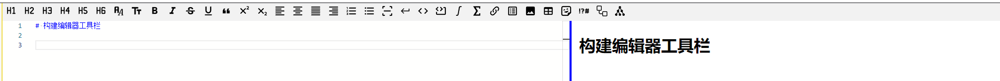
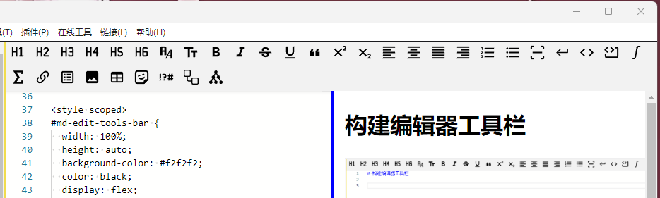
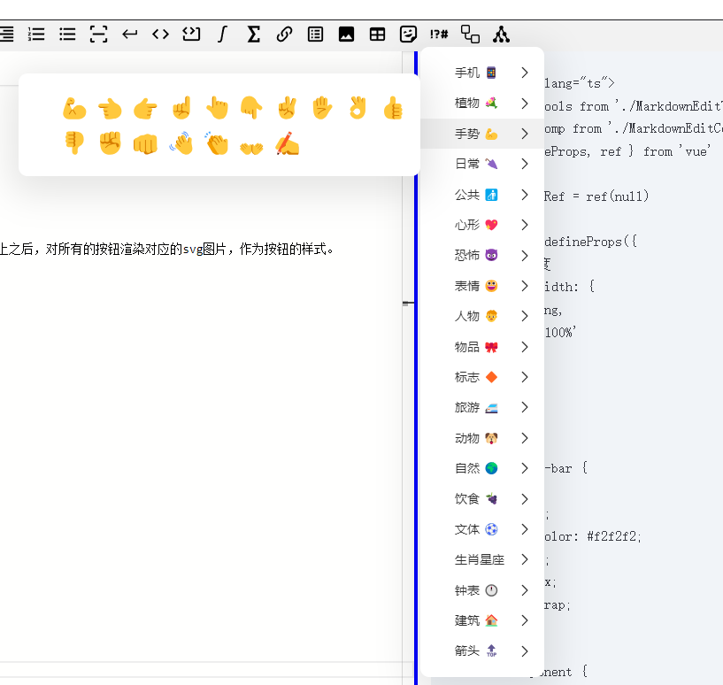

# 构建编辑器工具栏



如图所示为最终效果。

## 一、组件选用

编辑器工具栏是嵌入到编辑区域的。放在编辑组件的上方布局。

```vue
<template>
  <div id="md-edit-tools-bar" ref="toolsBarRef" class="md-edit-tools-bar">
    <MdEditTools :tool-bar-width="props.mdContainerWidth" />
  </div>
  <div id="md-edit-component" class="md-edit-component">
    <MdEditComp :editor-preview-width="props.mdContainerWidth" />
  </div>
</template>

<script setup lang="ts">
import MdEditTools from './MarkdownEditToolsComponent.vue'
import MdEditComp from './MarkdownEditComponent.vue'
import { defineProps, ref } from 'vue'

const toolsBarRef = ref(null)

const props = defineProps({
  mdContainerWidth: {
    type: String,
    default: '100%'
  }
})
</script>

<style scoped>
#md-edit-tools-bar {
  width: 100%;
  height: auto;
  background-color: #f2f2f2;
  color: black;
  display: flex;
  flex-wrap: wrap;
}

#md-edit-component {
  height: calc(100vh - 40px - 2px - 20px);
  display: flex;
  flex: 1;
  width: 100%;
  flex-direction: row;
}
</style>
```

编辑器工具栏宽度按照上层组件的100%宽度显示，高度auto，这样高度就会根据内部的按钮动态变化。如下图所示例的情况，按钮分两行显示的时候，高度会自动增加。



## 二、按钮的实现

因为按钮有很多，如果在vue里面直接写，templete会占用很大篇幅，而且也不太好查找，所以这里用了一个对象，对象包含很多子对象。

按钮配置定义在 `src/renderer/src/components/Markdown/hemy-editor-quick-access.ts` 中，包含以下按钮分类：

- **标题**：一级标题 ~ 六级标题
- **字体**：字体样式、字体大小、加粗、倾斜、删除线、下划线、引用、上标、下标
- **对齐**：左对齐、居中、两边对齐、右对齐
- **列表**：有序列表、无序列表、水平线、段内换行
- **代码**：行内代码、代码块
- **公式**：行内公式、公式块
- **链接**：网站链接、任务列表
- **插入**：插入图片、表格、Emoji、特殊符号、Mermaid、PlantUML

```vue
<template>
  <!-- 标题 | 字体 加粗 倾斜 删除线 下划线 颜色 引用 | 文字左对齐 文字居中 文字右对齐 |
       有序列表 无序列表 水平线 段内换行 | 行内代码 代码块 行内公式 公式块 | 超链接 锚点链接 任务列表 |
       插入图片 图片居中 Emoji 表格 标记 分类 | material mermaid plantuml |
  -->
  <button
    v-for="(items, index) in editor.QuickAccess"
    :id="items.id"
    :key="index"
    :title="items.title"
    :class="['tool-btn', items.class]"
    @click="items.clickFn($event, items.param)"
  ></button>
</template>
```

按钮的属性包含 `id`（唯一标识）、`title`（标题）、`class`（样式）、`@click`（按键动作）。

这里定义了一个对象，对象包含如下属性：

```typescript
type MarkdownEditQuickAccess = {
  [key: string]: {
    id: string
    title: string
    class: string
    clickFn: (event: Event, context: string, ...args: never[]) => void
    param: string
    svg: string
  }
}
```

在vue组件中，在组件加载的时候，通过for循环，先创建所有的按钮。然后在组件挂在到DOM上之后，对所有的按钮渲染对应的svg图片，作为按钮的样式。

```typescript
function initButtonSvg() {
  for (const key in editor.QuickAccess) {
    if (Object.prototype.hasOwnProperty.call(editor.QuickAccess, key)) {
      const element = document.getElementById(key)
      if (element) {
        element.innerHTML = editor.QuickAccess[key].svg
      }
    }
  }
}

onMounted(() => {
  initButtonSvg()
})
```

每个按钮对象的 `clickFn` 属性，指示按钮点击后的动作处理。动作处理函数定义在 `hemy-editor-actions.ts` 中，通过 EventBus 或 IPC 与编辑器组件通信。

## 三、按钮子菜单

对于有些按钮，我增加了子菜单。比如emoji符号，这样在点击按钮的时候，就会在编辑区中增加对应的符号。



<details>
<summary style="color:rgb(0,0,255);font-weight:bold">生成标签按钮菜单列表</summary>
<blockcode><pre><code>

```typescript
import ContextMenu from '@imengyu/vue3-context-menu'

// 创建一个函数来生成表情按钮的列表
function createEmojiButtons(
  emojiCategory: string,
  emojiStyle: Record<string, string>,
  buttonStyle: Record<string, string>
) {
  return h(
    'div',
    { style: emojiStyle },
    emojis[emojiCategory].data.map((text: string) => {
      return h(
        'button',
        {
          style: buttonStyle,
          onClick: () => {
            EventBus.$emit('monaco-editor-insert-text', text)
          }
        },
        text
      )
    })
  )
}

const emojiContextMenus = Object.keys(emojis).map((category) => {
  return {
    label: emojis[category].label,
    direction: 'lr',
    children: [
      {
        label: createEmojiButtons(
          category,
          emojiMenuChildrenStyle,
          emojiMenuChildrenButtonStyle
        )
      }
    ]
  }
})

export function showEmojiQuickAccess(e: MouseEvent) {
  ContextMenu.showContextMenu({
    x: e.x,
    y: e.y + 10,
    items: emojiContextMenus as MenuItem[]
  })
}
```

</code></pre></blockcode></details>

emojis是一个列表，这里用了 `@imengyu/vue3-context-menu` 组件，利用组件的 `showContextMenu` 方法，展示一个子菜单。Emoji 数据定义在 `hemy-quick-access-emojis.ts` 中，特殊符号数据定义在 `hemy-quick-access-symbols.ts` 中。

## 四、按钮分类说明

### 4.1 标题按钮

通过 `onFontHeaderFormat` 函数处理，根据 `param` 参数（h1~h6）在当前行或选中文本前添加对应数量的 `#`。

### 4.2 字体格式按钮

通过 `onFontFormat` 函数处理，支持以下格式：

| param | 功能 | Markdown 语法 |
| --- | --- | --- |
| `bold` | 加粗 | `**text**` |
| `italic` | 倾斜 | `*text*` |
| `deleteline` | 删除线 | `~~text~~` |
| `underline` | 下划线 | `<u>text</u>` |
| `fontquote` | 引用 | `> text` |
| `fontsuper` | 上标 | `<sup>text</sup>` |
| `fontsub` | 下标 | `<sub>text</sub>` |
| `alignleft` | 左对齐 | `:<text` |
| `aligncenter` | 居中 | `:text:` |
| `alignright` | 右对齐 | `text>:` |

### 4.3 列表按钮

| param | 功能 | Markdown 语法 |
| --- | --- | --- |
| `listnumbered` | 有序列表 | `1. item` |
| `listbulleted` | 无序列表 | `- item` |
| `linescan` | 水平线 | `---` |
| `tasklists` | 任务列表 | `- [ ] item` |

### 4.4 代码与公式按钮

| param | 功能 | Markdown 语法 |
| --- | --- | --- |
| `codeline` | 行内代码 | `` `code` `` |
| `codeblock` | 代码块 | ` ```code``` ` |
| `mathline` | 行内公式 | `$formula$` |
| `mathblock` | 公式块 | `$$formula$$` |

### 4.5 插入类按钮

- **插入图片**（`onInsertImage`）：弹出图片插入对话框，支持本地图片和网络图片
- **插入表格**（`onInsertTable`）：弹出表格编辑对话框，生成 Markdown 表格
- **Emoji**（`onShowEmojiMenu`）：显示 Emoji 选择子菜单
- **特殊符号**（`onShowSymbolsMenu`）：显示特殊符号选择子菜单
- **Mermaid**（`onShowMermaidMenu`）：显示 Mermaid 模板选择子菜单
- **PlantUML**（`onShowPlantUmlMenu`）：显示 PlantUML 模板选择子菜单

## 附：按钮对象列表

按钮对象完整定义在 `src/renderer/src/components/Markdown/hemy-editor-quick-access.ts` 中，以下为部分示例：

<details>
<summary style="color:rgb(0,0,255);font-weight:bold">按钮对象列表源码示例</summary>
<blockcode><pre><code>

```typescript
export const MdEditQuickAccess: MarkdownEditQuickAccess = {
  'header-1': {
    id: 'header-1',
    title: '一级标题',
    class: 'tool-btn',
    clickFn: onFontHeaderFormat,
    param: 'h1',
    svg: '<svg class="fixed-size-svg" xmlns="http://www.w3.org/2000/svg" viewBox="0 0 24 24"><path d="M3 4h2v6h4V4h2v14H9v-6H5v6H3V4m11 14v-2h2V6.31l-2.5 1.44V5.44L16 4h2v12h2v2h-6Z"/></svg>'
  },
  'header-2': {
    id: 'header-2',
    title: '二级标题',
    class: 'tool-btn',
    clickFn: onFontHeaderFormat,
    param: 'h2',
    svg: '<svg class="fixed-size-svg" xmlns="http://www.w3.org/2000/svg" viewBox="0 0 24 24"><path d="M3 4h2v6h4V4h2v14H9v-6H5v6H3V4m18 14h-6a2 2 0 0 1-2-2c0-.53.2-1 .54-1.36l4.87-5.23c.37-.36.59-.86.59-1.41a2 2 0 0 0-2-2 2 2 0 0 0-2 2h-2a4 4 0 0 1 4-4 4 4 0 0 1 4 4c0 1.1-.45 2.1-1.17 2.83L15 16h6v2Z"/></svg>'
  },
  'font-bold': {
    id: 'font-bold',
    title: '加粗',
    class: 'tool-btn',
    clickFn: onFontFormat,
    param: 'bold',
    svg: '<svg class="fixed-size-svg" xmlns="http://www.w3.org/2000/svg" viewBox="0 0 24 24"><path d="M13.5 15.5H10v-3h3.5A1.5 1.5 0 0 1 15 14a1.5 1.5 0 0 1-1.5 1.5m-3.5-9h3A1.5 1.5 0 0 1 14.5 8 1.5 1.5 0 0 1 13 9.5h-3m5.6 1.29c.97-.68 1.65-1.79 1.65-2.79 0-2.26-1.75-4-4-4H7v14h7.04c2.1 0 3.71-1.7 3.71-3.79 0-1.52-.86-2.82-2.15-3.42Z"/></svg>'
  },
  'font-italic': {
    id: 'font-italic',
    title: '倾斜',
    class: 'tool-btn',
    clickFn: onFontFormat,
    param: 'italic',
    svg: '<svg class="fixed-size-svg" xmlns="http://www.w3.org/2000/svg" viewBox="0 0 24 24"><path d="M10 4v3h2.21l-3.42 8H6v3h8v-3h-2.21l3.42-8H18V4h-8Z"/></svg>'
  },
  'list-numbered': {
    id: 'list-numbered',
    title: '有序列表',
    class: 'tool-btn',
    clickFn: onFontFormat,
    param: 'listnumbered',
    svg: '<svg class="fixed-size-svg" xmlns="http://www.w3.org/2000/svg" viewBox="0 0 24 24"><path d="M7 13v-2h14v2H7m0 6v-2h14v2H7M7 7V5h14v2H7M3 8V5H2V4h2v4H3m-1 9v-1h3v4H2v-1h2v-.5H3v-1h1V17H2m2.25-7a.75.75 0 0 1 .75.75c0 .2-.08.39-.21.52L3.12 13H5v1H2v-.92L4 11H2v-1h2.25Z"/></svg>'
  },
  'code-block': {
    id: 'code-block',
    title: '代码块',
    class: 'tool-btn',
    clickFn: onFontFormat,
    param: 'codeblock',
    svg: '<svg class="fixed-size-svg" xmlns="http://www.w3.org/2000/svg" viewBox="0 0 24 24"><path d="M5.59 3.41 7 4.82 3.82 8 7 11.18 5.59 12.6 1 8l4.59-4.59m5.82 0L16 8l-4.59 4.6L10 11.18 13.18 8 10 4.82l1.41-1.41M22 6v12c0 1.11-.89 2-2 2H4a2 2 0 0 1-2-2v-4h2v4h16V6h-2.97V4H20c1.11 0 2 .89 2 2Z"/></svg>'
  },
  'insert-emoji': {
    id: 'insert-emoji',
    title: 'Emoji',
    class: 'tool-btn',
    clickFn: onShowEmojiMenu,
    param: '',
    svg: '<svg class="fixed-size-svg" xmlns="http://www.w3.org/2000/svg" viewBox="0 0 24 24"><path d="M5.5 2C3.56 2 2 3.56 2 5.5v13C2 20.44 3.56 22 5.5 22H16l6-6V5.5C22 3.56 20.44 2 18.5 2h-13m.25 2h12.5A1.75 1.75 0 0 1 20 5.75V15h-1.5c-1.94 0-3.5 1.56-3.5 3.5V20H5.75A1.75 1.75 0 0 1 4 18.25V5.75A1.75 1.75 0 0 1 5.75 4m8.69 2.77c-.16 0-.32.02-.47.06-.94.26-1.47 1.22-1.23 2.17.05.15.12.3.21.44l3.23-.88c0-.17-.02-.34-.06-.51-.21-.75-.9-1.28-1.68-1.28M8.17 8.5c-.17 0-.32 0-.47.05-.93.26-1.48 1.22-1.23 2.15.03.16.12.3.21.46l3.23-.88c0-.17-.02-.34-.06-.5A1.72 1.72 0 0 0 8.17 8.5m8.55 2.76-9.13 2.51a5.266 5.266 0 0 0 5.36 1.64 5.273 5.273 0 0 0 3.77-4.15Z"/></svg>'
  },
  'insert-mermaid': {
    id: 'insert-mermaid',
    title: 'mermaid',
    class: 'tool-btn',
    clickFn: onShowMermaidMenu,
    param: '',
    svg: '<svg class="fixed-size-svg" xmlns="http://www.w3.org/2000/svg" viewBox="0 0 24 24"><path d="M1 3a2 2 0 0 1 2-2h6.5a2 2 0 0 1 2 2v6.5a2 2 0 0 1-2 2H7v4.063C7 16.355 7.644 17 8.438 17H12.5v-2.5a2 2 0 0 1 2-2H21a2 2 0 0 1 2 2V21a2 2 0 0 1-2 2h-6.5a2 2 0 0 1-2-2v-2.5H8.437A2.939 2.939 0 0 1 5.5 15.562V11.5H3a2 2 0 0 1-2-2Zm2-.5a.5.5 0 0 0-.5.5v6.5a.5.5 0 0 0 .5.5h6.5a.5.5 0 0 0 .5-.5V3a.5.5 0 0 0-.5-.5ZM14.5 14a.5.5 0 0 0-.5.5V21a.5.5 0 0 0 .5.5H21a.5.5 0 0 0 .5-.5v-6.5a.5.5 0 0 0-.5-.5Z"/></svg>'
  },
  'insert-plantuml': {
    id: 'insert-plantuml',
    title: 'plantuml',
    class: 'tool-btn',
    clickFn: onShowPlantUmlMenu,
    param: '',
    svg: '<svg class="fixed-size-svg" xmlns="http://www.w3.org/2000/svg" viewBox="0 0 24 24"><path d="M19.5 17c-.13 0-.26 0-.39.04l-1.61-3.25a2.5 2.5 0 0 0-1.75-4.29c-.13 0-.25 0-.39.04l-1.63-3.25c.48-.45.77-1.08.77-1.79a2.5 2.5 0 0 0-5 0c0 .71.29 1.34.76 1.79L8.64 9.54c-.14-.04-.26-.04-.39-.04a2.5 2.5 0 0 0-1.75 4.29l-1.61 3.25C4.76 17 4.63 17 4.5 17a2.5 2.5 0 0 0 0 5A2.5 2.5 0 0 0 7 19.5c0-.7-.29-1.34-.76-1.79l1.62-3.25c.14.04.26.04.39.04s.25 0 .39-.04l1.63 3.25c-.47.45-.77 1.09-.77 1.79a2.5 2.5 0 0 0 5 0A2.5 2.5 0 0 0 12 17c-.13 0-.26 0-.39.04L10 13.79c.46-.45.75-1.08.75-1.79s-.29-1.34-.75-1.79l1.61-3.25c.13.04.26.04.39.04s.26 0 .39-.04L14 10.21c-.45.45-.75 1.09-.75 1.79a2.5 2.5 0 0 0 2.5 2.5c.13 0 .25 0 .39-.04l1.63 3.25c-.47.45-.77 1.09-.77 1.79a2.5 2.5 0 0 0 5 0 2.5 2.5 0 0 0-2.5-2.5Z"/></svg>'
  }
  // ... 更多按钮定义请查看源码文件
}
```
</code></pre></blockcode></details>

> **完整按钮列表**：请查看源码文件 `src/renderer/src/components/Markdown/hemy-editor-quick-access.ts` 获取所有按钮的完整定义。
