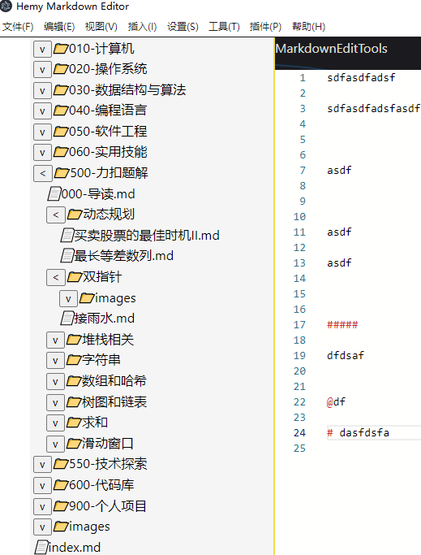
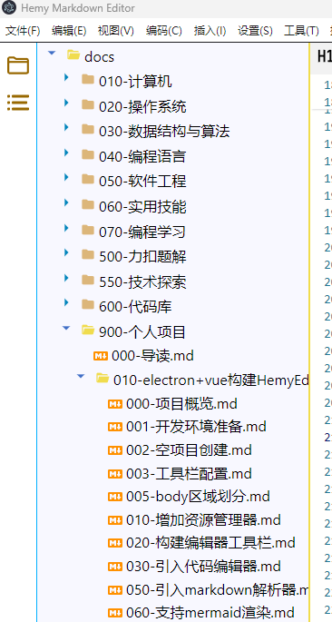
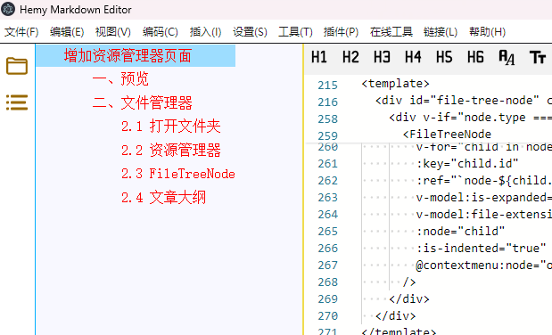

# 增加资源管理器页面

## 一、预览

资源管理器左侧导航栏包含以下功能入口：

- 文件管理器
- 文章大纲
- 微信、邮箱、腾讯会议、网络云盘等快捷应用
- 绘图工具
- Mermaid
- PlantUml
- Json编辑
- Yaml编辑

## 二、文件管理器

经常写文档的时候，是把所有的md文件放在一起，这样找起来也比较好找，这样就需要一个文件管理器来显示所有的文件。

当前的功能，是从用户指定的文件夹下进行显示，不支持全系统盘处理，那文件太多了。

目前支持显示 `.md`、`.png`、`.jpg` 等后缀的文件，其他类型的不在管理器中显示。



### 2.1 打开文件夹

利用electron的 `dialog` 和 `fs.readdir`，递归读取文件夹下的文件列表，只保留文件夹和 `.md`、`.png`、`.jpg` 后缀的文件属性。

通过 `mainWindow.webContents.send('file-system-data', JSON.stringify(mdFiles))` 将信息传递给渲染进程。

就是我们的资源管理器vue组件。

<details>
<summary style="color:rgb(0,0,255);font-weight:bold">递归读取文件夹Tree参考</summary>
<blockcode><pre><code>

```typescript
function shouOpenDirectoryDialog(mainWindow: Electron.BrowserWindow) {
    dialog
        .showOpenDialog(mainWindow, {
            properties: ['openDirectory']
        })
        .then((result) => {
            if (result.canceled) return

            const dirPath = result.filePaths[0]

            traverseDirectory(dirPath, (mdFiles) => {
                // 发送文件名列表到渲染进程
                mainWindow.webContents.send('file-system-data', JSON.stringify(mdFiles))
            })
        })
        .catch((err) => {
            console.error('Error opening directory dialog:', err)
        })
}

// 递归读取目录中的文件，并构建目录树
function traverseDirectory(dir, callback) {
    fs.readdir(dir, (err, files) => {
        if (err) {
            console.error(err)
            return
        }

        const items = files.map((file) => {
            const fullPath = path.join(dir, file)
            return {
                name: file,
                path: fullPath,
                isDirectory: false,
                children: []
            }
        })

        Promise.all(
            items.map((item) => {
                return new Promise((resolve, reject) => {
                    fs.lstat(item.path, (err, stats) => {
                        if (err) {
                            reject(err)
                        } else {
                            item.isDirectory = stats.isDirectory()

                            if (item.isDirectory) {
                                // 如果是目录，则递归调用
                                traverseDirectory(item.path, (subItems) => {
                                    item.children = subItems
                                    item.type = 'folder'
                                    resolve(item)
                                })
                            } else if (
                                path.extname(item.name) === '.md' ||
                                path.extname(item.name) === '.png' ||
                                path.extname(item.name) === '.jpg'
                            ) {
                                item.type = 'file'
                                resolve(item)
                            } else {
                                resolve(null)
                            }
                        }
                    })
                })
            })
        )
            .then((resolvedItems) => {
                const filteredItems = resolvedItems.filter(Boolean)
                callback(filteredItems)
            })
            .catch((err) => {
                console.error(err)
            })
    })
}
```
</code></pre></blockcode></details>

### 2.2 资源管理器组件

`ResourceManager.vue` 组件包含文件树和文章大纲两个部分，通过 `v-show` 切换显示：

```vue
<template>
    <div v-show="showFileExplorer" id="resource-manager-component" class="resource-manager-component">
        <div id="file-manager" class="file-manager">
            <div id="file-tree">
                <FileTreeNode
                    v-for="item in fileNodes"
                    :key="item.id"
                    v-model:is-expanded="item.isExpanded"
                    v-model:file-extension="item.fileExtension"
                    :is-indented="false"
                    :node="item"
                />
            </div>
        </div>
    </div>
    <div v-show="showMarkdownToc" id="markdown-toc-component" class="markdown-toc-component">
        <div id="markdown-toc-heading">
            <div v-for="item in tocArray" :id="item.id" :key="item.id" @click="scrollToSection(item)">
                <span class="markdown-toc-title" v-html="getIndentedText(item)"></span>
            </div>
        </div>
    </div>
</template>
```

在资源管理器组件中，监听主进程的消息，收到后给组件进行解析显示。这里用了子组件 `FileTreeNode.vue`，通过 `v-show` 进行显示的切换。

```typescript
window.electron.ipcRenderer.on('file-system-data', (_, fileTree: string) => {
  try {
    fileNodes.value = JSON.parse(fileTree) as FileSysItem[]
  } catch (error) {
    console.error('Error parsing file system data:', error)
  }
})

function SwitchResourceManager(value: string) {
  if (value == 'markdown-toc') {
    showMarkdownToc.value = true
    showFileExplorer.value = false
    EventBus.$emit('monaco-editor-get-chapters', true)
  } else if (value == 'file-explorer') {
    showFileExplorer.value = true
    showMarkdownToc.value = false
    EventBus.$emit('monaco-editor-switch-explorer', true)
  }
}

watch(() => props.naviShow, (value) => {
  SwitchResourceManager(value)
})
```

### 2.3 FileTreeNode



这里面就是递归显示处理了，并在文件操作上增加了点击事件和右键菜单。

<details>
<summary style="color:rgb(0,0,255);font-weight:bold">递归显示文件树</summary>
<blockcode><pre><code>
```vue
<template>
  <div id="file-tree-node" class="file-tree-node" :class="{ indented: isIndented }">
    <div id="node-content" class="node-content"
      @click="handleClick(node)"
      @contextmenu.prevent="onContextMenu($event, node)">
      <!-- 文件夹：显示展开/收起按钮和文件夹图标 -->
      <span v-if="node.type === 'folder'">
        <button @click="toggleFolder">
          <svg v-if="getSvg(isExpanded, 'collapse')" ...>
            <path :d="getSvg(isExpanded, 'collapse').path" />
          </svg>
        </button>
        <svg v-if="getSvg(isExpanded, 'folder')" ...>
          <path :d="getSvg(isExpanded, 'folder').path" />
        </svg>
      </span>
      <!-- 文件：显示文件图标 -->
      <span v-else>
        <svg v-if="fileExtension && getSvg(false, fileExtension)" ...>
          <path :d="getSvg(false, fileExtension).path" />
        </svg>
      </span>
      <span class="file-manager-node">{{ node.name }}</span>
    </div>
    <!-- 递归显示子节点 -->
    <div v-if="node.type === 'folder' && isExpanded" id="file-subtree" class="file-subtree">
      <FileTreeNode
        v-for="child in node.children"
        :key="child.id"
        v-model:is-expanded="child.isExpanded"
        :node="child"
        :is-indented="true"
      />
    </div>
  </div>
</template>
```
</code></pre></blockcode></details>

### 2.4 右键菜单

文件树节点支持丰富的右键菜单功能，通过 IPC 通信由主进程处理：

| 功能 | 说明 |
| --- | --- |
| 新建文件 | 在当前目录下创建新文件 |
| 新建文件夹 | 在当前目录下创建新文件夹 |
| 重命名 | 重命名文件或文件夹 |
| 删除 | 删除文件或文件夹 |
| 复制 | 复制文件到剪贴板 |
| 剪切 | 剪切文件到剪贴板 |
| 粘贴 | 粘贴剪贴板中的文件 |
| 复制相对路径 | 复制文件相对于根目录的路径 |
| 复制文件链接 | 复制 Markdown 文件链接格式 |
| 复制图片链接 | 复制 Markdown 图片链接格式 |
| 在资源管理器中打开 | 调用系统资源管理器打开 |
| 从磁盘重新加载 | 重新从磁盘读取文件内容 |

打开文件处理：给主进程发送了一条消息，主进程收到后，读取文件内容，然后将内容发送给 monaco-editor 组件的渲染进程，然后显示在编辑器，同时通过 markdown-it 进行渲染，显示在预览区域。

## 三、文章大纲



大纲的显示，直接从文章中获取对应的标题，通过内部的通信方式（EventBus），传递给资源管理器组件，然后进行显示。

```typescript
function getIndentedText(item: MarkdownTOC): string {
  const levelStr = item.level.slice(1)
  if (!levelStr) {
    return item.text
  }
  // 返回带有缩进的文本
  const levelNum = parseInt(levelStr, 10)
  const indent = '&nbsp;'.repeat(levelNum * 2)
  return `${indent}${item.text}`
}

function scrollToSection(item: MarkdownTOC) {
  EventBus.$emit('monaco-editor-locate-target-line', item)
}

onMounted(() => {
  EventBus.$on('monaco-editor-chapters', (toc: MarkdownTOC[]) => {
    tocArray.value = toc
  })
})

onBeforeUnmount(() => {
  EventBus.$off('monaco-editor-chapters', () => {})
})
```

大纲数据由编辑器组件解析 Markdown 标题生成，点击大纲项时通过 EventBus 通知编辑器跳转到对应行。

## 四、辅助按钮

为了方便日常的使用，这里在资源管理器左侧的导航列，增加了一些日常使用的应用快捷通道。

在 `NaviTab.vue` 中增加下拉按钮，按照如下方式增加快捷按钮：

```vue
<button data-index="2" title="邮件" class="navi-tab-item outline" @click="onOpenEmailTool">
    <svg viewBox="0 -0.5 1025 1025" class="icon" xmlns="http://www.w3.org/2000/svg">
        <path d="..." fill="#5F6379" />
        <path d="..." fill="#3688FF" />
    </svg>
</button>
```

```typescript
function onOpenEmailTool() {
  window.electron.ipcRenderer.send(
    'navi-tab-open-exe',
    'D:\\yeah.net\\MailMaster\\Application\\mailmaster.exe'
  )
}
```

通过electron的API接口，发送消息到主进程，由主进程调用接口，启动应用：

```typescript
ipcMain.on('navi-tab-open-exe', async (_, exePath: string) => {
  await shell.openPath(exePath)
})
```


这里增加了常用的邮件、浏览器、会议、微信、QQ、百度网盘、钉钉等应用，目前应用地址是写死的，后续可以考虑优化，改成可配置的。

最终的方案，期望做成通过配置按钮，配置应用的路径、应用图标、应用类型。也可以增加一些网站的快速链接。

## 五、文件状态管理

项目支持文件状态自动保存和恢复：

- **自动保存**：定时保存当前打开的文件内容（默认30秒间隔）
- **状态恢复**：应用重启后自动恢复上次打开的文件和目录
- **状态栏显示**：实时显示文件保存状态（已保存/未保存）
- **最近打开**：记录最近打开的文件和文件夹，在欢迎界面显示

文件状态管理相关代码在 `src/main/utils/file-state.ts` 中，通过 `restoreLastOpenedFile` 函数在应用启动时恢复状态。
