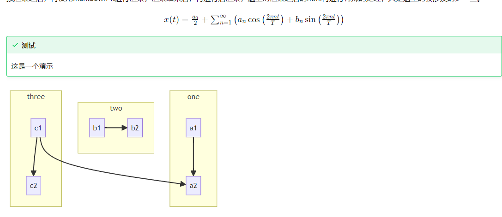
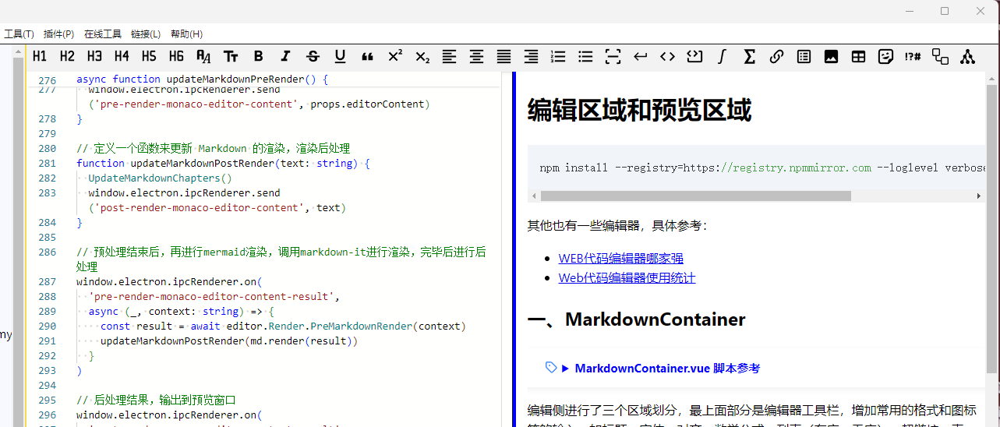

# 编辑区域和预览区域

```
npm install --registry=https://registry.npmmirror.com --loglevel verbose  monaco-editor --save-dev
```
其他也有一些编辑器，具体参考：

- [WEB代码编辑器哪家强](https://juejin.cn/post/6934153579900960782#heading-7)
- [Web代码编辑器使用统计](https://github.com/styfle/awesome-online-ide?tab=readme-ov-file#snippets)

## 一、MarkdownContainer

<details>
<summary style="color:rgb(0,0,255);font-weight:bold">MarkdownContainer.vue 脚本参考</summary>
<blockcode><pre><code>

```typescript
<template>
  <div id="md-edit-tools-bar" ref="toolsBarRef" class="md-edit-tools-bar">
    <MdEditTools :tool-bar-width="props.mdContainerWidth" />
  </div>
  <div id="md-edit-component" class="md-edit-component">
    <MdEditComp :editor-preview-width="props.mdContainerWidth" />
  </div>
</template>

<script setup lang="ts">
import MdEditTools from './MarkdownEditToolsComponent.vue'
import MdEditComp from './MarkdownEditComponent.vue'
import { defineProps, ref } from 'vue'

const toolsBarRef = ref(null)

const props = defineProps({
  // 编辑器宽度
  mdContainerWidth: {
    type: String,
    default: '100%'
  }
})
</script>
```
</code></pre></blockcode></details>

编辑侧进行了三个区域划分，最上面部分是编辑器工具栏，增加常用的格式和图标等的输入。如标题、字体、对齐、数学公式、列表（有序、无序）、超链接、表格、Emoji、特殊字符、mermaid绘图、Plantuml绘图。

下面的部分分为两部分，左侧作为编辑器区域，进行markdown的编辑，右侧增加预览区域。

中间有个分割部分，可以鼠标拖动，以修改编辑区和预览区的显示百分比。

另外，在视图部分，增加编辑框部分的显示模式。编辑器模式、预览模式、编辑/预览模式。

## 二、编辑器组件

这里使用的是monaco-editor编辑器，嵌入vue组件，组件监听编辑器内容变化，然后将新的内容实时渲染到预览区域

<details>
<summary style="color:rgb(0,0,255);font-weight:bold">MarkdownEditComponent.vue 脚本参考</summary>
<blockcode><pre><code>

```typescript
<template>
  <div
    v-show="isShowEditArea"
    id="md-edit-component"
    class="md-edit-component"
    :style="{ width: monacoEditorWidth }"
  >
    <MdMonacoEdit
      v-model="markdownEditorCode"
      :code="initialCodeContent"
      :editor-area-width="monacoEditorWidthPx"
      @update:code="handleMarkdownCodeUpdate"
    />
  </div>
  <div
    v-show="isShowResizer"
    id="resizer-md"
    class="resizer-md"
    :style="{ left: resizerLeft }"
    @mousedown="onEditorResizerMouseDown($event)"
  ></div>
  <div
    v-show="isShowPreviewArea"
    id="md-preview"
    class="md-preview"
    :style="{ width: editPreviewAreaWidth, left: editPreviewAreaLeft }"
  >
    <MdPreview :editor-content="markdownEditorContent" />
  </div>
</template>

function onEditorResizerMouseDown(e: MouseEvent) {
  editorMouseStart = e.clientX
  window.addEventListener('mousemove', onEditorMouseMove)
  window.addEventListener('mouseup', onEditorMouseUp)
}
// 编辑器大小调整逻辑（百分比）
function onEditorMouseMove(e: MouseEvent) {
  const windowWidthValue = parseInt(windowWidth.value.replace('px', ''), 10)
  const moveX = e.clientX - editorMouseStart
  // 将当前百分比宽度转换为像素值
  const currentWidthPx =
    (parseFloat(monacoEditorWidth.value.replace('%', '')) / 100) * windowWidthValue
  const newWidthPx = currentWidthPx + moveX

  // 转换为百分比
  let newWidthPercent = pxToPercent(newWidthPx, windowWidthValue)

  // 限制最小和最大宽度（百分比）
  const minWidthPercent = '20%'
  const maxWidthPercent = '70%'

  if (newWidthPercent > maxWidthPercent) {
    newWidthPercent = maxWidthPercent
  } else if (newWidthPercent < minWidthPercent) {
    newWidthPercent = minWidthPercent
  }

  // 更新 Monaco Editor 宽度
  monacoEditorWidth.value = newWidthPercent

  editorMouseStart = e.clientX
}

function onEditorMouseUp() {
  window.removeEventListener('mousemove', onEditorMouseMove)
  window.removeEventListener('mouseup', onEditorMouseUp)
}

function handleMarkdownCodeUpdate(newValue: string) {
  window.electron.ipcRenderer.send('update-select-file-content', newValue)
  markdownEditorContent.value = newValue
}

function onHandleNewContent(content: string) {
  if (content) {
    // 编辑区域显示时，传入
    if (isShowEditArea.value) {
      initialCodeContent.value = content
    }
    // 预览模式、编辑器/预览模式，才进行渲染
    if (isShowPreviewArea.value) {
      handleMarkdownCodeUpdate(content)
    }
  } else {
    // console.log('content bull')
    handleMarkdownCodeUpdate('\r\n')
  }
}

window.electron.ipcRenderer.on('show-selected-file-context', (_, content) => {
  EventBus.$emit('plugin-tools-container-show', false)
  onHandleNewContent(content)
})

window.electron.ipcRenderer.on('monaco-insert-writing-templates', (_, fileContent: string) => {
  onHandleNewContent(fileContent)
})

function onHandleEditorShow(edit: boolean, preview: boolean) {
  isShowEditArea.value = edit
  isShowPreviewArea.value = preview
  if (edit && preview) {
    isShowResizer.value = true
    monacoEditorWidth.value = '50%'
  } else {
    isShowResizer.value = false
    if (edit) {
      monacoEditorWidth.value = '100%'
    } else {
      monacoEditorWidth.value = '0%'
    }
  }
}

window.electron.ipcRenderer.on('markdown-edit-model', () => {
  onHandleEditorShow(true, false)
})

window.electron.ipcRenderer.on('markdown-preview-model', () => {
  onHandleEditorShow(false, true)
})

window.electron.ipcRenderer.on('markdown-edit-preview-model', () => {
  onHandleEditorShow(true, true)
})
```
</code></pre></blockcode></details>

这里面增加了一些样式控制的东西，可以动态调整编辑区域和预览区域

## 三、预览区域

<details>
<summary style="color:rgb(0,0,255);font-weight:bold">MarkdownPreviewComponent.vue 脚本参考</summary>
<blockcode><pre><code>

```typescript
<template>
  <div
    id="markdown-preview-html"
    class="markdown-preview-html"
    v-html="renderedMarkdownContent"
  ></div>
</template>

<script setup lang="ts">
import { onBeforeUnmount, onMounted, onUpdated, ref, watchEffect } from 'vue'
import highlightjs from 'markdown-it-highlightjs'
import { full as emoji } from 'markdown-it-emoji'
import hljs from 'highlight.js'
import * as editor from './hemy-editor'
import EventBus from '../../event-bus'
//import { marked } from 'marked'
//import { Remarkable } from 'remarkable'
import 'commonmark'

const props = defineProps({
  editorContent: {
    type: String,
    default: ''
  }
})

const renderedMarkdownContent = ref('')
// eslint-disable-next-line @typescript-eslint/no-unused-vars
//let isTocOpen = false

// eslint-disable-next-line @typescript-eslint/no-var-requires
const MarkdownIt = require('markdown-it')
const md = MarkdownIt({
  html: true, // 在源码中启用 HTML 标签
  xhtmlOut: true, // 使用 '/' 来闭合单标签 （比如 <br />）。 这个选项只对完全的 CommonMark 模式兼容。
  linkify: true, // 将类似 URL 的文本自动转换为链接。
  langPrefix: 'language-', // 给围栏代码块的 CSS 语言前缀。对于额外的高亮代码非常有用。
  breaks: true, // 转换段落里的 '\n' 到 <br>。
  // 启用一些语言中立的替换 + 引号美化
  // 双 + 单引号替换对，当 typographer 启用时。
  // 或者智能引号等，可以是 String 或 Array。
  // 比方说，你可以支持 '«»„“' 给俄罗斯人使用， '„“‚‘'  给德国人使用。
  // 还有 ['«\xA0', '\xA0»', '‹\xA0', '\xA0›'] 给法国人使用（包括 nbsp）。
  typographer: false
})
  .use(highlightjs, { inline: true, hljs: hljs })
  // eslint-disable-next-line @typescript-eslint/no-var-requires
  .use(require('markdown-it-plantuml'))
  .use(emoji)

// 组件挂载时，进行初始渲染
onMounted(() => {
  // eslint-disable-next-line @typescript-eslint/no-var-requires
  hljs.registerLanguage('actionscript', require('highlight.js/lib/languages/actionscript'))
})

// 监听 props.editorContent 的变化，并在变化时更新 Markdown
watchEffect(() => {
  updateMarkdownPreRender()
})

function UpdateMarkdownChapters() {
  // isTocOpen = tocOpen
  editor.Render.ParserMarkdownChapters(md, props.editorContent)
}

onMounted(() => {
  EventBus.$on('monaco-editor-get-chapters', UpdateMarkdownChapters)

  onBeforeUnmount(() => {
    EventBus.$off('monaco-editor-get-chapters', UpdateMarkdownChapters)
  })
})

// 定义一个函数来更新 Markdown 的渲染，预处理
async function updateMarkdownPreRender() {
  window.electron.ipcRenderer.send('pre-render-monaco-editor-content', props.editorContent)
}

// 定义一个函数来更新 Markdown 的渲染，渲染后处理
function updateMarkdownPostRender(text: string) {
  UpdateMarkdownChapters()
  window.electron.ipcRenderer.send('post-render-monaco-editor-content', text)
}

// 预处理结束后，再进行mermaid渲染，调用markdown-it进行渲染，完毕后进行后处理
window.electron.ipcRenderer.on(
  'pre-render-monaco-editor-content-result',
  async (_, context: string) => {
    const result = await editor.Render.PreMarkdownRender(context)
    updateMarkdownPostRender(md.render(result))
  }
)

// 后处理结果，输出到预览窗口
window.electron.ipcRenderer.on(
  'post-render-monaco-editor-content-result',
  async (_, context: string) => {
    renderedMarkdownContent.value = editor.Render.PostMarkdownRender(context)
  }
)
</script>
```
</code></pre></blockcode></details>

这里使用markdown-it进行渲染，因为markdown语法本身是支持html语言的，所以遇到一些特殊的或者自定义的格式，这里就在渲染之前，进行预渲染。比如mermaid绘图、公式、路径、链接、自定义的格式、特殊的字体等。

预渲染之后，再使用markdown-it进行渲染，渲染结束后，再进行后渲染，这里对渲染之后的html再进行特殊的处理，只是这里的会涉及的少一些。



## 四、效果


