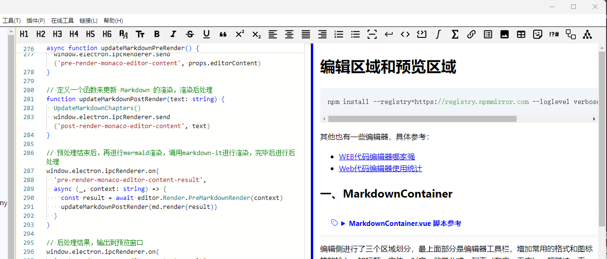

# 编辑区域和预览区域

```
npm install monaco-editor
```

其他也有一些编辑器，具体参考：

- [WEB代码编辑器哪家强](https://juejin.cn/post/6934153579900960782#heading-7)
- [Web代码编辑器使用统计](https://github.com/styfle/awesome-online-ide?tab=readme-ov-file#snippets)

项目使用 **Monaco Editor**（VS Code 同款编辑器）作为 Markdown 编辑器核心组件，支持智能补全、多光标编辑、代码折叠、语法高亮等特性。

## 一、MarkdownContainer

`MarkdownContainer.vue` 是 Markdown 编辑区域的容器，分为编辑器工具栏和编辑组件两部分：

<details>
<summary style="color:rgb(0,0,255);font-weight:bold">MarkdownContainer.vue 参考</summary>
<blockcode><pre><code>

```typescript
<template>
  <div id="md-edit-tools-bar" ref="toolsBarRef" class="md-edit-tools-bar">
    <MdEditTools :tool-bar-width="props.mdContainerWidth" />
  </div>
  <div id="md-edit-component" class="md-edit-component">
    <MdEditComp :editor-preview-width="props.mdContainerWidth" />
  </div>
</template>

<script setup lang="ts">
import MdEditTools from './MarkdownEditToolsComponent.vue'
import MdEditComp from './MarkdownEditComponent.vue'
import { defineProps, ref } from 'vue'

const props = defineProps({
  mdContainerWidth: {
    type: String,
    default: '100%'
  }
})
</script>
```
</code></pre></blockcode></details>

编辑侧进行了三个区域划分，最上面部分是编辑器工具栏，增加常用的格式和图标等的输入。如标题、字体、对齐、数学公式、列表（有序、无序）、超链接、表格、Emoji、特殊字符、mermaid绘图、Plantuml绘图。

下面的部分分为两部分，左侧作为编辑器区域，进行markdown的编辑，右侧增加预览区域。

中间有个分割部分，可以鼠标拖动，以修改编辑区和预览区的显示百分比。

另外，在视图部分，增加编辑框部分的显示模式。编辑器模式、预览模式、编辑/预览模式。

## 二、编辑器组件

这里使用的是 Monaco Editor 编辑器，嵌入 Vue 组件，组件监听编辑器内容变化，然后将新的内容实时渲染到预览区域。

### 2.1 MarkdownMonacoEditor.vue

Monaco Editor 通过 `monaco-editor.create()` 创建实例，挂载到 DOM 容器上：

<details>
<summary style="color:rgb(0,0,255);font-weight:bold">MarkdownMonacoEditor.vue 核心实现</summary>
<blockcode><pre><code>

```typescript
<template>
    <div id="monaco-editor-container" ref="monacoEditorContainer"
        class="monaco-editor-container"></div>
</template>

<script setup lang="ts">
import * as monaco from 'monaco-editor'
import { ref, onMounted, watch, onBeforeUnmount } from 'vue'
import * as editor from './hemy-editor'

const props = defineProps({
    code: { type: String, default: 'test' },
    editorAreaWidth: { type: String, default: '50%' },
    filePath: { type: String, default: '' }
})

const monacoEditorContainer = ref<HTMLElement | null>(null)
let editorInstance: monaco.editor.IStandaloneCodeEditor | null = null

// IPC 监听器：插入文本、更新选项、撤销/重做
window.electron.ipcRenderer.on('monaco-editor-insert-after-cursor', (_, context) => {
    if (context && editorInstance) {
        editor.InsertAfterCursor(editorInstance, context)
    }
})

// 监听代码内容变化（带值变化守卫，避免更新循环）
watch(() => props.code, (newCode) => {
    if (editorInstance) {
        if (newCode.length === 0) newCode = '# '
        // 更新编辑器内容
    }
})

onMounted(() => {
    if (monacoEditorContainer.value) {
        editorInstance = monaco.editor.create(monacoEditorContainer.value, {
            value: props.code,
            language: 'markdown',
            theme: 'vs',
            automaticLayout: true,
            // ... 其他配置
        })
    }
})
</script>
```
</code></pre></blockcode></details>

### 2.2 MarkdownEditComponent.vue

编辑区域和预览区域，支持三种显示模式和拖拽调整大小：

<details>
<summary style="color:rgb(0,0,255);font-weight:bold">MarkdownEditComponent.vue 参考</summary>
<blockcode><pre><code>

```typescript
<template>
  <div v-show="isShowEditArea" id="md-edit-component" class="md-edit-component"
    :style="{ width: monacoEditorWidth }">
    <MdMonacoEdit v-model="markdownEditorCode" :code="initialCodeContent"
      :editor-area-width="monacoEditorWidthPx"
      @update:code="handleMarkdownCodeUpdate" />
  </div>
  <div v-show="isShowResizer" id="resizer-md" class="resizer-md"
    :style="{ left: resizerLeft }"
    @mousedown="onEditorResizerMouseDown($event)"></div>
  <div v-show="isShowPreviewArea" id="md-preview" class="md-preview"
    :style="{ width: editPreviewAreaWidth, left: editPreviewAreaLeft }">
    <MdPreview :editor-content="markdownEditorContent" />
  </div>
</template>
```
</code></pre></blockcode></details>

**拖拽调整大小**：通过鼠标事件实现编辑区和预览区的宽度调整，限制最小 20%、最大 70%：

```typescript
function onEditorResizerMouseDown(e: MouseEvent) {
  editorMouseStart = e.clientX
  window.addEventListener('mousemove', onEditorMouseMove)
  window.addEventListener('mouseup', onEditorMouseUp)
}

function onEditorMouseMove(e: MouseEvent) {
  const windowWidthValue = parseInt(windowWidth.value.replace('px', ''), 10)
  const moveX = e.clientX - editorMouseStart
  const currentWidthPx = (parseFloat(monacoEditorWidth.value.replace('%', '')) / 100) * windowWidthValue
  const newWidthPx = currentWidthPx + moveX
  let newWidthPercent = pxToPercent(newWidthPx, windowWidthValue)

  // 限制最小和最大宽度
  const minWidthPercent = '20%'
  const maxWidthPercent = '70%'
  if (newWidthPercent > maxWidthPercent) newWidthPercent = maxWidthPercent
  else if (newWidthPercent < minWidthPercent) newWidthPercent = minWidthPercent

  monacoEditorWidth.value = newWidthPercent
  editorMouseStart = e.clientX
}
```

**三种显示模式**：通过 IPC 监听切换编辑模式、预览模式、编辑/预览模式：

```typescript
function onHandleEditorShow(edit: boolean, preview: boolean) {
  isShowEditArea.value = edit
  isShowPreviewArea.value = preview
  if (edit && preview) {
    isShowResizer.value = true
    monacoEditorWidth.value = '50%'
  } else {
    isShowResizer.value = false
    monacoEditorWidth.value = edit ? '100%' : '0%'
  }
}

window.electron.ipcRenderer.on('markdown-edit-model', () => onHandleEditorShow(true, false))
window.electron.ipcRenderer.on('markdown-preview-model', () => onHandleEditorShow(false, true))
window.electron.ipcRenderer.on('markdown-edit-preview-model', () => onHandleEditorShow(true, true))
```

## 三、预览区域

`MarkdownPreviewComponent.vue` 使用 markdown-it 及其插件链进行渲染，支持代码高亮、PlantUML、Emoji 等：

<details>
<summary style="color:rgb(0,0,255);font-weight:bold">MarkdownPreviewComponent.vue 参考</summary>
<blockcode><pre><code>

```typescript
<template>
    <div id="markdown-preview-html" class="markdown-preview-html md-typeset"
        v-html="renderedMarkdownContent"></div>
</template>

<script setup lang="ts">
import { onBeforeUnmount, onMounted, ref, watch } from 'vue'
import highlightjs from 'markdown-it-highlightjs'
import { full as emoji } from 'markdown-it-emoji'
import hljs from 'highlight.js'
import MarkdownIt from 'markdown-it'
import plantuml from 'markdown-it-plantuml'
import * as editor from './hemy-editor'
import EventBus from '../../common/event_bus/event-bus'

const props = defineProps({
    editorContent: { type: String, default: '' }
})

const renderedMarkdownContent = ref('')
let renderDebounceTimer: ReturnType<typeof setTimeout> | null = null
const RENDER_DEBOUNCE_DELAY = 150  // 防抖延迟 150ms

// markdown-it 渲染管线
const md = MarkdownIt({
    html: true,        // 启用 HTML 标签
    xhtmlOut: true,    // 使用 '/' 闭合单标签
    linkify: true,     // 自动转换 URL 为链接
    langPrefix: 'language-',
    breaks: true,      // '\n' 转换为 <br>
    typographer: false
})
    .use(highlightjs, {   // 代码高亮
        inline: true,
        hljs: hljs,
        highlight: function (str, lang) {
            if (lang && hljs.getLanguage(lang)) {
                try { return hljs.highlight(str, { language: lang }).value }
                catch (__) { console.warn(`Highlight error: ${lang}`, __) }
            }
            return ''
        }
    })
    .use(plantuml)      // PlantUML 支持
    .use(emoji)         // Emoji 表情

// 监听内容变化，带防抖优化
watch(() => props.editorContent, () => {
    if (renderDebounceTimer) clearTimeout(renderDebounceTimer)
    renderDebounceTimer = setTimeout(() => {
        updateMarkdownPreRender()
        renderDebounceTimer = null
    }, RENDER_DEBOUNCE_DELAY)
}, { immediate: true })

// 预渲染：处理 mermaid、公式、路径等特殊格式
async function updateMarkdownPreRender() {
    window.electron.ipcRenderer.send('pre-render-monaco-editor-content', props.editorContent)
}

// 后渲染：处理渲染后的 HTML
function updateMarkdownPostRender(text: string) {
    UpdateMarkdownChapters()
    window.electron.ipcRenderer.send('post-render-monaco-editor-content', text)
}

// 预渲染结果 -> markdown-it 渲染 -> 后渲染
window.electron.ipcRenderer.on('pre-render-monaco-editor-content-result',
    async (_, context) => {
        const result = await editor.Render.PreMarkdownRender(context)
        updateMarkdownPostRender(md.render(result))
    })

// 后渲染结果 -> 输出到预览窗口
window.electron.ipcRenderer.on('post-render-monaco-editor-content-result',
    async (_, context) => {
        renderedMarkdownContent.value = editor.Render.PostMarkdownRender(context)
    })
</script>
```
</code></pre></blockcode></details>

### 3.1 渲染管线

渲染过程分为三个阶段：

```
编辑器内容变化
      │
      ▼
1. 预渲染（PreMarkdownRender）
   ├── Mermaid 图表渲染（```mermaid 块）
   ├── KaTeX 数学公式渲染（$...$ 和 $$...$$）
   ├── Material Admonition 处理
   ├── 选项卡（Tabbed Set）处理
   └── 路径、链接、特殊字体处理
      │
      ▼
2. markdown-it 渲染
   ├── HTML 标签支持
   ├── 代码高亮（highlight.js）
   ├── PlantUML 渲染
   ├── Emoji 表情
   └── 自动链接转换
      │
      ▼
3. 后渲染（PostMarkdownRender）
   ├── HTML 后处理
   └── 特殊格式调整
      │
      ▼
v-html 绑定到预览区域
```

因为 markdown 语法本身是支持 html 语言的，所以遇到一些特殊的或者自定义的格式，这里就在渲染之前，进行预渲染。比如 mermaid 绘图、公式、路径、链接、自定义的格式、特殊的字体等。

预渲染之后，再使用 markdown-it 进行渲染，渲染结束后，再进行后渲染，这里对渲染之后的 html 再进行特殊的处理。

### 3.2 防抖优化

预览渲染使用 150ms 的防抖延迟，避免编辑器快速输入时频繁触发渲染，提升性能：

```typescript
watch(() => props.editorContent, () => {
    if (renderDebounceTimer) clearTimeout(renderDebounceTimer)
    renderDebounceTimer = setTimeout(() => {
        updateMarkdownPreRender()
        renderDebounceTimer = null
    }, 150)
}, { immediate: true })
```

## 四、效果


