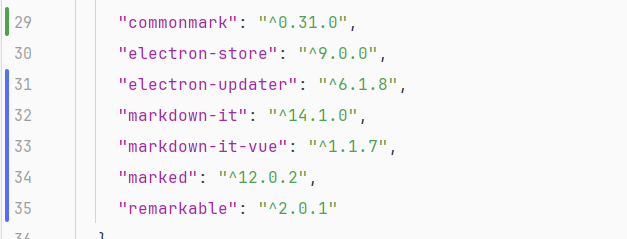
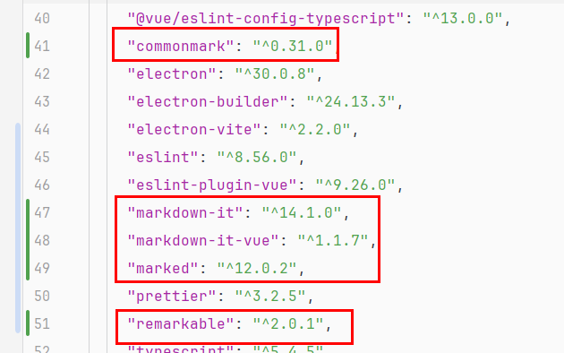

# 引入markdown解析器

## 一、解析器选择

这里准备引入`markdown-it`、`markdown-it-vue`、`remarkable`、`marked`、`commonmark`几个，然后看看那个渲染的效果好一些，如果可以，想做成可选功能，由用户去选择使用哪个解析器。

### 1）安装--save

```
npm install --registry=https://registry.npmmirror.com --loglevel verbose markdown-it --save
npm install --registry=https://registry.npmmirror.com --loglevel verbose markdown-it-vue --save
npm install --registry=https://registry.npmmirror.com --loglevel verbose remarkable --save
npm install --registry=https://registry.npmmirror.com --loglevel verbose marked --save
npm install --registry=https://registry.npmmirror.com --loglevel verbose commonmark --save
```

安装完毕之后，`package.json`的`dependencies`会增加如下项目：



### 1）安装--save-dev（建议）

```
npm install --registry=https://registry.npmmirror.com --loglevel verbose markdown-it --save-dev
npm install --registry=https://registry.npmmirror.com --loglevel verbose markdown-it-vue --save-dev
npm install --registry=https://registry.npmmirror.com --loglevel verbose remarkable --save-dev
npm install --registry=https://registry.npmmirror.com --loglevel verbose marked --save-dev
npm install --registry=https://registry.npmmirror.com --loglevel verbose commonmark --save-dev
```

安装完毕之后，`package.json`的`devDependencies`会增加如下项目：




## 二、markdown-it解析器