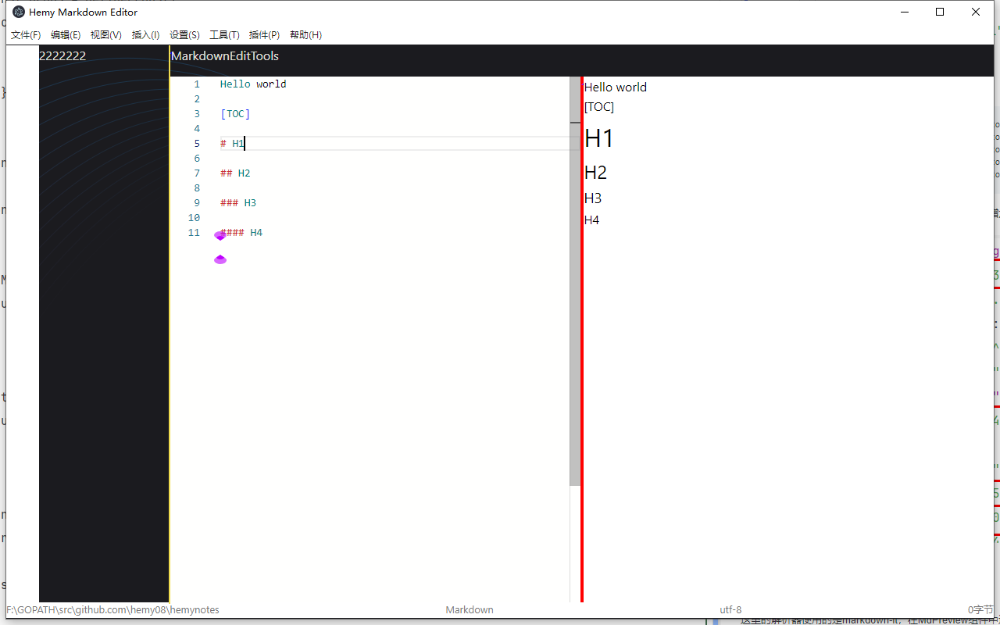

# 引入markdown解析器

## 一、解析器选择

项目最终选用 **markdown-it** 作为主要 Markdown 解析器，并集成多个插件扩展功能。

### 1.1 候选解析器对比

| 解析器 | 特点 | 选择 |
| --- | --- | --- |
| markdown-it | 功能强大，插件丰富，支持 CommonMark | ✅ **选用** |
| remarkable | 解析速度快，100% 支持 CommonMark | ❌ |
| marked | 文档丰富，使用简单 | ❌ |
| commonmark | 严格遵循 Markdown 语法规范 | ❌ |

### 1.2 安装

```
npm install markdown-it
```

### 1.3 插件安装

项目使用了以下 markdown-it 插件：

```
npm install markdown-it-highlightjs    # 代码高亮
npm install markdown-it-emoji          # Emoji 表情
npm install markdown-it-plantuml       # PlantUML 支持
npm install markdown-it-anchor         # 标题锚点
```

辅助库：

```
npm install highlight.js               # 代码高亮引擎
npm install mermaid                    # Mermaid 图表
npm install katex                      # 数学公式
```

安装完毕之后，`package.json` 的 `dependencies` 会增加对应项目：

```json
{
  "markdown-it": "^15.0.0",
  "markdown-it-anchor": "^9.2.1",
  "markdown-it-emoji": "^3.1.0",
  "markdown-it-highlightjs": "^4.1.0",
  "markdown-it-plantuml": "^1.4.1",
  "highlight.js": "^11.12.0",
  "mermaid": "^11.17.0",
  "katex": "^0.18.4"
}
```

## 二、markdown-it 渲染配置

解析器在 `MarkdownPreviewComponent.vue` 中配置，构建完整的渲染管线：

<details>
<summary style="color:rgb(0,0,255);font-weight:bold">markdown-it 配置参考</summary>
<blockcode><pre><code>
```typescript
import MarkdownIt from 'markdown-it'
import highlightjs from 'markdown-it-highlightjs'
import { full as emoji } from 'markdown-it-emoji'
import hljs from 'highlight.js'
import plantuml from 'markdown-it-plantuml'

const md = MarkdownIt({
    html: true,        // 在源码中启用 HTML 标签
    xhtmlOut: true,    // 使用 '/' 来闭合单标签
    linkify: true,     // 将类似 URL 的文本自动转换为链接
    langPrefix: 'language-',  // 围栏代码块的 CSS 语言前缀
    breaks: true,      // 转换段落里的 '\n' 到 <br>
    typographer: false  // 不启用引号美化
})
    .use(highlightjs, {     // 代码高亮
        inline: true,
        hljs: hljs,
        highlight: function (str: string, lang: string): string {
            if (lang && hljs.getLanguage(lang)) {
                try {
                    return hljs.highlight(str, { language: lang }).value
                } catch (__) {
                    console.warn(`Highlight.js error for language '${lang}':`, __)
                }
            }
            return ''
        }
    })
    .use(plantuml)          // PlantUML 支持
    .use(emoji)             // Emoji 表情
```
</code></pre></blockcode></details>

### 配置说明

| 选项 | 值 | 说明 |
| --- | --- | --- |
| `html` | `true` | 启用 HTML 标签，支持在 Markdown 中直接写 HTML |
| `xhtmlOut` | `true` | 使用自闭合标签（如 `<br />`） |
| `linkify` | `true` | 自动将 URL 文本转换为链接 |
| `langPrefix` | `language-` | 代码块 CSS 语言前缀 |
| `breaks` | `true` | 段落中的 `\n` 转换为 `<br>` |
| `typographer` | `false` | 不启用引号美化 |

## 三、渲染管线

项目的 Markdown 渲染采用三阶段管线，处理各种特殊格式：

```
编辑器内容
    │
    ▼
┌─────────────────────────────────┐
│  1. 预渲染 (PreMarkdownRender)   │
│  ├── Mermaid 图表渲染            │
│  ├── KaTeX 数学公式渲染          │
│  ├── Material Admonition 处理    │
│  ├── 选项卡 (Tabbed Set) 处理    │
│  └── 路径、链接、特殊字体处理     │
└─────────────────────────────────┘
    │
    ▼
┌─────────────────────────────────┐
│  2. markdown-it 渲染             │
│  ├── HTML 标签支持               │
│  ├── 代码高亮 (highlight.js)     │
│  ├── PlantUML 渲染               │
│  ├── Emoji 表情                  │
│  └── 自动链接转换                │
└─────────────────────────────────┘
    │
    ▼
┌─────────────────────────────────┐
│  3. 后渲染 (PostMarkdownRender)  │
│  ├── HTML 后处理                 │
│  └── 特殊格式调整                │
└─────────────────────────────────┘
    │
    ▼
v-html 绑定到预览区域
```

预渲染和后渲染的代码在 `src/main/renders/HemyRender.ts` 中，通过 IPC 通信在主进程处理。

## 四、效果



## 五、相关文档

- [030-编辑器和预览区域](030-编辑器和预览区域.md)：编辑器和预览区域的整体实现
- [060-支持mermaid渲染](060-支持mermaid渲染.md)：Mermaid 图表渲染的详细说明
