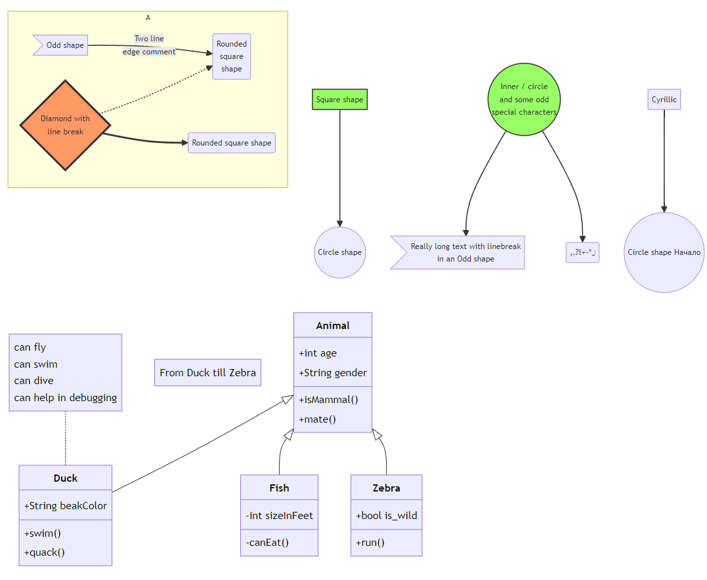

# 支持mermaid渲染

## 一、markdown-it-mermaid

markdown-it-mermaid 这个是js开发的markdown-it插件，支持mermaid渲染。

试用了下，好像并不能进行渲染，因为本人使用的是Electron + Vue + Typescript开发的工具，发现并没有现成的支持markdown-it的插件。

个人的想法是：从编辑器获取mermaid部分字符，然后先渲染成html脚本，取其中的svg部分，再拿给markdown-it进行渲染。

或者可以直接自己开发一个内部的支持mermaid渲染的markdown-it的插件。

## 二、实现

在preview组件中，增加mermaid的渲染组件，不显示

```typescript
<template xmlns="http://www.w3.org/1999/html">
    <div class="markdown-content" v-html="renderedMarkdownContent"></div>
    <div v-show="isShowMermaidContainer" ref="mermaidContainer" class="mermaid"></div>
    <MermaidRender v-show="isShowMermaidComponent" /> 
</template>
```

在编辑器文字变化时，进行渲染，渲染的时候先获取对应的文本块，然后进行渲染，这里进行异步渲染，直接在preview组件进行渲染

```typescript
function generateRandomNumberString(length: number): string {
    let result = ''
    const characters = '0123456789'
    const charactersLength = characters.length
    for (let i = 0; i < length; i++) {
        result += characters.charAt(Math.floor(Math.random() * charactersLength))
    }
    return result
}

async function mermaidRender(graphDefinition: string): Promise<string> {
    try {
        const mermaidId = 'mermaid' + generateRandomNumberString(10)
        const renderSvg = await mermaid.render(mermaidId, graphDefinition)
        return Promise.resolve(
            '<div><pre class="mermaid"><code style="height: auto;display: flex">' +
            renderSvg.svg +
            '</code></pre></div>'
        )
    } catch (error) {
        console.log('mermaidRender error', error)
    }

    return ''
}

async function preRenderMermaidProc(text: string) {
    // 正则表达式匹配以 $ 开头和结尾的文本（简单版本，不处理转义字符或嵌套）
    let renderResult = text
    let match: RegExpExecArray | null = null
    const regex = /```mermaid([\s\S]*?)```/g
    // 使用全局搜索来查找所有匹配项
    while ((match = regex.exec(text)) !== null) {
        const renderedSvg = await mermaidRender(match[1])
        renderResult = renderResult.replace(match[0], renderedSvg)
    }

    return renderResult
}
```

子组件MermaidRender是为了给主进程的对话框进行实时渲染使用，通过IPC通信，将渲染结果发送到主进程，由主进程显示在对话框中。 

## 三、效果示例

<details>
<summary style="color:rgb(0,0,255);font-weight:bold">mermaid 基本流程图源码示例</summary>
<blockcode><pre><code>
```
graph TB
    sq[Square shape] --> ci((Circle shape))

    subgraph A
        od>Odd shape]-- Two line<br/>edge comment --> ro
        di{Diamond with <br/> line break} -.-> ro(Rounded<br>square<br>shape)
        di==>ro2(Rounded square shape)
    end

    %% Notice that no text in shape are added here instead that is appended further down
    e --> od3>Really long text with linebreak<br>in an Odd shape]

    %% Comments after double percent signs
    e((Inner / circle<br>and some odd <br>special characters)) --> f(,.?!+-*ز)

    cyr[Cyrillic]-->cyr2((Circle shape Начало));

     classDef green fill:#9f6,stroke:#333,stroke-width:2px;
     classDef orange fill:#f96,stroke:#333,stroke-width:4px;
     class sq,e green
     class di orange
```
</code></pre></blockcode></details>

<details>
<summary style="color:rgb(0,0,255);font-weight:bold">mermaid 类图源码示例</summary>
<blockcode><pre><code>
```
---
title: Animal example
---
classDiagram
    note "From Duck till Zebra"
    Animal <|-- Duck
    note for Duck "can fly\ncan swim\ncan dive\ncan help in debugging"
    Animal <|-- Fish
    Animal <|-- Zebra
    Animal : +int age
    Animal : +String gender
    Animal: +isMammal()
    Animal: +mate()
    class Duck{
        +String beakColor
        +swim()
        +quack()
    }
    class Fish{
        -int sizeInFeet
        -canEat()
    }
    class Zebra{
        +bool is_wild
        +run()
    }
```
</code></pre></blockcode></details>


效果如图：




