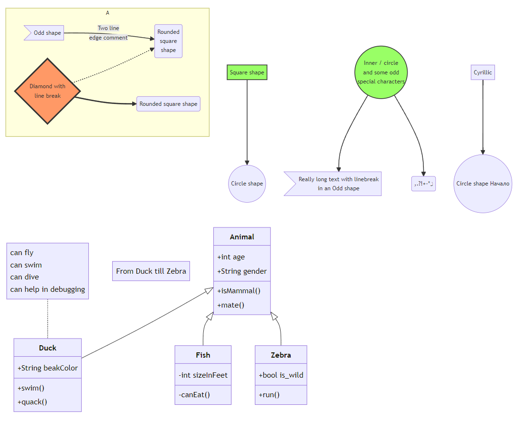

# 支持mermaid渲染

## 一、实现方案

项目没有使用现成的 markdown-it-mermaid 插件（因为兼容性问题），而是自行实现 Mermaid 渲染逻辑，集成在预渲染阶段。

### 实现思路

1. 从编辑器内容中提取 ` ```mermaid ` 代码块
2. 调用 mermaid 库将代码块渲染为 SVG
3. 将 SVG 替换回原文，再交给 markdown-it 渲染

## 二、Mermaid 渲染实现

### 2.1 渲染流程

Mermaid 渲染在预渲染阶段处理，代码位于 `src/main/renders/HemyRender.ts`：

<details>
<summary style="color:rgb(0,0,255);font-weight:bold">Mermaid 渲染核心逻辑</summary>
<blockcode><pre><code>
```typescript
// 生成随机 ID
function generateRandomNumberString(length: number): string {
    let result = ''
    const characters = '0123456789'
    for (let i = 0; i < length; i++) {
        result += characters.charAt(Math.floor(Math.random() * characters.length))
    }
    return result
}

// 渲染 Mermaid 图表为 SVG
async function mermaidRender(graphDefinition: string): Promise<string> {
    try {
        const mermaidId = 'mermaid' + generateRandomNumberString(10)
        const renderSvg = await mermaid.render(mermaidId, graphDefinition)
        return Promise.resolve(
            '<div><pre class="mermaid"><code style="height: auto;display: flex">' +
            renderSvg.svg +
            '</code></pre></div>'
        )
    } catch (error) {
        console.log('mermaidRender error', error)
    }
    return ''
}

// 预渲染：处理所有 mermaid 代码块
async function preRenderMermaidProc(text: string) {
    let renderResult = text
    let match: RegExpExecArray | null = null
    const regex = /```mermaid([\s\S]*?)```/g
    // 使用全局搜索查找所有 mermaid 代码块
    while ((match = regex.exec(text)) !== null) {
        const renderedSvg = await mermaidRender(match[1])
        renderResult = renderResult.replace(match[0], renderedSvg)
    }
    return renderResult
}
```
</code></pre></blockcode></details>

### 2.2 预览组件中的调用

在 `MarkdownPreviewComponent.vue` 中，编辑器内容变化时触发预渲染：

```typescript
// 预渲染：发送到主进程处理 mermaid、公式等
async function updateMarkdownPreRender() {
    window.electron.ipcRenderer.send('pre-render-monaco-editor-content', props.editorContent)
}

// 预渲染结果 -> markdown-it 渲染 -> 后渲染
window.electron.ipcRenderer.on('pre-render-monaco-editor-content-result',
    async (_, context) => {
        const result = await editor.Render.PreMarkdownRender(context)
        updateMarkdownPostRender(md.render(result))
    })
```

### 2.3 独立 Mermaid 编辑窗口

项目还提供了独立的 Mermaid 编辑预览窗口（通过工具菜单 -> Mermaid 绘图打开），支持实时编辑和预览：

- `src/main/dialogs/OpenMermaidRenderFrame.ts`：主进程创建 Mermaid 渲染窗口
- `src/renderer/src/components/Markdown/MermaidRender.vue`：渲染进程的 Mermaid 渲染组件

子组件 `MermaidRender.vue` 是为了给主进程的对话框进行实时渲染使用，通过 IPC 通信，将渲染结果发送到主进程，由主进程显示在对话框中。

## 三、Mermaid 模板插入

编辑器工具栏提供 Mermaid 模板快速插入功能，模板定义在 `src/renderer/src/common/templates.ts` 中：

- **Mermaid Part1**：流程图、时序图等基础模板
- **Mermaid Part2**：类图、状态图、甘特图等高级模板

通过插入菜单 -> Mermaid -> 选择模板，将模板代码插入到编辑器当前光标位置。

## 四、效果示例

<details>
<summary style="color:rgb(0,0,255);font-weight:bold">mermaid 基本流程图源码示例</summary>
<blockcode><pre><code>
```
graph TB
    sq[Square shape] --> ci((Circle shape))

    subgraph A
        od>Odd shape]-- Two line<br/>edge comment --> ro
        di{Diamond with <br/> line break} -.-> ro(Rounded<br>square<br>shape)
        di==>ro2(Rounded square shape)
    end

    %% Notice that no text in shape are added here instead that is appended further down
    e --> od3>Really long text with linebreak<br>in an Odd shape]

    %% Comments after double percent signs
    e((Inner / circle<br>and some odd <br>special characters)) --> f(,.?!+-*ز)

    cyr[Cyrillic]-->cyr2((Circle shape Начало));

     classDef green fill:#9f6,stroke:#333,stroke-width:2px;
     classDef orange fill:#f96,stroke:#333,stroke-width:4px;
     class sq,e green
     class di orange
```
</code></pre></blockcode></details>

<details>
<summary style="color:rgb(0,0,255);font-weight:bold">mermaid 类图源码示例</summary>
<blockcode><pre><code>
```
---
title: Animal example
---
classDiagram
    note "From Duck till Zebra"
    Animal <|-- Duck
    note for Duck "can fly\ncan swim\ncan dive\ncan help in debugging"
    Animal <|-- Fish
    Animal <|-- Zebra
    Animal : +int age
    Animal : +String gender
    Animal: +isMammal()
    Animal: +mate()
    class Duck{
        +String beakColor
        +swim()
        +quack()
    }
    class Fish{
        -int sizeInFeet
        -canEat()
    }
    class Zebra{
        +bool is_wild
        +run()
    }
```
</code></pre></blockcode></details>

<details>
<summary style="color:rgb(0,0,255);font-weight:bold">mermaid 时序图源码示例</summary>
<blockcode><pre><code>
```
sequenceDiagram
    participant Alice
    participant Bob
    Alice->>Bob: Hello Bob, how are you?
    Bob-->>Alice: Great!
    Alice->>Bob: Where do you want to go?
    Bob-->>Alice: Let's go to the cinema
    Bob->>Alice: See you at 7pm
```
</code></pre></blockcode></details>

<details>
<summary style="color:rgb(0,0,255);font-weight:bold">mermaid 甘特图源码示例</summary>
<blockcode><pre><code>
```
gantt
    title A Gantt Diagram
    dateFormat  YYYY-MM-DD
    section Section
    A task           :a1, 2014-01-01, 30d
    Another task     :after a1  , 20d
    section Another
    Task in sec      :2014-01-12  , 12d
    another task    : 24d
```
</code></pre></blockcode></details>

效果如图：



## 五、相关文档

- [Mermaid 官方文档](https://mermaid.js.org/)
- [Mermaid Live Editor](https://mermaid.live/edit)
- [mermaid GitHub](https://github.com/mermaid-js/mermaid)
