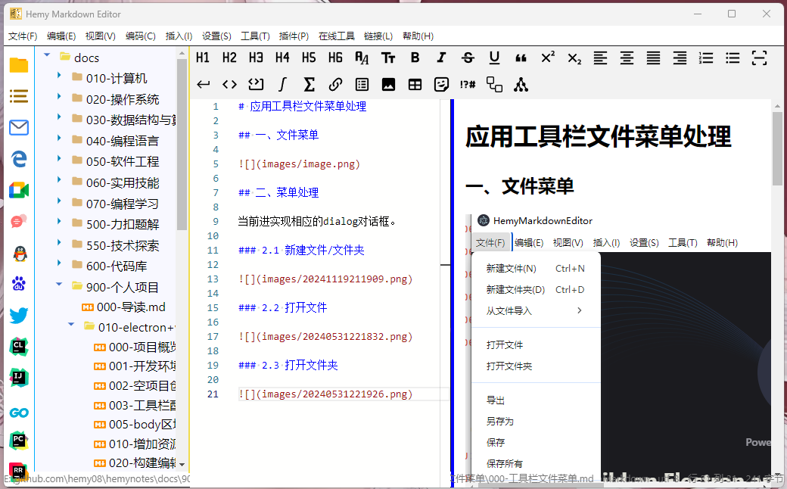
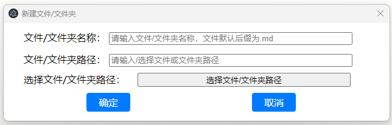
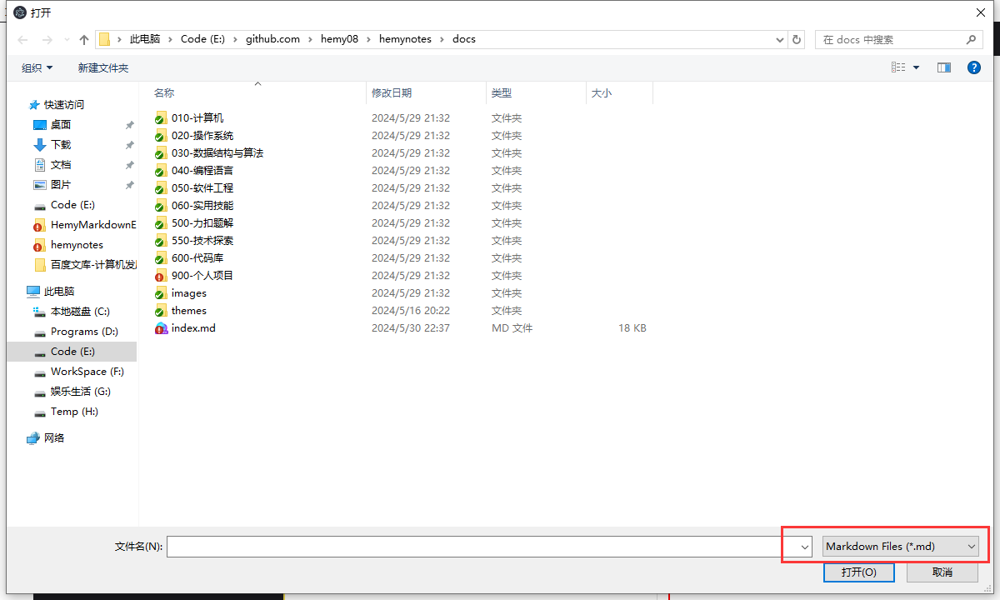
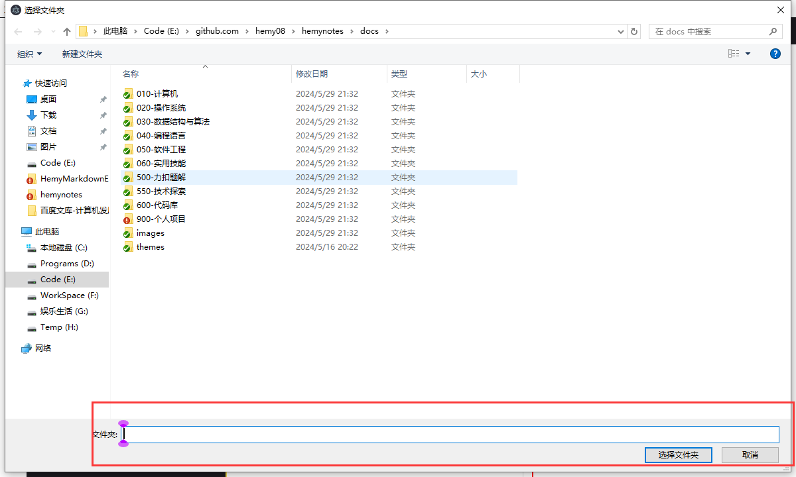

# 应用工具栏文件菜单处理

## 一、文件菜单

文件菜单包含以下功能：

| 功能 | 快捷键 | 说明 |
| --- | --- | --- |
| 新建 | `Ctrl+N` | 新建空白 Markdown 文件 |
| 打开文件 | - | 打开单个文件 |
| 打开文件夹 | `Ctrl+O` | 打开文件夹，显示文件树 |
| 从文件导入 | - | 从 Word/HTML/JSON/YAML/XML/文本导入 |
| 导出到文件 | - | 导出为 Word/JSON/XML/YAML/HTML/PDF |
| 保存 | `Ctrl+S` | 保存当前文件 |
| 另存为 | - | 另存为新文件 |
| 从磁盘重新加载 | `Ctrl+R` | 从磁盘重新读取文件内容 |
| 重启应用 | `Ctrl+Shift+R` | 重启应用 |
| 退出 | `F4` | 退出应用 |

## 二、菜单处理

文件菜单的 IPC 处理在 `src/main/ipc/menu_file.ts` 中，对话框在 `src/main/dialogs/` 目录下。

### 2.1 新建文件/文件夹

通过 `ShowCreateFileFolderDialog.ts` 创建新建文件/文件夹对话框。

### 2.2 打开文件

使用 Electron 的 `dialog.showOpenDialog` 打开文件选择对话框，读取文件内容后发送到渲染进程。

### 2.3 打开文件夹

使用 `dialog.showOpenDialog` 选择目录，递归读取文件树后发送到资源管理器组件。

### 2.4 导入导出

- **导入**：支持从 Word（mammoth）、HTML、JSON、YAML、XML、文本文件导入，转换为 Markdown 格式
- **导出**：支持导出为 Word（officegen）、JSON、XML、YAML、HTML、PDF 格式

### 2.5 保存

- **保存**：将编辑器内容写入当前文件路径
- **另存为**：弹出文件保存对话框，选择新路径保存
- **自动保存**：定时自动保存（默认30秒间隔），配置项 `autoSaveInterval`

### 2.6 从磁盘重新加载

从磁盘重新读取文件内容，覆盖编辑器当前内容。用于文件被外部修改后同步最新内容。
