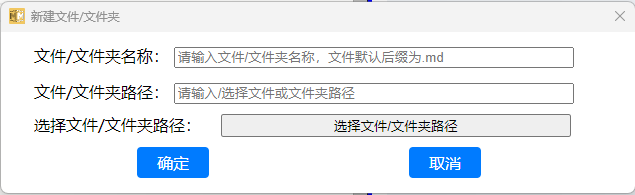

# 新建文件或文件夹



typescript语言，通过electron组件加载一个动态或者静态的html页面，显示新建文件/文件夹的对话框。

```typescript
export function getAppFileMenuItem(
  mainWindow: Electron.BrowserWindow
): Electron.MenuItemConstructorOptions {
  const fileMenuItems: Electron.MenuItemConstructorOptions[] = [
    {
      label: '新建文件(N)',
      accelerator: 'ctrl+n',
      click: () => {
        dialogs.ShowNewFileFolderDialog(true)
      }
    },
    {
      label: '新建文件夹(D)',
      accelerator: 'ctrl+d',
      click: () => {
        dialogs.ShowNewFileFolderDialog(false)
      }
    },
```

显示对话框的时候，通过BrowserWindow接口创建一个窗口，容纳后 通过loadURL加载对应的html页面。

```typescript
export function ShowNewFileFolderDialog(isFile: boolean) {
  if (customNewFileDialog) {
    digcom.ShowAlreadyExistDialog()
    return
  }

  customNewFileDialog = new BrowserWindow({
    width: 650,
    height: 200,
    minimizable: false,
    maximizable: false,
    resizable: false,
    title: '新建文件/文件夹',
    autoHideMenuBar: true,
    webPreferences: {
      nodeIntegration: true, // 允许在渲染器进程中使用 Node.js 功能（注意：出于安全考虑，新版本 Electron 默认禁用）
      contextIsolation: false, // 禁用上下文隔离（同样出于安全考虑，新版本 Electron 默认启用）
      sandbox: false
    }
  })

  customNewFileDialog.setMenu(null)

  const temphtml = makeNewFileFolderDialogHtml()
  // 加载一个 HTML 文件作为对话框的内容
  customNewFileDialog.loadURL(`data:text/html;charset=utf-8,${encodeURIComponent(temphtml)}`)

  // 显示窗口
  customNewFileDialog.show()

  customNewFileDialog.on('closed', () => {
    customNewFileDialog = null
    ipcMain.removeListener('dialog-new-file-folder-show-select', processNewFileFolder)
    ipcMain.removeListener('dialog-new-file-folder-confirm', processNewFileFolderConfirm)
    ipcMain.removeListener('dialog-new-file-folder-cancel', exitCustomFontDialog)
  })

  function exitCustomFontDialog() {
    if (customNewFileDialog) {
      ipcMain.removeListener('dialog-new-file-folder-show-select', processNewFileFolder)
      ipcMain.removeListener('dialog-new-file-folder-confirm', processNewFileFolderConfirm)
      ipcMain.removeListener('dialog-new-file-folder-cancel', exitCustomFontDialog)
      customNewFileDialog.close()
      customNewFileDialog = null
    }
  }

  function processNewFileFolder(event) {
    if (customNewFileDialog) {
      GetSelectDir(customNewFileDialog, function (path) {
        if (path) {
          event.returnValue = path
        }
      })
    }
  }

  function processNewFileFolderConfirm(_, fileInfo: { name: string; path: string }) {
    if (isFile) {
      if (fileInfo.name.lastIndexOf('.') === -1) {
        CreateFile(fileInfo.path, fileInfo.name, '.md')
      } else {
        CreateFile(fileInfo.path, fileInfo.name, '')
      }
    } else {
      CreateDirectory(fileInfo.path, fileInfo.name)
    }
    exitCustomFontDialog()
  }

  ipcMain.on('dialog-new-file-folder-show-select', processNewFileFolder)
  ipcMain.on('dialog-new-file-folder-confirm', processNewFileFolderConfirm)
  ipcMain.on('dialog-new-file-folder-cancel', exitCustomFontDialog)
}
```

通过对话框操作和主进程通信，处理新建文件/文件夹的动作。

文件/文件夹名称，如果是创建文件夹，则不需要后缀，如果是创建文件，则需要输入文件类型，如果不输入，默认后缀是.md，

文件/文件夹的路径，可以直接输入，也可以通过按钮进行选择。