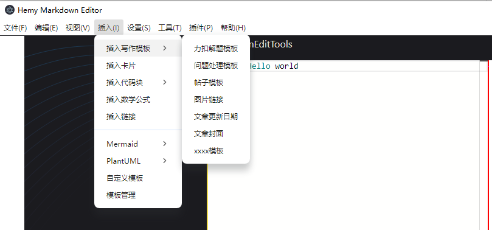
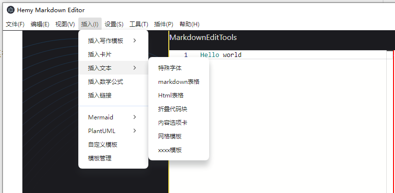
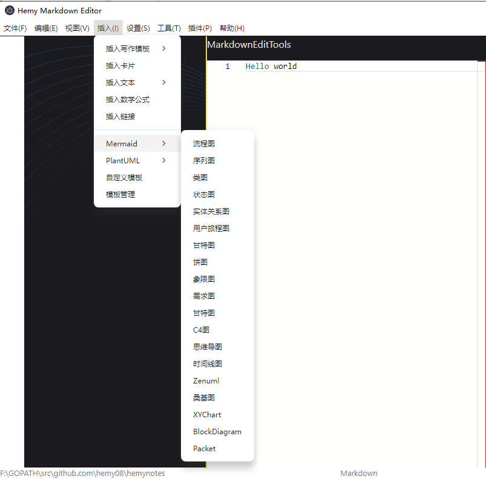
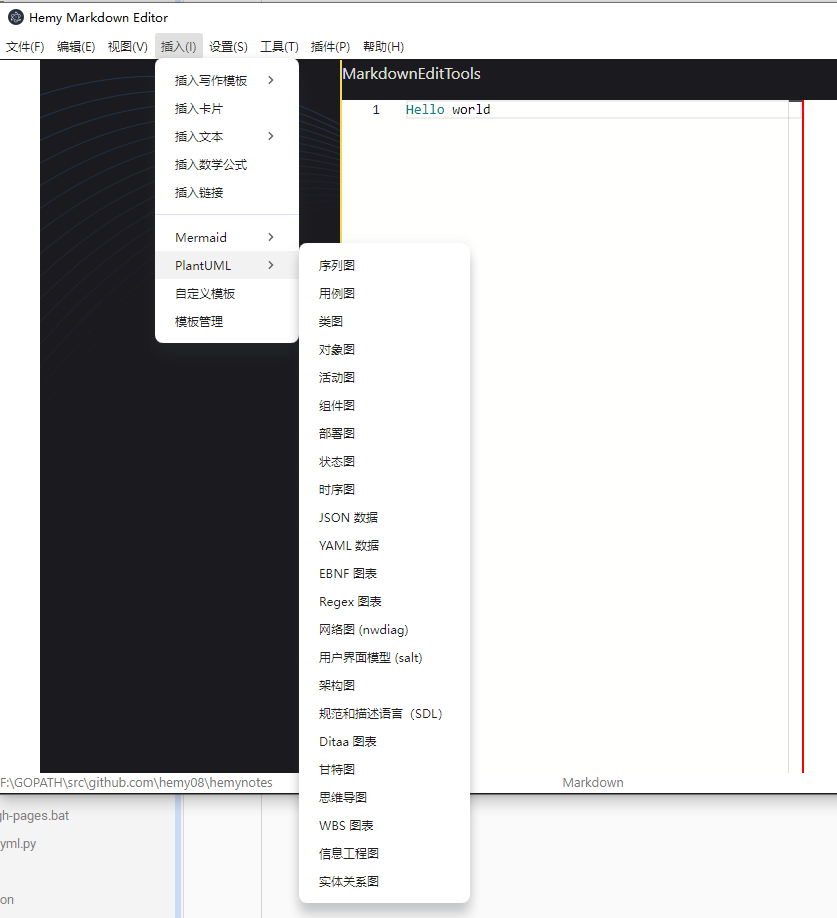

# 工具栏插入菜单实现

## 一、插入菜单


### 1.1 插入写作模板



### 1.2 插入文本块



### 1.3 Mermaid



### 1.4 PlantUML



## 二、插入写作模板

在空白的文档中，直接插入写作模板，这个直接整个替换当前编辑器里面的内容即可，不用考虑鼠标当前位置等信息

```typescript
function insertLeetCodeProblemSolving(mainWindow: Electron.BrowserWindow) {
  import('../../lib/templates/writing/writing').then((module) => {
    mainWindow.webContents.send('monaco-insert-writing-templates', module.leetcode_problem_solving)
  })
}
```

```typescript
window.electron.ipcRenderer.on('monaco-insert-writing-templates', (_, fileContent: string) => {
  if (fileContent) {
    initialCodeContent = fileContent
    handleMarkdownCodeUpdate(fileContent)
  } else {
    handleMarkdownCodeUpdate(initialCodeContent)
  }
})
```

## 三、插入文本块

### 3.1 公共插入处理

在光标位置之后插入指定的文本块，首先需要获取光标的位置，然后在光标位置之后插入指定文本块。

```typescript
function insertTextBlockArticleUpdateDate(mainWindow: Electron.BrowserWindow) {
  import('../../lib/templates/textblock/textblock').then((module) => {
    mainWindow.webContents.send('monaco-insert-text-block-templates', module.article_update_date)
  })
}
```

<details>
<summary style="color:rgb(0,0,255);font-weight:bold">公共代码块插入处理参考</summary>
<blockcode><pre><code>
```typescript
window.electron.ipcRenderer.on('monaco-insert-text-block-templates', (_, context: string) => {
    if (context) {
        insertTextAfterCursor(editorInstance, editorCursorPos, context)
    }
})
// 定义一个函数来插入字符串
function insertTextAfterCursor(editor, position, textToInsert: string) {
    if (!position) return
    // 创建一个编辑操作，将字符串插入到光标之后
    const edit = {
        range: new monaco.Range(
            position.lineNumber,
            position.column,
            position.lineNumber,
            position.column
        ), // 这是一个空范围，表示插入位置
        text: textToInsert, // 要插入的文本
        forceMoveMarkers: true // 如果需要，强制移动标记（如断点）
    }
    // 执行编辑操作
    editor.executeEdits('', [edit])
}
```
</code></pre></blockcode></details>

### 3.2 插入特定字体

支持选择特定的字体，插入到文本中，然后渲染成html。

做一个对话框，完成用户的输入和选择。

效果如下：


实现时，通过election的BrowserWindow创建一个子窗口，窗口加载html页面。

因为这里使用的是vite编译，在编译过程中并不会拷贝html页面到out目录，这里使用了另外一种方式。

将html内容定义为字符串，然后通过loadURL进行加载。

<details>
<summary style="color:rgb(0,0,255);font-weight:bold">插入特定字体参考</summary>
<blockcode><pre><code>
```typescript
function createCustomDialog() {
  customDialogWindow = new BrowserWindow({
    width: 700,
    height: 450,
    minimizable: false,
    maximizable: false,
    title: '文字样式选择',
    autoHideMenuBar: true,
    webPreferences: {
      nodeIntegration: true, // 允许在渲染器进程中使用 Node.js 功能（注意：出于安全考虑，新版本 Electron 默认禁用）
      contextIsolation: false, // 禁用上下文隔离（同样出于安全考虑，新版本 Electron 默认启用）
      sandbox: false
    }
  })
  if (!customDialogWindow) {
    return
  }
  customDialogWindow.setMenu(null)
  // 加载一个 HTML 文件作为对话框的内容
  customDialogWindow.loadURL(`data:text/html;charset=utf-8,${encodeURIComponent(CustomFontDialogHtml)}`)
  // 当窗口关闭时，清除引用
  customDialogWindow.on('closed', () => {
    customDialogWindow = null
  })
  // 显示窗口
  customDialogWindow.show()
  ipcMain.on('user-input-to-custom-font-dialog', (_, inputData) => {
    console.log('inputData', inputData)
  })
}
```
</code></pre></blockcode></details>

注意这里用encodeURIComponent，否则也行特定的属性没法加载

## 四、插入mermaid模板

以flowchart为例，定义一个模板文件flowchart.ts：

```typescript
export const flowchart =
  '```mermaid\n' +
  'flowchart TB\n' +
  '    c1-->a2\n' +
  '    subgraph one\n' +
  '    a1-->a2\n' +
  '    end\n' +
  '    subgraph two\n' +
  '    b1-->b2\n' +
  '    end\n' +
  '    subgraph three\n' +
  '    c1-->c2\n' +
  '    end\n' +
  '```'
```

再定义一个mermaid.ts：

```typescript
import { flowchart } from './flowchart'

export {
    flowchart
}
```

其他的参考这个实现就行，在插入的时候，只导出mermaid.ts即可。

渲染的话可能也有点麻烦，因为是用的Typescript，和vue，貌似没有比较成熟的插件，可以考虑进行内置处理。

## 五、插入PlantUml模板

这个跟mermaid的处理方式一样，不需要特别处理，就是渲染可能需要自己想办法了，目前没找到比较成熟的插件，可以考虑内置处理。
