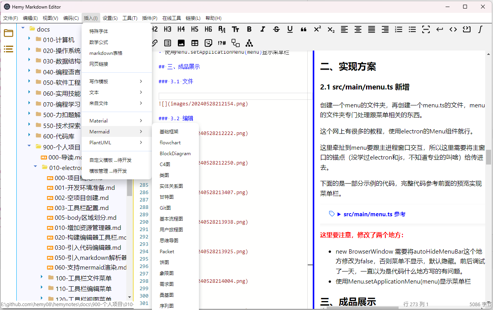

# 工具栏插入菜单实现

## 一、插入菜单



### 1.1 插入写作模板


### 1.2 插入文本块


### 1.3 Mermaid


### 1.4 PlantUML


## 二、插入写作模板

在空白的文档中，直接插入写作模板，这个直接整个替换当前编辑器里面的内容即可，不用考虑鼠标当前位置等信息

```typescript
function insertLeetCodeProblemSolving(mainWindow: Electron.BrowserWindow) {
  import('../../lib/templates/writing/writing').then((module) => {
    mainWindow.webContents.send('monaco-insert-writing-templates', module.leetcode_problem_solving)
  })
}
```

```typescript
window.electron.ipcRenderer.on('monaco-insert-writing-templates', (_, fileContent: string) => {
  if (fileContent) {
    initialCodeContent = fileContent
    handleMarkdownCodeUpdate(fileContent)
  } else {
    handleMarkdownCodeUpdate(initialCodeContent)
  }
})
```

## 三、插入文本块

在光标位置之后插入指定的文本块，首先需要获取光标的位置，然后在光标位置之后插入指定文本块。

```typescript
function insertTextBlockArticleUpdateDate(mainWindow: Electron.BrowserWindow) {
  import('../../lib/templates/textblock/textblock').then((module) => {
    mainWindow.webContents.send('monaco-insert-text-block-templates', module.article_update_date)
  })
}
```

```typescript
window.electron.ipcRenderer.on('monaco-insert-text-block-templates', (_, context: string) => {
    if (context) {
        insertTextAfterCursor(editorInstance, editorCursorPos, context)
    }
})

// 定义一个函数来插入字符串
function insertTextAfterCursor(editor, position, textToInsert: string) {
    if (!position) return
    // 创建一个编辑操作，将字符串插入到光标之后
    const edit = {
        range: new monaco.Range(
            position.lineNumber,
            position.column,
            position.lineNumber,
            position.column
        ), // 这是一个空范围，表示插入位置
        text: textToInsert, // 要插入的文本
        forceMoveMarkers: true // 如果需要，强制移动标记（如断点）
    }

    // 执行编辑操作
    editor.executeEdits('', [edit])
}
```
## 四、插入mermaid模板

以flowchart为例，定义一个模板文件flowchart.ts：

```typescript
export const flowchart =
  '```mermaid\n' +
  'flowchart TB\n' +
  '    c1-->a2\n' +
  '    subgraph one\n' +
  '    a1-->a2\n' +
  '    end\n' +
  '    subgraph two\n' +
  '    b1-->b2\n' +
  '    end\n' +
  '    subgraph three\n' +
  '    c1-->c2\n' +
  '    end\n' +
  '```'
```

再定义一个mermaid.ts：

```typescript
import { flowchart } from './flowchart'

export {
    flowchart
}
```

其他的参考这个实现就行，在插入的时候，只导出mermaid.ts即可。

渲染的话可能也有点麻烦，因为是用的Typescript，和vue，貌似没有比较成熟的插件，可以考虑进行内置处理。

## 五、插入PlantUml模板

这个跟mermaid的处理方式一样，不需要特别处理，就是渲染可能需要自己想办法了，目前没找到比较成熟的插件，可以考虑内置处理。
