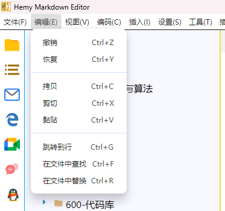
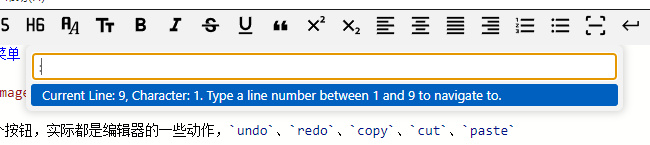
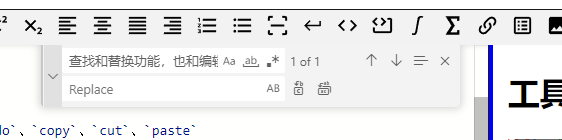

# 工具栏编辑菜单

编辑菜单包含以下功能：

| 功能 | 快捷键 | 说明 |
| --- | --- | --- |
| 撤销 | `Ctrl+Z` | 撤销上一步操作 |
| 重做 | `Ctrl+Y` | 重做撤销的操作 |
| 剪切 | `Ctrl+X` | 剪切选中文本 |
| 复制 | `Ctrl+C` | 复制选中文本 |
| 粘贴 | `Ctrl+V` | 粘贴剪贴板内容 |
| 跳转到行 | `Ctrl+G` | 跳转到指定行号 |
| 查找 | `Ctrl+F` | 在当前文件中查找 |
| 替换 | `Ctrl+H` | 在当前文件中替换 |
| 在文件中查找 | `Ctrl+Shift+F` | 在文件夹中查找 |
| 在文件中替换 | `Ctrl+Shift+H` | 在文件夹中替换 |

编辑菜单的各个按钮，实际都是 Monaco Editor 的内置动作，通过 `editorInstance.trigger('keyboard', action, {})` 触发。

查找和替换功能，也和编辑器的功能一样，通过 Monaco Editor 的内置命令实现。

## IPC 处理

编辑菜单的 IPC 处理在 `src/main/ipc/menu_edit.ts` 中，主要将菜单动作转发到渲染进程的 Monaco Editor 实例。
