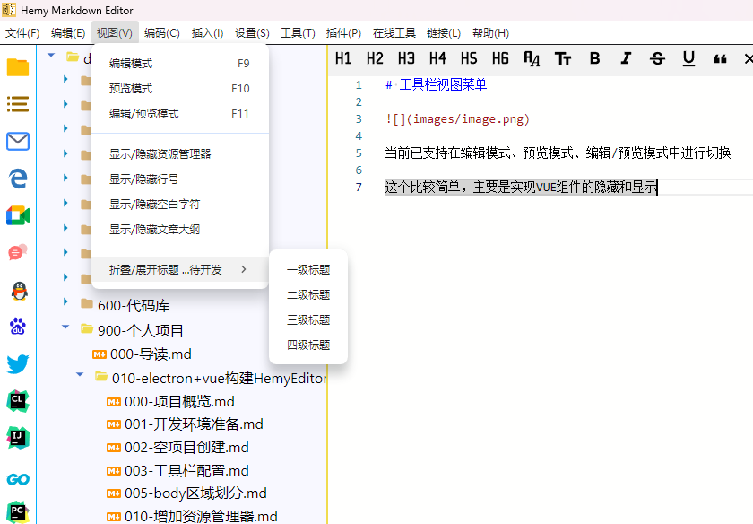

# 工具栏视图菜单



视图菜单包含以下功能：

| 功能 | 快捷键 | 说明 |
| --- | --- | --- |
| 编辑模式 | `F9` | 仅显示编辑器 |
| 预览模式 | `F10` | 仅显示预览区域 |
| 编辑/预览模式 | `F11` | 同时显示编辑器和预览区域 |
| 开发人员工具 | `F12` | 打开 DevTools |
| 显示/隐藏资源管理器 | - | 切换左侧资源管理器显示 |
| 显示/隐藏行号 | - | 切换编辑器行号显示 |
| 显示/隐藏空白字符 | - | 切换空白字符显示 |
| 显示/隐藏文章大纲 | - | 切换文章大纲显示 |
| 折叠/展开标题 | - | 按标题级别折叠/展开 |

## 实现说明

当前已支持在编辑模式、预览模式、编辑/预览模式中进行切换。

这个比较简单，主要是实现 VUE 组件的隐藏和显示，通过 `v-show` 指令控制各区域的显示状态：

```typescript
function onHandleEditorShow(edit: boolean, preview: boolean) {
  isShowEditArea.value = edit
  isShowPreviewArea.value = preview
  if (edit && preview) {
    isShowResizer.value = true
    monacoEditorWidth.value = '50%'
  } else {
    isShowResizer.value = false
    monacoEditorWidth.value = edit ? '100%' : '0%'
  }
}
```

## IPC 处理

视图菜单的 IPC 处理在 `src/main/ipc/menu_view.ts` 中，通过 IPC 通道通知渲染进程切换显示模式。
