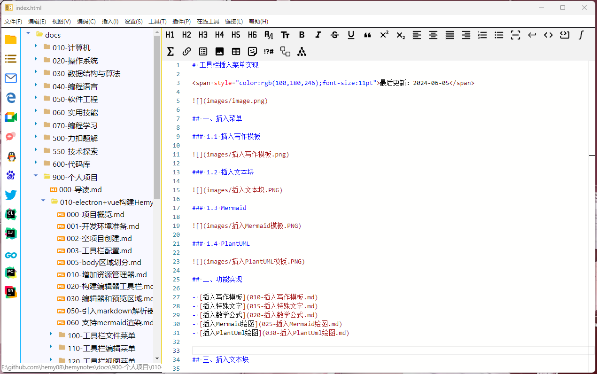
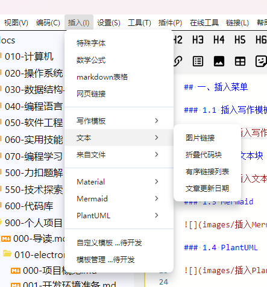
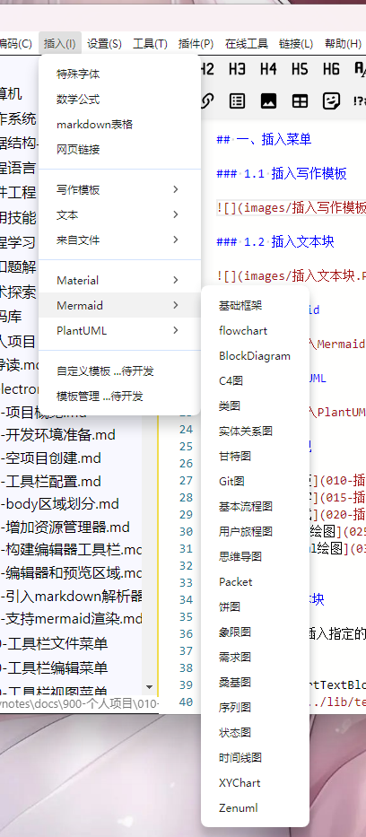
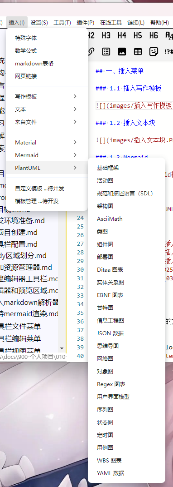

# 工具栏插入菜单实现

<span style="color:rgb(100,180,246);font-size:11pt">最后更新：2024-06-05</span>



## 一、插入菜单

### 1.1 插入写作模板


### 1.2 插入文本块



### 1.3 Mermaid



### 1.4 PlantUML



## 二、功能实现

- [插入写作模板](010-插入写作模板.md)
- [插入特殊文字](015-插入特殊文字.md)
- [插入数学公式](020-插入数学公式.md)
- [插入Mermaid绘图](025-插入Mermaid绘图.md)
- [插入PlantUml绘图](030-插入PlantUml绘图.md)


## 三、插入文本块

在光标位置之后插入指定的文本块，首先需要获取光标的位置，然后在光标位置之后插入指定文本块。

```typescript
function insertTextBlockArticleUpdateDate(mainWindow: Electron.BrowserWindow) {
  import('../../lib/templates/textblock/textblock').then((module) => {
    mainWindow.webContents.send('monaco-insert-text-block-templates', module.article_update_date)
  })
}
```

```typescript
window.electron.ipcRenderer.on('monaco-insert-text-block-templates', (_, context: string) => {
    if (context) {
        insertTextAfterCursor(editorInstance, editorCursorPos, context)
    }
})

// 定义一个函数来插入字符串
function insertTextAfterCursor(editor, position, textToInsert: string) {
    if (!position) return
    // 创建一个编辑操作，将字符串插入到光标之后
    const edit = {
        range: new monaco.Range(
            position.lineNumber,
            position.column,
            position.lineNumber,
            position.column
        ), // 这是一个空范围，表示插入位置
        text: textToInsert, // 要插入的文本
        forceMoveMarkers: true // 如果需要，强制移动标记（如断点）
    }

    // 执行编辑操作
    editor.executeEdits('', [edit])
}
```
