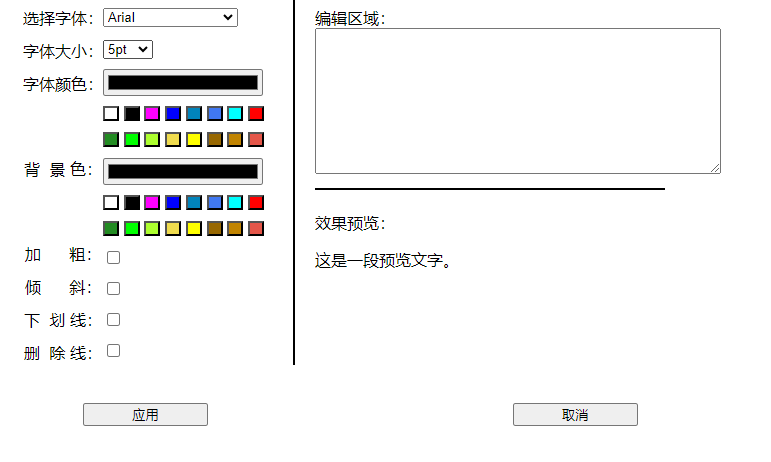
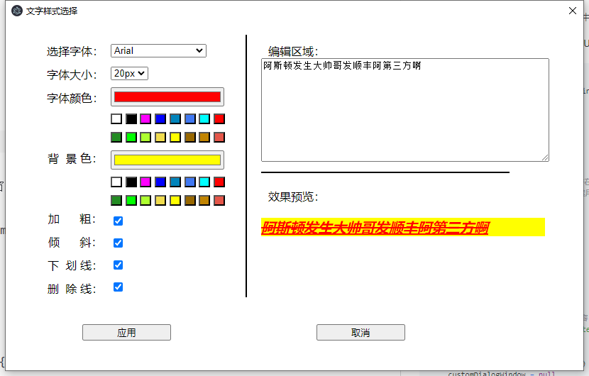

# 插入特殊文字


## 字体选择对话框

先用一个html页面模拟了下



## 对话框和主进程交互

支持选择特定的字体，插入到文本中，然后渲染成html。

做一个对话框，完成用户的输入和选择。

效果如下：



实现时，通过election的BrowserWindow创建一个子窗口，窗口加载html页面。

因为这里使用的是vite编译，在编译过程中并不会拷贝html页面到out目录，这里使用了另外一种方式。

将html内容定义为字符串，然后通过loadURL进行加载。

CustomFontDialogHtml就是html页面的内容，以字符串常量形式写入ts文件


```typescript
function createCustomDialog() {
  customDialogWindow = new BrowserWindow({
    width: 700,
    height: 450,
    minimizable: false,
    maximizable: false,
    title: '文字样式选择',
    autoHideMenuBar: true,
    webPreferences: {
      nodeIntegration: true, // 允许在渲染器进程中使用 Node.js 功能（注意：出于安全考虑，新版本 Electron 默认禁用）
      contextIsolation: false, // 禁用上下文隔离（同样出于安全考虑，新版本 Electron 默认启用）
      sandbox: false
    }
  })

  if (!customDialogWindow) {
    return
  }

  customDialogWindow.setMenu(null)

  // 加载一个 HTML 文件作为对话框的内容
  customDialogWindow.loadURL(`data:text/html;charset=utf-8,${encodeURI(CustomFontDialogHtml)}`)

  // 当窗口关闭时，清除引用
  customDialogWindow.on('closed', () => {
    customDialogWindow = null
  })

  // 显示窗口
  customDialogWindow.show()

  ipcMain.on('user-input-to-custom-font-dialog', (_, inputData) => {
    console.log('inputData', inputData)
  })
}
```