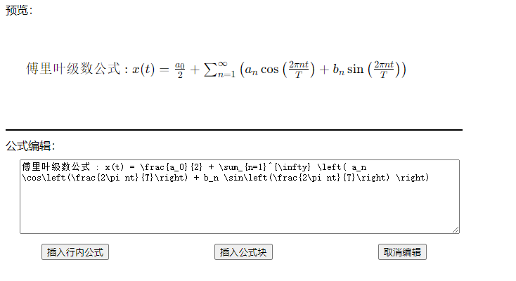

# 插入数学公式

## 数学公式编辑器

html模拟效果

<details>
<summary style="color:rgb(0,0,255);font-weight:bold">KaTexEditDialog.html</summary>
<blockcode><pre><code>
```html
<!DOCTYPE html>
<html lang="en">
<head>
  <meta charset="UTF-8">
  <meta name="viewport" content="width=device-width, initial-scale=1.0">
  <title>KaTeX公式编辑器</title>
  <link rel="stylesheet" href="../../../main/lib/Katex/katex.css">
  <script src="../../../main/lib/Katex/katex.js"></script>
  <style>
    #textInput {width: 620px;height: 100px;overflow-y: auto;margin-left: 20px;margin-top: 10px;flex-direction: column}
    #katex-preview {width: 600px;height: 150px;display:flex;justify-content:center;align-items: center}
    .btn-style {width:650px;margin-top: 10px; display:flex; justify-content:center;align-items: center;gap: 150px}
  </style>
</head>
<body>
  <div id="katex-container">
    <div style="flex-direction: row">
      <div><label style="width: 10px">预览：</label></div>
      <div id="katex-preview" ></div>
    </div>
    <div style="width:650px;height: 2px; margin-top: 10px; color: black; background-color: black"></div>
    <div style="margin-top: 10px">
      <div><label style="width: 10px; margin-top: 10px">公式编辑：</label></div>
      <div><textarea id="textInput" class="text-input"></textarea></div>
    </div>
  </div>
  <div class="btn-style">
    <button id="insert-math-line" onclick="sendInsertMathLineText()">插入行内公式</button>
    <button id="insert-math-block" onclick="sendInsertMathBlockText()">插入公式块</button>
    <button id="cancel-insert-math" onclick="sendCancelInsertMathText()">取消编辑</button>
  </div>
  <script>
  // const { ipcRenderer } = require('electron')
  let latex = ''
  document.addEventListener('DOMContentLoaded', () => {
    // 初始显示 c = \sqrt{a^2 + b^2}
    const latexInit = '傅里叶级数公式 : x(t) = \\frac{a_0}{2} + \\sum_{n=1}^{\\infty} \\left( a_n \\cos\\left(\\frac{2\\pi nt}{T}\\right) + b_n \\sin\\left(\\frac{2\\pi nt}{T}\\right) \\right)'
    document.getElementById('katex-preview').innerHTML = katex.renderToString(latexInit)
    document.getElementById('textInput').textContent = latexInit
  })
  // 处理textInput的input事件，获取内容，渲染后进行显示
  function updateTextInput(event) {
    const inputText = event.target.value
    let html = ''
    try {
      html = katex.renderToString(inputText)
    } catch (error) {
      html = latex
    }
    document.getElementById("katex-preview").innerHTML = html
    latex = event.target.value
  }
  // 监控textInput的input事件
  document.getElementById('textInput').addEventListener('input', updateTextInput);
  // 这里是JavaScript函数，例如：
  function sendInsertMathLineText() {
    ipcRenderer.send('user-insert-math-line-text', '$' + latex + '$')
  }
  function sendInsertMathBlockText() {
    ipcRenderer.send('user-insert-math-block-text', '$$' + latex + '$$')
  }
  function sendCancelInsertMathText() {
    ipcRenderer.send('user-insert-math-text-cancel')
  }
  </script>
</body>
</html>

```
</code></pre></blockcode></details>



## 数学公式插入对话框

因为源html文件是有加入`<script src="../../../main/lib/Katex/katex.js"></script>`引入katex脚本的，但是在ts中直接loadUrl会出错，所以在写ts文件的时候，直接引入这部分去掉了，换成了通过IPC通信

渲染进程监控到编辑区域内容变化后，发送同步消息给主进程，主进程进行katex渲染，然后返回给渲染进程，由渲染进程更新预览区域数据。

实现的时候，发现渲染结果里面包含`katex-mathml`和`katex-html`两个标签，俩都被显示出来了，通过css标签样式设置，将其中一个给隐藏掉了。

<details>
<summary style="color:rgb(0,0,255);font-weight:bold">KaTexEditDialog.ts</summary>
<blockcode><pre><code>
```typescript
import { BrowserWindow, ipcMain } from 'electron'
import { katexRenderToString } from '../../utils/MarkdownContentRender'
let customMathTextDialog: Electron.BrowserWindow | null
export function showMathTextDialog(mainWindow: Electron.BrowserWindow) {
  createMathTextDialog(mainWindow)
}
const latexInit =
  '傅里叶级数公式：x(t) = \\frac{a_0}{2} + \\sum_{n=1}^{\\infty} \\left( a_n \\cos\\left(\\frac{2\\pi nt}{T}\\right) + b_n \\sin\\left(\\frac{2\\pi nt}{T}\\right) \\right)'
// 创建一个自定义对话框的函数
function createMathTextDialog(mainWindow: Electron.BrowserWindow) {
  customMathTextDialog = new BrowserWindow({
    width: 1280,
    height: 550,
    minimizable: false,
    maximizable: false,
    title: '文字样式选择',
    autoHideMenuBar: true,
    webPreferences: {
      nodeIntegration: true, // 允许在渲染器进程中使用 Node.js 功能（注意：出于安全考虑，新版本 Electron 默认禁用）
      contextIsolation: false, // 禁用上下文隔离（同样出于安全考虑，新版本 Electron 默认启用）
      sandbox: false
    }
  })
  if (!customMathTextDialog) {
    return
  }
  customMathTextDialog.setMenu(null)
  // 加载一个 HTML 文件作为对话框的内容
  customMathTextDialog.loadURL(
    `data:text/html;charset=utf-8,${encodeURIComponent(mdMathTextDialogHtmlContext)}`
  )
  // 当窗口关闭时，清除引用
  customMathTextDialog.on('closed', () => {
    ipcMain.removeListener('user-insert-math-line-text', processMathLineTextInsert)
    ipcMain.removeListener('user-insert-math-block-text', processMathBlockTextInsert)
    ipcMain.removeListener('user-insert-math-text-cancel', () => {})
    customMathTextDialog = null
  })
  // 显示窗口
  customMathTextDialog.show()
  function exitCustomFontDialog() {
    if (customMathTextDialog) {
      ipcMain.removeListener('user-insert-math-line-text', processMathLineTextInsert)
      ipcMain.removeListener('user-insert-math-block-text', processMathBlockTextInsert)
      ipcMain.removeListener('user-insert-math-text-cancel', () => {})
      customMathTextDialog.close()
      customMathTextDialog = null
    }
  }
  function processMathLineTextInsert(_, mathText) {
    mainWindow.webContents.send('monaco-insert-text-block-templates', mathText + '\n')
    exitCustomFontDialog()
  }
  function processMathBlockTextInsert(_, mathText) {
    mainWindow.webContents.send('monaco-insert-text-block-templates', mathText + '\n')
    exitCustomFontDialog()
  }
  ipcMain.on('user-insert-math-line-text', processMathLineTextInsert)
  ipcMain.on('user-insert-math-block-text', processMathBlockTextInsert)
  ipcMain.on('user-insert-math-text-cancel', () => {
    exitCustomFontDialog()
  })
  ipcMain.on('sync-katex-render-message', (event, arg) => {
    if (arg == '') {
      event.returnValue = katexRenderToString(latexInit)
    } else {
      event.returnValue = katexRenderToString(arg)
    }
  })
}
```
</code></pre></blockcode></details>

## 预览区支持公式预览

markdown-it本身不支持ketex渲染，而我用的是election-vite框架，ts语言，本身又没法直接import对应的katex作为markdown-it插件使用，所以想了个比较笨的办法。

额外增加了一个专门进行katex渲染处理的ts文件，在vue组件中import后使用。

组件直接返回渲染结果，然后再放在markdown-it中进行render处理。

```typescript
function updateMarkdown() {
  renderedMarkdownContent.value = md.render(katexRenderMathInText(props.code))
}
```

<details>
<summary style="color:rgb(0,0,255);font-weight:bold">KaTexEditDialogUtils.ts</summary>
<blockcode><pre><code>
```typescript
function renderMathInText(text: string, regex: RegExp, isBlock: boolean): string {
  // 正则表达式匹配以 $ 开头和结尾的文本（简单版本，不处理转义字符或嵌套）
  let result = text
  let match: RegExpExecArray | null = null

  // 使用全局搜索来查找所有匹配项
  while ((match = regex.exec(text)) !== null) {
    // 获取匹配到的 LaTeX 字符串（去掉 $ 符号）
    const latex = match[1]
    // 使用 KaTeX 渲染 LaTeX 字符串为 HTML
    let html = ''
    try {
      html = katex.renderToString(latex)
    } catch (error) {
      html = latex
    }
    if (isBlock) {
      html = '<div style="text-align: center;"><p>' + html + '</p></div>'
    }
    // 替换原始文本中的 $latex$ 为渲染后的 HTML
    // 注意：这里我们假设文本中不含有会破坏 HTML 的特殊字符
    result = result.replace(match[0], html)
  }
  return result
}
function renderMathLineInText(text: string): string {
  // 正则表达式匹配以 $ 开头和结尾的文本（简单版本，不处理转义字符或嵌套）
  const regex = /\$([^$]+)\$/g

  return renderMathInText(text, regex, false)
}
function renderMathBlockInText(text: string): string {
  // 正则表达式匹配以 $ 开头和结尾的文本（简单版本，不处理转义字符或嵌套）
  const regex = /\$\$([^$]+)\$\$/g

  return renderMathInText(text, regex, true)
}
export function katexRenderToString(text: string): string {
  let html = ''
  try {
    html = katex.renderToString(text)
  } catch (error) {
    html = text
  }
  return html
}
export function katexRenderMathInText(text: string): string {
  // 正则表达式匹配以 $ 开头和结尾的文本（简单版本，不处理转义字符或嵌套）
  const result = renderMathBlockInText(text)
  return renderMathLineInText(result)
}
```
</code></pre></blockcode></details>