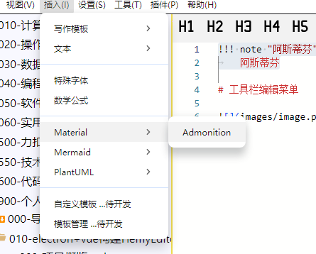
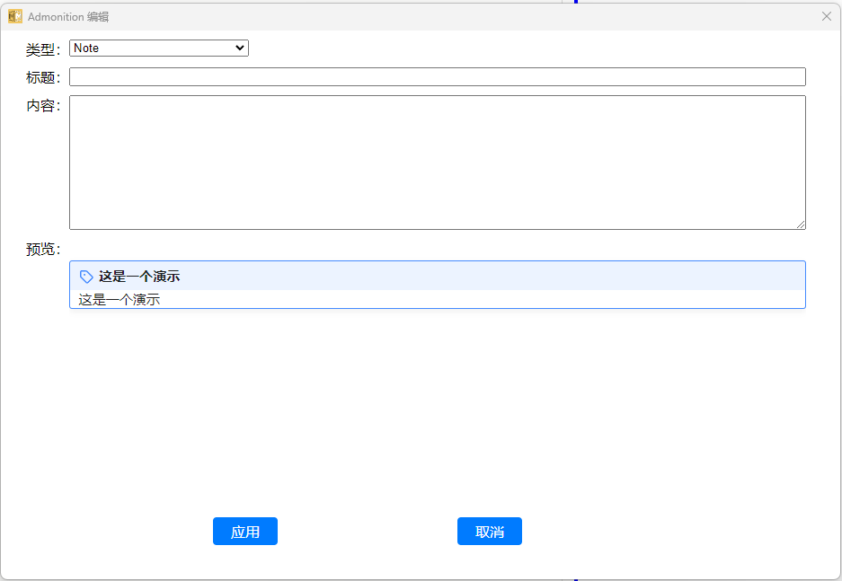
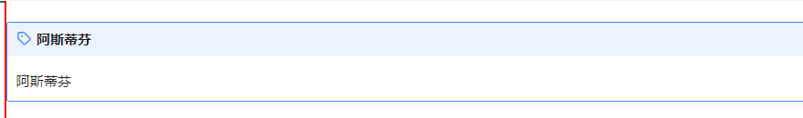
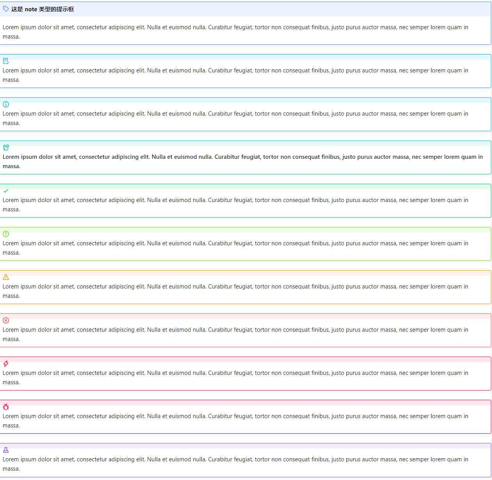

# 插入Material样式

## 菜单栏

菜单栏的实现比较简单，就是向编辑区域插入文本块，文本块的内容就是对应样式表。





## 预览

当前只做了admonition样式，其他的后续待补充



## 实现

### admonition
因为markdown本身不支持这种写法，markdown-it也不支持渲染这种语法，需要自己实现

基本原理就是在文本中找到`!!!`开头的文字，以后续的第一个非空行作为结束。

`!!!`行后面跟的是类型，类型后用双引号填写标题，后面的行，所有开头为4个空格或者tab的，都属于admonition的内容，如：

```text
!!! note "这是一个测试"
    这是一个测试文本
```

#### 渲染过程

```typescript
export function materialAdmonitionsRender(text: string): string {
  let renderResult = text
  let match: RegExpExecArray | null = null
  // 匹配字符串中所有以!!!开始的内容（直到遇到另一个
  // !（图片、下一个块）、#（标题）、`（代码块）、=（内容选项卡）、
  // -、+（无序列表、行分隔符）、[（链接）、$(公式)、|（表格）、{（特殊块）、<（html语法）
  // :(icon，emojis)、*（加粗）、~（删除线）、>（引用）、\r?\n（空行）
  // 或者字符串的结尾）
  const regex = /!!!([\s\S]*?)(?=\n[!#`=\-+[$|{<:*~>\S]|$)/g
  // 使用全局搜索来查找所有匹配项，匹配到的字符串，已经去掉了前缀和后缀
  while ((match = regex.exec(renderResult)) !== null) {
    //console.log('match[1]', match[1])
    const content = materialParserAdmonitions(match[1])
    const renderHtml =
      `<div class="admonition ${content.type}">` +
      `<p class="admonition-title">${content.title}</p>` +
      `${content.content}</div>`
    renderResult = renderResult.replace(match[0], renderHtml)
    //console.log('renderResult', renderResult)
  }

  return renderResult
}
```

其实就是一个字符串匹配的动作，匹配后的字符串，安装规则解析，然后填写对应的html标签。设置对应的样式表，样式表是从网站上copy下来的。

#### 特殊处理

material原生的admonition是支持在其中添加代码块的，这里需要进行特殊处理。

在找到的admonition字符串中，匹配代码块，使用markdown-it + highlightjs 进行渲染

数学公式也是同样的处理，将渲染后的html上下文，替换掉原来的文字。就可以实现。

#### 支持列表

当前支持Note、Abstract、Info、Tip、Success、Question、Warning、Failure、Danger、Bug、Example、Quote、Pied-Piper几种样式，效果如下：



源码：


```text
!!! note "这是 note 类型的提示框"
    Lorem ipsum dolor sit amet, consectetur adipiscing elit. Nulla et euismod nulla. Curabitur feugiat, tortor non consequat finibus, justo purus auctor massa, nec semper lorem quam in massa.

!!! Abstract
    Lorem ipsum dolor sit amet, consectetur adipiscing elit. Nulla et euismod nulla. Curabitur feugiat, tortor non consequat finibus, justo purus auctor massa, nec semper lorem quam in massa.

!!! Info
    Lorem ipsum dolor sit amet, consectetur adipiscing elit. Nulla et euismod nulla. Curabitur feugiat, tortor non consequat finibus, justo purus auctor massa, nec semper lorem quam in massa.

!!! Tip
    Lorem ipsum dolor sit amet, consectetur adipiscing elit. Nulla et euismod nulla. Curabitur feugiat, tortor non consequat finibus, justo purus auctor massa, nec semper lorem quam in massa.

!!! Success
    Lorem ipsum dolor sit amet, consectetur adipiscing elit. Nulla et euismod nulla. Curabitur feugiat, tortor non consequat finibus, justo purus auctor massa, nec semper lorem quam in massa.

!!! Question
    Lorem ipsum dolor sit amet, consectetur adipiscing elit. Nulla et euismod nulla. Curabitur feugiat, tortor non consequat finibus, justo purus auctor massa, nec semper lorem quam in massa.

!!! Warning
    Lorem ipsum dolor sit amet, consectetur adipiscing elit. Nulla et euismod nulla. Curabitur feugiat, tortor non consequat finibus, justo purus auctor massa, nec semper lorem quam in massa.

!!! Failure
    Lorem ipsum dolor sit amet, consectetur adipiscing elit. Nulla et euismod nulla. Curabitur feugiat, tortor non consequat finibus, justo purus auctor massa, nec semper lorem quam in massa.

!!! Danger
    Lorem ipsum dolor sit amet, consectetur adipiscing elit. Nulla et euismod nulla. Curabitur feugiat, tortor non consequat finibus, justo purus auctor massa, nec semper lorem quam in massa.

!!! Bug
    Lorem ipsum dolor sit amet, consectetur adipiscing elit. Nulla et euismod nulla. Curabitur feugiat, tortor non consequat finibus, justo purus auctor massa, nec semper lorem quam in massa.

!!! Example
    Lorem ipsum dolor sit amet, consectetur adipiscing elit. Nulla et euismod nulla. Curabitur feugiat, tortor non consequat finibus, justo purus auctor massa, nec semper lorem quam in massa.

!!! Quote
    Lorem ipsum dolor sit amet, consectetur adipiscing elit. Nulla et euismod nulla. Curabitur feugiat, tortor non consequat finibus, justo purus auctor massa, nec semper lorem quam in massa.

!!! pied-piper "Pied Piper"
    Lorem ipsum dolor sit amet, consectetur adipiscing elit. Nulla et euismod nulla. Curabitur feugiat, tortor non consequat finibus, justo purus auctor massa, nec semper lorem quam in massa.
```
