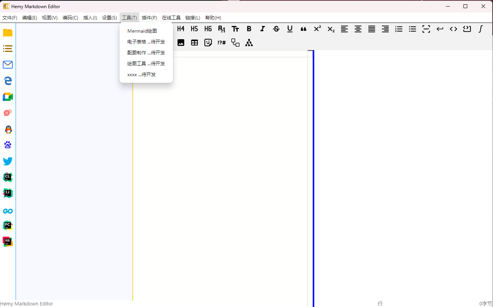

# 工具栏Tools菜单

工具菜单包含以下功能：

| 功能 | 说明 |
| --- | --- |
| Mermaid 绘图 | 打开独立的 Mermaid 编辑预览窗口 |
| 公式编辑器 | KaTeX 公式编辑器 |
| 电子表格 | 电子表格编辑工具 |
| 配图制作 | 配图创作工具 |
| 绘图工具 | 简单的绘图工具 |

## 实现说明

工具菜单的 IPC 处理在 `src/main/ipc/menu_tools.ts` 中，通过 IPC 通知渲染进程在右侧工作区域显示对应的工具组件。

各工具组件在 `src/renderer/src/components/HemyTools/` 目录下：

- `ShowHtmlVIew.vue`：HTML 查看组件
- `ShowPdfEditor.vue`：PDF 编辑器组件
- `MermaidRender.vue`：Mermaid 渲染组件

Mermaid 绘图通过 `OpenMermaidRenderFrame.ts` 创建独立的渲染窗口，支持实时编辑和预览。
