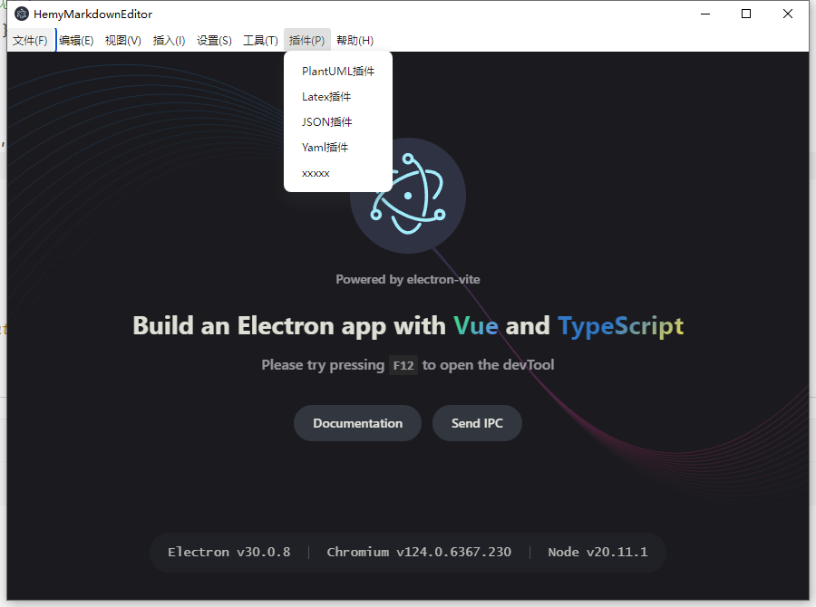
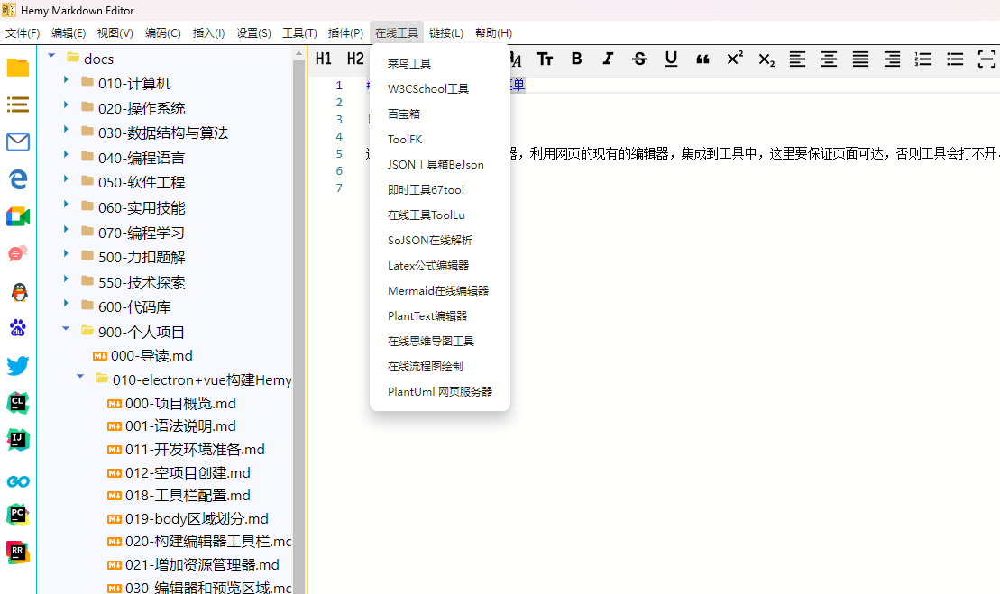

# 工具栏插件/在线工具菜单

## 插件菜单

插件菜单这里集成了一些常用的工具，一些加解密插件、时间转换器、数字转换器、文本格式转换器、子网计算、地址计算、MAC计算、ASCII码、公式对账、物理符号等各类工具。

操作也比较简单，通过主线程菜单栏按钮触发内部IPC消息，给渲染进程发送指令，由渲染进程在编辑区域呈现VUE组件。

## 在线工具菜单

这里主要是打开在线编辑器，利用网页的现有的编辑器，集成到工具中，这里要保证页面可达，否则工具会打不开。

