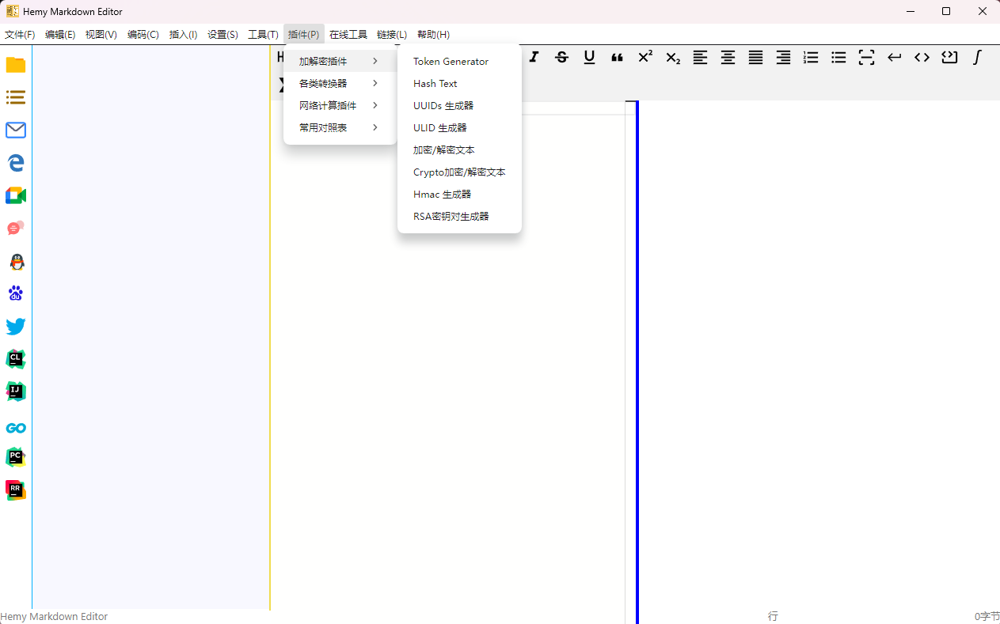
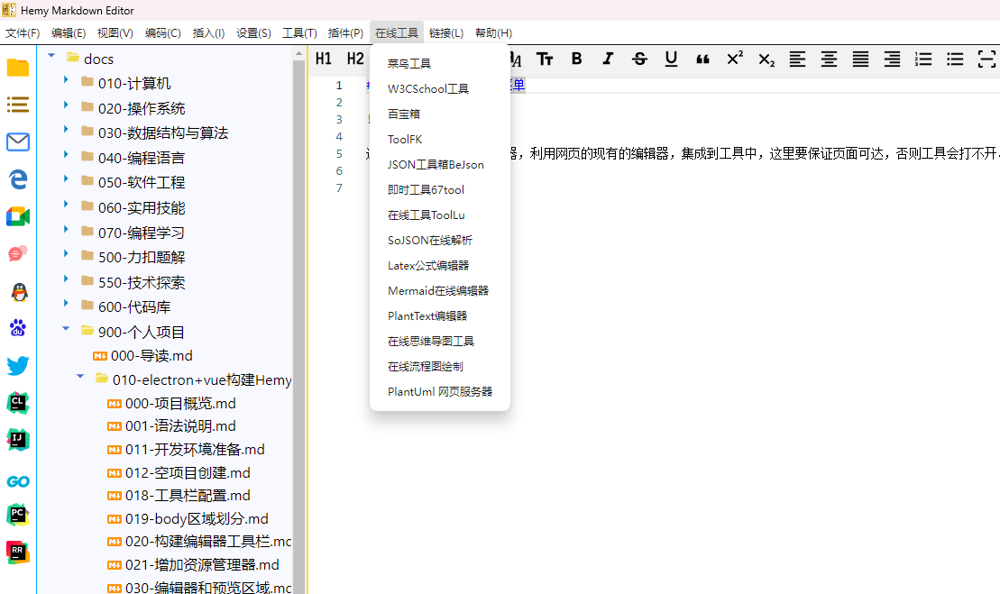

# 工具栏插件/在线工具菜单

## 插件菜单

插件菜单这里集成了一些常用的工具，分为以下几类：

### 加解密插件
- AES、DES、RSA 等加密算法
- MD5、SHA-1、SHA-256、SHA-512 哈希计算
- Base64 编码解码

### 各类转换器
- **编解码转换**：URL 编解码、HTML 实体编解码等
- **格式转换器**：JSON/CSV/YAML/TOML 互转
- **大小写转换**：驼峰、下划线、短横线等
- **格式化工具**：JSON、XML、SQL 格式化

### 网络计算插件
- 地址转换器（IP/MAC）
- 解析器
- 子网计算等

### 常用对照表
- ASCII 码对照表
- 数据和命令对照表
- 科学符号对照表

### 语言语法关键字对照表
- 各编程语言关键字对照

操作也比较简单，通过主线程菜单栏按钮触发内部 IPC 消息，给渲染进程发送指令，由渲染进程在编辑区域呈现 VUE 组件。插件组件在 `src/renderer/src/components/PluginTools/` 目录下。

## 在线工具菜单

这里主要是打开在线编辑器，利用网页的现有的编辑器，集成到工具中，这里要保证页面可达，否则工具会打不开。

在线工具分类：

- **菜鸟在线工具**：菜鸟工具集
- **编程狮在线工具**：W3School 工具集
- **在线编解码工具**：各类编解码工具
- **在线 IDE 编辑器**：在线 IDE
- **开发者工具**：开发者常用工具
- **国内知名前端团队**：前端团队网站
- **云计算平台**：各大云平台

在线工具通过 `OpenOnlineWebPages.ts` 在独立窗口中打开，使用 `shell.openExternal` 或内嵌 BrowserWindow 实现。
