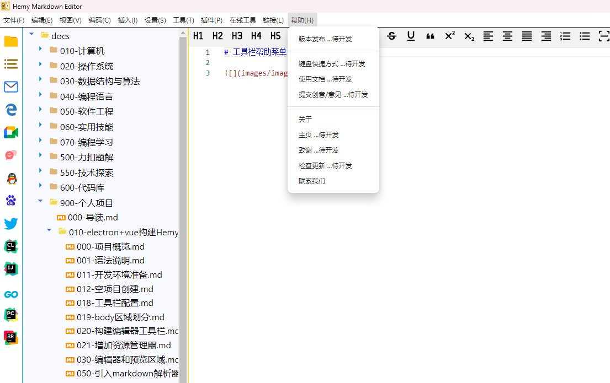

# 工具栏帮助菜单

帮助菜单包含以下功能：

| 功能 | 说明 |
| --- | --- |
| 版本发布 | 查看各版本（v1.0.0 ~ v1.2.2）的发布说明 |
| 修改日志 | 查看重大版本升级日志 |
| 键盘快捷方式 | 查看快捷键设置 |
| 使用文档 | 简单的使用指导 |
| 提交创意/意见 | 提交 issue 和建议 |
| 技术栈 | 查看项目技术栈信息 |
| 关于 | 关于对话框 |
| 主页 | 打开项目主页 |
| 检查更新 | 检查应用更新 |
| 联系我们 | 联系方式 |

## 对话框实现

各帮助对话框在 `src/main/dialogs/` 目录下：

- `ShowReleaseNotesDialog.ts`：版本发布对话框
- `ShowUpdateLogDialog.ts`：更新日志对话框
- `ShowHelpAboutDialog.ts`：关于对话框
- `ShowHelpContactUsDialog.ts`：联系我们对话框
- `ShowTechStackDialog.ts`：技术栈对话框

## 自动更新

项目集成 `electron-updater` 支持自动更新，配置在 `dev-app-update.yml` 中。检查更新时通过 `electron-updater` 的 API 检查最新版本，提示用户下载安装。
