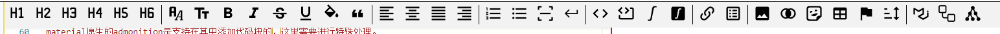

# 编辑器工具栏



## 预览

主要是为了方便编辑，增加一些简单的快捷按钮。

当前支持：

- 将选中行设置为对应的标题
- 文字常见的样式设置：加粗（`**`）、倾斜(`*`)、下划线（`<u></u>`）、删除线（`~~`）
- 插入页面分隔符（`------------`）
- 插入行内代码、代码块
- 插入行内公式、公式块
- 插入mermaid、plantuml图片代码
- 插入链接
- Emoji表情图标和特殊字符已支持输入

后续会继续补充：

- 字体样式、大小、颜色，选中文字变为引用
- 文字左对齐、右对齐、居中对齐、两侧对齐
- 有序列表、无序列表
- 插入图片、图片居中、表格、标记、分类
- 锚点链接、任务列表 
- material样式
- 其他

## 实现

因为软件架构原因，工具栏和编辑器不是同一个vue组件，无法通过props等动作进行处理。

这里使用了eventbus，进行vue组件间的通信

### 1. 定义event-bus.js

```typescript
// event-bus.js
const EventBus = {
  // 你可以使用 ref 创建一个响应式的数据源（如果需要的话）
  // 也可以使用 Map 或其他数据结构来存储事件和回调
  callbacks: new Map(),

  $on(eventName, callback) {
    if (!this.callbacks.has(eventName)) {
      this.callbacks.set(eventName, [])
    }
    this.callbacks.get(eventName).push(callback)
  },
  $emit(eventName, payload) {
    if (this.callbacks.has(eventName)) {
      this.callbacks.get(eventName).forEach((callback) => {
        callback(payload)
      })
    }
  },
  $off(eventName, callback) {
    if (this.callbacks.has(eventName)) {
      this.callbacks.set(
        eventName,
        this.callbacks.get(eventName).filter((cb) => cb !== callback)
      )
    }
  },
  // 修改 $off 方法以支持移除所有事件的所有监听器
  $offAll() {
    this.callbacks.clear()
  }
}

export default EventBus
```

### 2. 在工具栏组件中触发事件：

```typescript
import EventBus from '../../event-bus'
function handleUpdateHeaderFormat(header: string) {
    EventBus.$emit('monaco-editor-update-header-format', header)
}
```

### 3. 在编辑器组件中监听事件

```typescript
import EventBus from '../../event-bus'

onMounted(() => {
    EventBus.$on('monaco-editor-update-header-format', (value: string) => {
        updateConvertFontHeaderFormat(editorInstance, value)
    })

    onBeforeUnmount(() => {
        EventBus.$off('monaco-editor-update-header-format', (value: string) => {
            updateConvertFontHeaderFormat(editorInstance, value)
        })
    })
})
```

### 4. 利用monaco的API处理

```typescript
function updateHandleFontStyle(
    editor: monaco.editor.IStandaloneCodeEditor,
    startStr: string,
    endStr: string
) {
    // 获取当前的选择范围
    const selection = editor.getSelection()
    if (!selection || selection.isEmpty()) {
        // 没有选择，则直接插入字符串
        insertTextAfterCursor(editor, startStr + endStr)
        return
    }
    // 获取编辑器模型, 确保模型存在
    const model = editor.getModel()
    if (!model) return
    const { startLineNumber, startColumn, endLineNumber, endColumn } = selection
    let selectRange: Range = selection
    const selectedText = model.getValueInRange(selection)
    // 选择的部分就有*
    let newText: string
    if (selectedText.startsWith(startStr) && selectedText.endsWith(endStr)) {
        newText = selectedText.substring(startStr.length, selectedText.length - endStr.length)
    } else {
        // 选择的部分没有*，向前后增加三个字符
        const lineLength = model.getLineLength(endLineNumber)
        const start = Math.max(1, startColumn - startStr.length)
        const end = Math.min(lineLength + 1, endColumn + endStr.length)
        selectRange = new monaco.Range(startLineNumber, start, endLineNumber, end)
        const content = model.getValueInRange(selectRange)
        // 三个*，说明文字本来是加粗倾斜的，去掉倾斜
        if (content.startsWith(startStr) && content.endsWith(endStr)) {
            newText = content.substring(startStr.length, content.length - endStr.length)
        } else {
            selectRange = selection
            newText = `${startStr}${selectedText}${endStr}`
        }
    }

    const edit = {
        range: selectRange, // 这是一个空范围，表示插入位置
        text: newText, // 要插入的文本
        forceMoveMarkers: false // 如果需要，强制移动标记（如断点）
    }
    editor.executeEdits('updateHandleFontItalic', [edit])
}
```