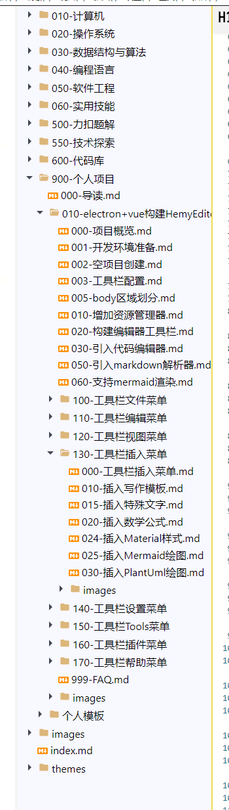

# 文件资源管理器

## 预览

## 实现

这里主要是在左侧区域增加文件资源管理器窗口。

打开文件夹后，文件夹内部的 md 文档和图片会在这里显示。

如果你点击某个 md 文件，文档内容直接显示在编辑区域，并且当你修改了文档后，会进行保存，当前默认 30s 自动保存一次（可通过系统设置修改 `autoSaveInterval`），也可以使用 `Ctrl+S` 快捷键进行保存。

详细实现参考 [021-增加资源管理器](../021-增加资源管理器.md)。

## 功能列表

- 文件树递归显示（支持 `.md`、`.png`、`.jpg` 等文件）
- 文件操作：新建、重命名、删除、复制、剪切、粘贴
- 右键菜单：复制路径、复制链接、在资源管理器中打开、从磁盘重新加载
- 文章大纲：Markdown 标题导航
- 文件状态自动保存和恢复
- 最近打开记录
